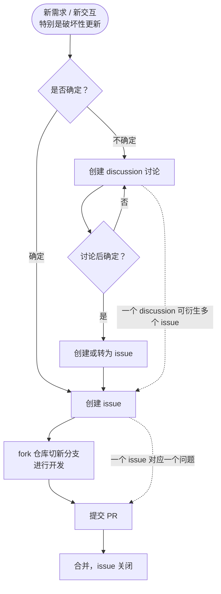

# 开源参与指南

## 代码贡献步骤

### 协作流程规范

新需求新交互，特别是偏向破坏性的更新，确定的先提 issue，不确定的提 discussion，确定后再创建或者转 issue，issue 定了后，再 fork 切新分支 PR。

- 一个 discussion 应该会对应多个 issue
- 一个 issue 对应一个问题，一个 PR 解决一个问题



### 1. Fork 此仓库

点击 [Ikaros 仓库](https://github.com/ikaros-dev/ikaros)主页右上角的 `Fork` 按钮即可。

### 2. Clone 仓库到本地

```bash
git clone https://github.com/{YOUR_USERNAME}/ikaros --recursive
```

### 3. 添加主仓库

添加主仓库（upstream）方便未来同步主仓库最新的 commits，以及基于最新代码创建新的分支。

```bash
git remote add upstream https://github.com/ikaros-dev/ikaros.git
git fetch upstream
```

### 4. 初始化 git submodule

主题模板使用 git submodule 关联了另一个仓库，需要先初始化：

```bash
git submodule init
git submodule update
```

### 5. 创建新的开发分支

从主仓库的主分支（main）创建新的开发分支：

```bash
git checkout upstream/main
git checkout -b {YOU_BRANCH_NAME}
```

### 6. 开发

在新创建的分支上进行开发。

### 7. 提交代码

```bash
git add .
git commit -s -m "Fix a bug or issue"
```

### 8. 推送到你的 GitHub fork 库

在提交 Pull Request 之前，尽量保证当前分支与上游仓库的代码保持同步，需要手动操作。确保当前处于新建的分支。

示例：

```bash
git fetch upstream main
git merge upstream/main
git push origin {YOU_BRANCH_NAME}
```

**注意**：merge 上游仓库可能会存在冲突，需要你手动解决并提交一个 commit，再进行 push。

### 9. 创建 Pull Request

进入此阶段说明已经完成了代码的编写、测试和自测，并且准备好接受 Code Review。

回到自己的仓库页面，选择 `New pull request` 按钮，创建 `Pull Request` 到原仓库的 `main` 分支。
然后等待 Review 即可，如有 `Change Request`，在本地修改后再次 commit 并 push 即可。

提交 Pull Request 的注意事项：

- 提交 Pull Request 请充分自测。
- 每个 Pull Request 尽量只解决一个 Issue，特殊情况除外。
- 应尽可能多的添加单元测试，其他测试（集成测试和 E2E 测试）可看情况添加。

### 10. 更新 commits

Code Review 阶段可能需要 Pull Request 作者重新修改代码，请直接在当前分支 commit 并 push 即可，无需关闭并重新提交 Pull Request。示例：

```bash
git add .
git commit -s -m "Refactor some code according code review"
git push origin bug/xxx
```

同时，若已经进入 Code Review 阶段，请不要强制推送 commits 到当前分支。否则 Reviewers 需要从头开始 Code Review。

### 11. PR 后的操作

**删除本地新建的分支**：

```bash
git checkout main
git branch -D {YOU_BRANCH_NAME}
```

**删除远端新建分支**：

你可以直接在 PR 页面删除 fork 仓库的新分支，也可以本地通过命令删除：

```bash
git remote origin
git push origin --delete {YOU_BRANCH_NAME}
```

**删除本地仓库的远程 fork 仓库分支引用**：

请先确保已经删除远程分支：

```bash
git remote prune origin
```

**更新本地和 fork 仓库主分支**：

```shell
git pull upstream main
git push origin main
```

### 此文参考

- [开源项目Halo贡献指南](https://github.com/halo-dev/halo/blob/master/CONTRIBUTING.md)