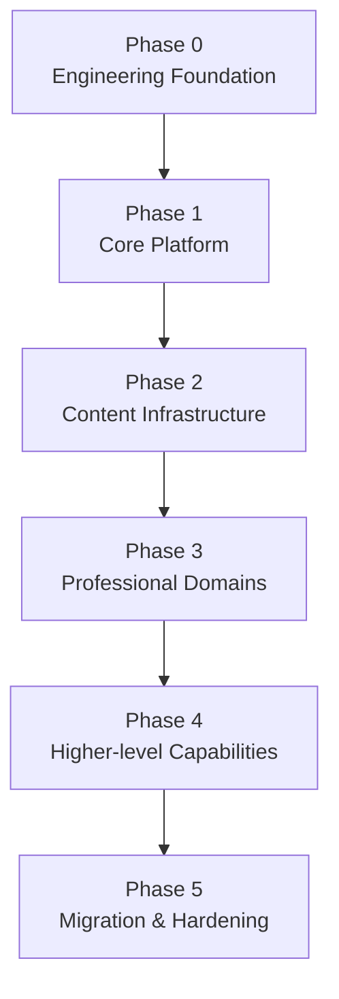

# Ikaros V2 Implementation Roadmap and Dependency Graph

| 项目 | 内容 |
|---|---|
| 文档名称 | Ikaros V2 Implementation Roadmap and Dependency Graph |
| 适用版本 | Ikaros V2 |
| 状态 | Draft |
| 上位设计 | `Product-Requirements-Document.md`、`System-Overview-Design.md` |

> 本文档负责把 V2 已完成的产品、系统与子系统设计转换为可执行的工程实施顺序。
>
> 本文档不重新定义领域语义；若与 PRD、System Overview、Database Overview、API Convention 或对应 Subsystem Design 冲突，以更上位或更具体的正式设计为准。

---

## 1. 目标

V2 已完成大部分领域设计，下一阶段的主要风险不再是“缺少业务域”，而是：

- 多个模块同时开工导致基础契约重复实现；
- 子系统之间在代码层重新形成跨 Repository / Entity 耦合；
- Schema、API、Event 和权限在实现阶段各自演进；
- 过早实现高层业务，后续因底座变化反复返工；
- 没有明确的阶段退出条件，导致“代码已写很多，但平台仍不可验证”。

因此实施采用 **Foundation → Core Platform → Content Infrastructure → Professional Domains → Higher-level Capabilities → Migration & Hardening** 的纵向收敛路径。

---

## 2. 总体依赖图



逻辑依赖：

```text
Engineering Foundation
├── UUIDv7 / Clock / Timezone
├── Error / Problem Contract
├── Principal / Security Context
├── PostgreSQL / Migration Framework
├── Transaction Boundary
├── Event / Outbox Runtime
├── Background Task Runtime
└── Observability Baseline

        ↓

Core Platform
├── Resource / Collection / Relation
├── Attachment / Blob / Placement
├── Permission / ACL foundation
├── Plugin Runtime foundation
└── Search Projection foundation

        ↓

Content Infrastructure
├── Content Ingestion / Metadata Sync
├── Personal Drive
├── Offline / Device Sync
├── Sharing / Collaboration
└── Backup / Restore

        ↓

Professional Domains
├── Media
├── Reading
├── Music
├── Photo
├── Document / Content Creation
└── Game Archive

        ↓

Higher-level Capabilities
├── Automation
├── Analytics
├── AI / Persona
├── Productivity
├── Personal Finance
├── Private Notes
└── Password Manager
```

---

## 3. Phase 0 — Engineering Foundation

### 3.1 目标

建立所有业务模块共同依赖、且不应由各领域重复实现的工程基础。

### 3.2 Deliverables

必须完成：

1. **统一 ID Generator**
   - UUIDv7；
   - 时钟回拨策略；
   - 同毫秒并发策略；
   - 测试替换能力。
2. **Clock / Timezone Foundation**
   - `timestamptz` 映射；
   - RFC 3339 API 表达；
   - Application Timezone；
   - 可注入 Clock。
3. **Error Foundation**
   - Domain Error；
   - Application Error；
   - `application/problem+json` 映射；
   - stable error code registry。
4. **Principal / Security Context**
   - authenticated principal；
   - actor / system principal；
   - correlation context；
   - step-up verification context。
5. **Database / Migration Foundation**
   - PostgreSQL-only；
   - Schema / owner migration organization；
   - schema compatibility check；
   - migration failure startup policy。
6. **Transaction Boundary**
   - Application command transaction；
   - transaction-local Outbox append；
   - 禁止跨领域共享 transaction implementation detail。
7. **Durable Event / Outbox Runtime**
   - Event envelope；
   - producer contract；
   - dispatcher；
   - at-least-once delivery；
   - consumer idempotency store；
   - correlation / causation propagation。
8. **Background Task Runtime Skeleton**
   - submit；
   - lease / claim；
   - retry；
   - cancel；
   - progress；
   - persisted attempt history。
9. **Observability Baseline**
   - Request ID；
   - Correlation ID；
   - structured logging；
   - health/readiness；
   - basic metrics。

### 3.3 Exit Criteria

Phase 0 只有在以下条件全部满足后才算完成：

- 一个测试 Domain Command 可以在事务中修改状态并写 Outbox；
- 进程在 commit 后、dispatch 前崩溃，重启后 Event 仍可投递；
- 同一 Event 重复投递不会重复产生测试副作用；
- Background Task 可以跨重启恢复可执行状态；
- API 错误能够稳定映射为统一 Problem Contract；
- 数据库版本不兼容时 Server 拒绝正常进入 READY；
- 核心 foundation contract 有自动化测试。

---

## 4. Phase 1 — Core Platform

### 4.1 Resource Core

实现范围：

- Resource；
- Title / Alias；
- Metadata Provenance；
- External Identity；
- Collection；
- Tag；
- Relation；
- Resource Lifecycle；
- User State 基础。

必须先形成：

- Resource Schema；
- Resource Command / Query Catalog；
- Resource API Contract；
- Resource Event Catalog；
- Resource Permission Registry。

### 4.2 Attachment / Blob Storage Core

实现范围：

- Attachment；
- Blob；
- Placement / Replica；
- content hash；
- upload commit；
- readable replica resolution；
- integrity state；
- lifecycle / GC reference foundation。

首阶段至少支持一个本地或 S3-compatible Provider，但 Provider Contract 必须从第一版就保持可扩展。

### 4.3 Security / Authorization Core

建立：

- permission registry；
- RBAC foundation；
- resource-scoped authorization hook；
- Step-up policy hook；
- audit context。

### 4.4 Plugin Runtime Foundation

只实现后续业务插件所必需的最小 Runtime：

- manifest；
- API compatibility；
- install / enable / disable / uninstall lifecycle；
- permission / capability declaration；
- configuration + secret reference；
- extension registry。

### 4.5 Search Projection Foundation

只建立投影框架，不提前做复杂 ranking：

- stable document identity；
- source version；
- projector version；
- incremental projection；
- rebuild generation；
- dead-letter / reconciliation。

### 4.6 Exit Criteria

- Resource 可创建、查询、更新、归档并产生可靠 Event；
- Attachment 可以完成 upload → Blob → Placement → Attachment；
- 相同内容可以复用 Blob，但 Attachment 仍保持独立；
- 权限检查位于业务入口而非 UI；
- Search Projection 可以从业务真相全量重建；
- Plugin Runtime 能加载一个最小测试插件且不直接访问其他领域私有 persistence。

---

## 5. Phase 2 — Content Infrastructure

按以下顺序推进：

1. **Content Ingestion / Metadata Synchronization**
2. **Personal Drive P0**
3. **Offline / Device Sync Runtime**
4. **Sharing / ACL / Room 基础**
5. **Backup / Restore**

### 5.1 Personal Drive P0

Drive 实现必须以现有 `Personal-Drive-File-Synchronization-P0-Semantics.md` 为验收基线，至少完成：

- Drive Space；
- Node / Parent relation；
- immutable File Revision；
- resumable upload commit；
- Move / Rename；
- Trash / Restore；
- Tombstone / Change Generation；
- Quota；
- Backup Mode；
- Conflict Copy；
- Camera Backup file-side state。

严禁在此阶段另建一套独立物理文件存储模型。

### 5.2 Exit Criteria

必须通过：

- 重复上传；
- 中断恢复；
- crash/retry；
- rename/move identity preservation；
- trash/restore；
- stale client mutation；
- duplicate event；
- sync conflict；
- quota boundary；
- backup mode deletion safety；

等集成测试。

---

## 6. Phase 3 — Professional Domains

推荐实施顺序：

1. Media / Video / Anime；
2. Reading / Comic / Novel / Ebook；
3. Music；
4. Photo；
5. Document / Content Creation；
6. Game Archive。

排序依据不是业务重要性，而是优先验证 Resource + Attachment + Blob + Progress + Derived Attachment 等核心抽象能否支持真实专业领域。

每个领域开工前必须先完成自己的：

```text
Schema Design
Command / Query Catalog
Event Catalog
Permission Registry
API / OpenAPI Contract
Acceptance Matrix
```

禁止先写 Controller / Repository，再根据实现反推契约。

---

## 7. Phase 4 — Higher-level Capabilities

建议依赖成熟的基础业务事实后再进入：

- Platform Automation；
- Analytics；
- AI Intelligence / Persona；
- Productivity；
- Personal Finance；
- Private Notes；
- Password Manager。

其中：

- Analytics 只能消费业务事实，不反向成为业务真相；
- AI 只能通过 Capability / Command 执行业务动作；
- Secure Domain 必须先完成 Key / Crypto / Recovery foundation，再实现业务 Vault；
- Finance 上线前必须完成精确金额、不可变业务事实与 Reconciliation 测试。

---

## 8. Phase 5 — Migration and Hardening

主要工作：

1. V1 → V2 Migration / Import Tool；
2. OpenAPI / SDK compatibility validation；
3. Plugin compatibility test suite；
4. Backup → Restore Drill；
5. Security review；
6. Performance / capacity baseline；
7. Upgrade / migration drill；
8. Crash / retry / duplicate delivery chaos tests；
9. App / CMS E2E；
10. Release readiness checklist。

---

## 9. 每个模块的 Definition of Ready

任何模块进入编码前至少必须具备：

- Owner Subsystem；
- Scope / Non-goal；
- Domain Invariants；
- Schema Draft；
- Command / Query 定义；
- Event Producer / Consumer 定义；
- Permission / Security requirement；
- API surface；
- failure / retry / idempotency semantics；
- acceptance tests。

缺少其中任一关键项时，应先回到设计层补齐，不应把未决领域规则留在 Controller 或 Repository 中临时决定。

---

## 10. 每个模块的 Definition of Done

一个 V2 模块不能仅以“接口能调用”作为完成标准。

至少需要：

- Schema Migration；
- Application Command / Query；
- Authorization；
- Event / Outbox；
- API / OpenAPI；
- observability；
- retry / concurrency / idempotency tests；
- migration test；
- integration test；
- documentation traceability。

高风险模块还需要：

- security audit test；
- destructive action test；
- backup / restore test；
- offline / conflict test（适用时）。

---

## 11. 禁止的实施路径

V2 实现阶段明确避免：

1. 以 V1 Entity / Repository 为模板直接复制 V2 数据模型；
2. 多个子系统直接操作同一 Owner 的私有表；
3. 先完成大量 Controller，再统一 API Contract；
4. 用进程内 Event 替代可靠 Outbox；
5. 用 Search / Analytics projection 回写业务真相；
6. 把后台任务默认视为管理员主体；
7. 通过 `ADMIN` 绕过 Resource / Drive / Secure Domain 内容权限；
8. 把 Path / Object Key 当稳定内容身份；
9. 把 Cache / Download / Replica 合并为一个“文件副本”概念；
10. 为尚未出现的规模问题提前微服务化。

---

## 12. Roadmap 演进规则

本 Roadmap 只定义依赖与工程 Gate，不锁定具体日期。

当需求变化时：

- 产品范围变化先修改 PRD；
- 系统边界变化先修改 System Overview；
- 领域规则变化先修改 Subsystem Design；
- Roadmap 只同步实施顺序与 Gate；
- 不允许通过调整 Roadmap 偷偷改变领域语义。

当某一 Phase 的后续能力已经完成，但其前置 Exit Criteria 仍未满足，应视为技术债和发布阻塞项，而不是通过文档把前置条件标记为“可选”。
