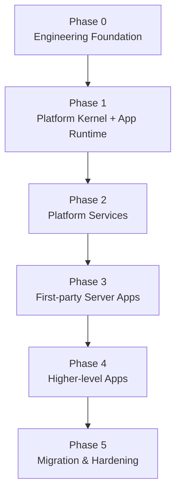

# Ikaros V2 Implementation Roadmap and Dependency Graph

| 项目 | 内容 |
|---|---|
| 文档名称 | Ikaros V2 Implementation Roadmap and Dependency Graph |
| 适用版本 | Ikaros V2 |
| 状态 | Draft |
| 上位设计 | `Product-Requirements-Document.md`、`System-Overview-Design.md` |

> 本文档负责把 V2 已完成的产品、系统与子系统设计转换为可执行的工程实施顺序。
>
> 本文档不重新定义领域语义；若与 PRD、System Overview、Database Overview、API Convention 或对应 Subsystem Design 冲突，以更上位或更具体的正式设计为准。

---

## 1. 目标

V2 已完成大部分领域设计，下一阶段的主要风险不再是“缺少业务域”，而是：

- 多个模块同时开工导致基础契约重复实现；
- 子系统之间在代码层重新形成跨 Repository / Entity 耦合；
- Schema、API、Event 和权限在实现阶段各自演进；
- 过早实现高层业务，后续因底座变化反复返工；
- 没有明确的阶段退出条件，导致“代码已写很多，但平台仍不可验证”。

因此实施采用 **Engineering Foundation → Platform Kernel / App Runtime → Platform Services → First-party Server Apps → Higher-level Apps → Migration & Hardening** 的纵向收敛路径。

---

## 2. 总体依赖图



逻辑依赖：

```text
Engineering Foundation
├── UUIDv7 / Clock / Timezone
├── Error / Problem Contract
├── Principal / Security Context
├── PostgreSQL / Migration Framework
├── Transaction Boundary
├── Event / Outbox Runtime
├── Background Task Runtime
└── Observability Baseline

        ↓

Platform Kernel + App Runtime
├── Authentication / Authorization
├── App Registry / App Runtime
├── AppAuthorizationGrant / Client Scope
├── Resource / Collection / Relation
├── Attachment / Blob / Placement
├── Event / Outbox
├── Background Task / Scheduler
├── Notification / Audit / Config / Secret
├── Plugin Extension Runtime
└── Search Infrastructure

        ↓

Platform Services
├── Content Ingestion / Metadata Sync
├── Offline / Device Sync
├── Sharing / Collaboration
└── Backup / Restore

        ↓

First-party Server Apps
├── Personal Drive
├── Media / Anime
├── Reading
├── Music
├── Photo
├── Document / Content Creation
└── Game Archive

        ↓

Higher-level Apps
├── Automation UI / App-facing orchestration
├── Analytics
├── AI / Persona
├── Productivity
├── Personal Finance
├── Private Notes
└── Password Manager
```

---

## 3. Phase 0 — Engineering Foundation

### 3.1 目标

建立所有业务模块共同依赖、且不应由各领域重复实现的工程基础。

### 3.2 Deliverables

必须完成：

1. **统一 ID Generator**
   - UUIDv7；
   - 时钟回拨策略；
   - 同毫秒并发策略；
   - 测试替换能力。
2. **Clock / Timezone Foundation**
   - `timestamptz` 映射；
   - RFC 3339 API 表达；
   - Application Timezone；
   - 可注入 Clock。
3. **Error Foundation**
   - Domain Error；
   - Application Error；
   - `application/problem+json` 映射；
   - stable error code registry。
4. **Principal / Security Context**
   - authenticated principal；
   - actor / system principal；
   - correlation context；
   - step-up verification context。
5. **Database / Migration Foundation**
   - PostgreSQL-only；
   - Schema / owner migration organization；
   - schema compatibility check；
   - migration failure startup policy。
6. **Transaction Boundary**
   - Application command transaction；
   - transaction-local Outbox append；
   - 禁止跨领域共享 transaction implementation detail。
7. **Durable Event / Outbox Runtime**
   - Event envelope；
   - producer contract；
   - dispatcher；
   - at-least-once delivery；
   - consumer idempotency store；
   - correlation / causation propagation。
8. **Background Task Runtime Skeleton**
   - submit；
   - lease / claim；
   - retry；
   - cancel；
   - progress；
   - persisted attempt history。
9. **Observability Baseline**
   - Request ID；
   - Correlation ID；
   - structured logging；
   - health/readiness；
   - basic metrics。

### 3.3 Exit Criteria

Phase 0 只有在以下条件全部满足后才算完成：

- 一个测试 Domain Command 可以在事务中修改状态并写 Outbox；
- 进程在 commit 后、dispatch 前崩溃，重启后 Event 仍可投递；
- 同一 Event 重复投递不会重复产生测试副作用；
- Background Task 可以跨重启恢复可执行状态；
- API 错误能够稳定映射为统一 Problem Contract；
- 数据库版本不兼容时 Server 拒绝正常进入 READY；
- 核心 foundation contract 有自动化测试。

---

## 4. Phase 1 — Platform Kernel + App Runtime

### 4.1 Resource Core

实现范围：

- Resource；
- Title / Alias；
- Metadata Provenance；
- External Identity；
- Collection；
- Tag；
- Relation；
- Resource Lifecycle；
- User State 基础。

必须先形成：

- Resource Schema；
- Resource Command / Query Catalog；
- Resource API Contract；
- Resource Event Catalog；
- Resource Permission Registry。

### 4.2 Attachment / Blob Storage Core

实现范围：

- Attachment；
- Blob；
- Placement / Replica；
- content hash；
- upload commit；
- readable replica resolution；
- integrity state；
- lifecycle / GC reference foundation。

首阶段至少支持一个本地或 S3-compatible Provider，但 Provider Contract 必须从第一版就保持可扩展。

### 4.3 Security / Authorization Core

建立：

- permission registry；
- RBAC foundation；
- resource-scoped authorization hook；
- Step-up policy hook；
- AppAuthorizationGrant；
- Client / Device grant revocation；
- App Scope enforcement；
- audit context。

### 4.4 App Runtime Foundation

建立 Server App 的最小平台运行时：

- App Definition / App Registry；
- install / enable / disable / upgrade / uninstall lifecycle；
- App Package / Platform API compatibility；
- Server App Platform Permission declaration / grant；
- App Scope Registry；
- Client Registration；
- App Discovery；
- App Dependency；
- App Migration State；
- App-owned Data 保留 / 删除策略。

#### 当前实施检查点（2026-09-20）

PR #1427 已完成第一批 Foundation Slice：

- [x] `app-runtime-api` / `app-runtime` Maven 模块；
- [x] App Definition / Installation Registry；
- [x] install / enable / disable；
- [x] uninstall + `KEEP_DATA`，并在 uninstall 时撤销 Platform Permission Grant；
- [x] App Scope Registry 持久化；
- [x] Client Registration register / disable / query；
- [x] Platform Permission Grant + Authorization Permission Catalog 校验；
- [x] App Runtime Durable Event / Audit；
- [x] `app_runtime` Schema 与 Dependency / Migration State 基础表。

仍未完成：

- [ ] Package Manifest / integrity / signature；
- [ ] Platform API compatibility enforcement；
- [ ] Dependency enable gate；
- [ ] App-owned Migration orchestration；
- [ ] `DELETE_APP_DATA` / Data Erasure Handler；
- [ ] Instance / App Discovery HTTP；
- [ ] first-party Server App route/task/event admission dogfood；
- [ ] transitional lifecycle state orchestration；
- [ ] AppAuthorizationGrant / PKCE（属于 Security / Client Authorization Slice）。

因此当前不能把“App Runtime Foundation Slice 已合并”等同于 Phase 1 App Runtime 整体 Done。

第一阶段允许第一方 Server App 静态编译进同一 JVM，但必须通过上述逻辑边界运行。

### 4.5 Plugin Extension Runtime Foundation

只实现 Provider / Importer / Parser / Storage Provider / Automation Extension 等扩展所需 Runtime：

- manifest；
- Plugin API compatibility；
- permission / capability declaration；
- configuration + secret reference；
- extension registry；
- failure isolation。

Plugin 不再作为完整业务 App 的实施入口。

### 4.6 Search Projection Foundation

只建立投影框架，不提前做复杂 ranking：

- stable document identity；
- source version；
- projector version；
- incremental projection；
- rebuild generation；
- dead-letter / reconciliation。

### 4.7 Exit Criteria

- Resource 可创建、查询、更新、归档并产生可靠 Event；
- Attachment 可以完成 upload → Blob → Placement → Attachment；
- 相同内容可以复用 Blob，但 Attachment 仍保持独立；
- 权限检查位于业务入口而非 UI；
- Search Projection 可以从业务真相全量重建；
- App Registry 可以注册一个最小测试 Server App，并完成 install → enable → disable；
- 未授予 Platform Permission 的 Server App 调用被拒绝；
- 未授予 App Scope 的测试 Client 调用被拒绝；
- Client Grant revoke 后旧 App-scoped Token 被拒绝，但同用户其他 Client 不受影响；
- Plugin Extension Runtime 能加载一个最小测试扩展且不直接访问其他领域私有 persistence。

---

## 5. Phase 2 — Platform Services

按以下顺序推进：

1. **Content Ingestion / Metadata Synchronization**
2. **Offline / Device Sync Runtime**
3. **Sharing / ACL / Room 基础**
4. **Backup / Restore**

这些能力属于跨 App Platform Service / Infrastructure，不得拥有 Anime、Drive、Finance 等专业业务状态。

### 5.1 Exit Criteria

必须通过：

- ingestion duplicate / retry；
- offline cursor resume / stale mutation；
- duplicate event；
- sharing / ACL enforcement；
- backup / restore consistency；
- service unavailable / rebuild；

等跨 App 基础能力集成测试。

---

## 6. Phase 3 — First-party Server Apps

推荐实施顺序：

1. Personal Drive；
2. Media / Video / Anime；
3. Reading / Comic / Novel / Ebook；
4. Music；
5. Photo；
6. Document / Content Creation；
7. Game Archive。

Personal Drive 从本 Phase 起作为第一方 Server App，而不是 Platform Kernel 的内置业务模块。其文件树、Revision、Trash、Quota 等状态由 Drive App Owner 持有；Platform 继续只拥有 Attachment / Blob / Storage 等基础能力。

排序依据不是业务重要性，而是优先验证 Resource + Attachment + Blob + Progress + Derived Attachment 等核心抽象能否支持真实专业领域。

每个 Server App 开工前必须先完成自己的：

```text
app_id / App Manifest
App-owned Schema Design
Platform Permission Declaration
Client Scope Definition
Public App API / OpenAPI Contract
Command / Query Catalog
Event Catalog
Task Handler Catalog
Lifecycle / Migration Strategy
Acceptance Matrix
```

禁止先写 Controller / Repository，再根据实现反推契约。

---

## 7. Phase 4 — Higher-level Apps

建议依赖成熟的 Platform Services 与 App Runtime 后再进入：

- Automation 面向用户的高层编排能力；
- Analytics；
- AI Intelligence / Persona；
- Productivity；
- Personal Finance；
- Private Notes；
- Password Manager。

其中属于完整用户业务的能力按 Server App 约束实现；即使与 Server 同仓，也不回退为 Platform 内部 Repository。

其中：

- Analytics 只能消费业务事实，不反向成为业务真相；
- AI 只能通过 Capability / Command 执行业务动作；
- Secure Domain 必须先完成 Key / Crypto / Recovery foundation，再实现业务 Vault；
- Finance 上线前必须完成精确金额、不可变业务事实与 Reconciliation 测试。

---

## 8. Phase 5 — Migration and Hardening

主要工作：

1. V1 → V2 Migration / Import Tool；
2. Platform API + Server App Public API compatibility validation；
3. App Package / App API / Client compatibility test suite；
4. Plugin Extension compatibility test suite；
5. Client Authorization / Grant revoke / Device revoke security drill；
6. Backup → Restore Drill；
7. Security review；
8. Performance / capacity baseline；
9. Upgrade / migration drill；
10. Crash / retry / duplicate delivery chaos tests；
11. Independent Client App / Ikaros Admin / CMS E2E；
12. Release readiness checklist。

---

## 9. 每个模块的 Definition of Ready

任何模块进入编码前至少必须具备：

- Owner Subsystem / Server App Owner；
- 对 Server App：`app_id`、Manifest、Platform Permission、Client Scope、Public App API Major；
- Scope / Non-goal；
- Domain Invariants；
- Schema Draft；
- Command / Query 定义；
- Event Producer / Consumer 定义；
- Permission / Security requirement；
- API surface；
- failure / retry / idempotency semantics；
- acceptance tests。

缺少其中任一关键项时，应先回到设计层补齐，不应把未决领域规则留在 Controller 或 Repository 中临时决定。

---

## 10. 每个模块的 Definition of Done

一个 V2 模块不能仅以“接口能调用”作为完成标准。

至少需要：

- Schema Migration；
- Application Command / Query；
- Authorization；
- Event / Outbox；
- API / OpenAPI；
- observability；
- retry / concurrency / idempotency tests；
- migration test；
- integration test；
- documentation traceability。

高风险模块还需要：

- security audit test；
- destructive action test；
- backup / restore test；
- offline / conflict test（适用时）。

---

## 11. 禁止的实施路径

V2 实现阶段明确避免：

1. 以 V1 Entity / Repository 为模板直接复制 V2 数据模型；
2. 多个子系统直接操作同一 Owner 的私有表；
3. 先完成大量 Controller，再统一 API Contract；
4. 用进程内 Event 替代可靠 Outbox；
5. 用 Search / Analytics projection 回写业务真相；
6. 把后台任务默认视为管理员主体；
7. 通过 `ADMIN` 绕过 Resource / Drive / Secure Domain 内容权限；
8. 把 Path / Object Key 当稳定内容身份；
9. 把 Cache / Download / Replica 合并为一个“文件副本”概念；
10. 为尚未出现的规模问题提前微服务化；
11. 因第一方业务与 Platform 同进程，就直接访问 Platform 或其他 App 的 Repository；
12. 让专业 Client 绕过 Server App Public API，直接拼装 Resource / Attachment API 重建领域逻辑；
13. 把 Anime、Photos、Drive、Accounting 等完整业务重新包装成 Plugin。

---

## 12. Roadmap 演进规则

本 Roadmap 只定义依赖与工程 Gate，不锁定具体日期。

当需求变化时：

- 产品范围变化先修改 PRD；
- 系统边界变化先修改 System Overview；
- 领域规则变化先修改 Subsystem Design；
- Roadmap 只同步实施顺序与 Gate；
- 不允许通过调整 Roadmap 偷偷改变领域语义。

当某一 Phase 的后续能力已经完成，但其前置 Exit Criteria 仍未满足，应视为技术债和发布阻塞项，而不是通过文档把前置条件标记为“可选”。
