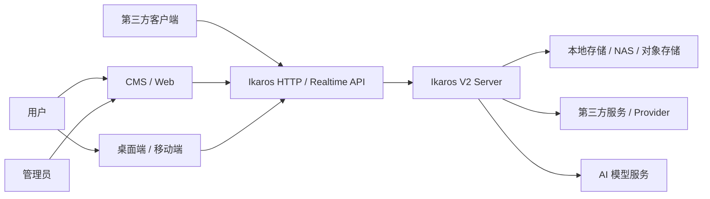
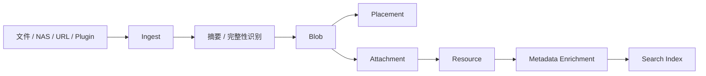
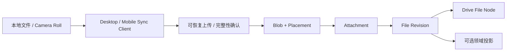
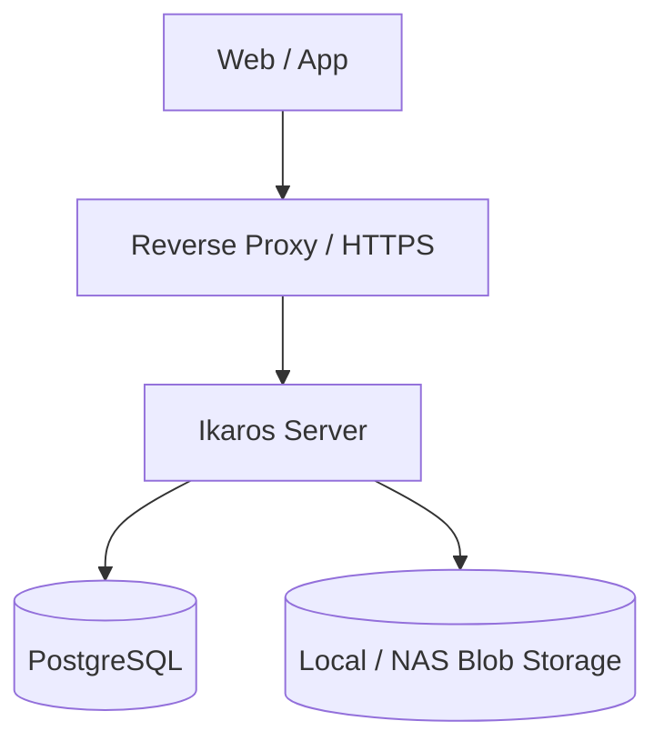
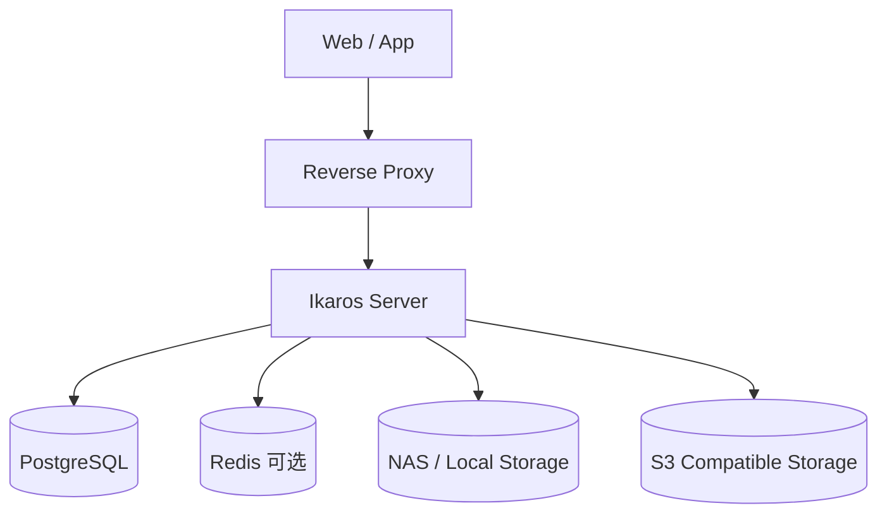
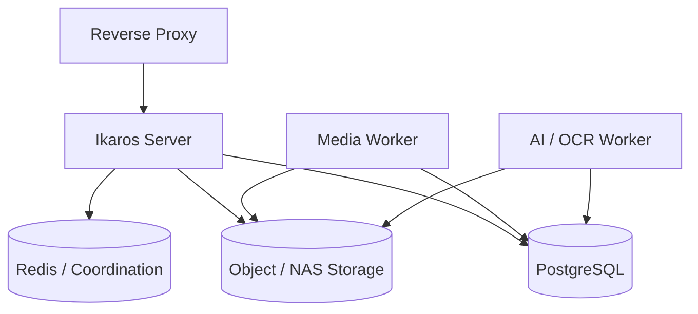

# Ikaros V2 系统概要设计

| 项目 | 内容 |
|---|---|
| 文档名称 | Ikaros V2 系统概要设计 |
| 适用版本 | Ikaros V2 |
| 文档版本 | v0.4 |
| 编写日期 | 2026-08-30 |
| 最后更新 | 2026-08-31 |
| 状态 | 草案（Draft） |
| 产品基线 | `Product-Requirements-Document.md` |

> 本文档定义 Ikaros V2 的系统级总体架构、子系统划分、核心技术边界、数据流、集成方式、安全模型、部署形态与演进原则。
>
> 本文档位于 PRD 与各子系统详细设计之间。PRD 回答“系统要做什么”，本文档回答“整个系统总体如何组织”，各子系统设计进一步回答“某个领域内部如何设计”。
>
> V2 是一次整体重构。V1 的代码、数据库表、API、目录结构和历史实现仅作为经验参考，不构成兼容性约束。

---

## 1. 文档目标与设计范围

Ikaros V2 不再只是一个围绕动画与本地媒体构建的内容管理系统，而是一个面向个人数字内容、知识、创作、效率、协作与自动化场景的自托管平台。

系统概要设计需要解决以下问题：

1. Ikaros V2 在逻辑上由哪些层和子系统组成。
2. 各子系统之间如何保持边界，并进行查询、命令、事件和自动化联动。
3. Resource、Attachment、Blob、Collection、Relation 等平台核心概念如何贯穿不同业务领域。
4. PostgreSQL、对象存储、缓存、搜索索引和分析数据分别承担什么职责。
5. Web、桌面端、移动端和第三方客户端如何访问同一套平台能力。
6. 后台任务、定时任务、插件、自动化与 AI 如何接入核心业务，而不绕过权限与领域规则。
7. 普通业务数据与高敏感 Secure Domain 数据如何使用不同安全边界。
8. 单机自托管部署如何保持简单，同时为后续扩展 Worker、多节点和外部基础设施保留演进空间。
9. 系统如何处理一致性、幂等、失败重试、审计、备份、恢复和可观测性。
10. 后续详细设计应该遵循哪些统一约束。

本文档不提前固定：

- 具体 Java 包名与类名；
- 最终数据库表名；
- 所有 REST API 的精确路径；
- 每个页面的 UI 结构；
- 每个算法的最终实现；
- 每个插件扩展点的最终 Java 接口签名。

这些内容应在领域详细设计、数据库设计、API 设计和交互设计中继续展开。

---

## 2. 总体设计目标

### 2.1 自托管优先

Ikaros V2 的主要运行模式仍然是用户自行部署。

系统必须优先支持：

- 单机 Docker / Docker Compose；
- 家庭服务器；
- NAS；
- 普通 Linux 服务器；
- 外置 PostgreSQL；
- 本地文件系统或对象存储；
- 反向代理后的 HTTPS 访问。

不能为了理论上的大规模分布式能力，使最常见的单机部署依赖大量基础设施组件。

### 2.2 数据自主

用户的 Resource、Attachment、Blob、Personal Drive 文件空间、文档、媒体、个人状态、创作数据与配置应由用户自己的 Ikaros 实例控制。

第三方服务只能作为：

- 元数据来源；
- 外部身份来源；
- 外部存储；
- AI Provider；
- 通知渠道；
- 插件集成；
- 自动化目标；
- 导入导出来源。

第三方平台不能成为 Ikaros 内部资源身份或业务状态的唯一真相源。

### 2.3 统一平台，专业体验

V2 使用统一 Resource 身份和通用平台能力，但不能把所有内容类型压缩成一套没有业务语义的通用 JSON 模型。

统一的是：

- 身份；
- 权限；
- 标签；
- 收藏；
- Collection；
- Relation；
- Attachment；
- 搜索；
- 分享；
- Activity；
- 生命周期；
- 通知；
- 自动化；
- 审计。

专业化的是：

- 动画与影视的作品、季、剧集、字幕、播放；
- 漫画的卷、章节、页和阅读模式；
- 小说与电子书的章节、排版和阅读进度；
- 音乐的艺术家、专辑、曲目和播放队列；
- 图片的相册、EXIF、预览与原图；
- Personal Drive 的文件树、File Revision、Trash、设备目录备份与文件同步；
- 文档的 Revision、协作和编辑；
- Productivity 的 Task、Goal、Project、OKR；
- Accounting 的 Ledger、Account、Transaction、Budget；
- Password Manager 与 Private Notes 的高敏感安全模型。

### 2.4 HTTP-first / HTTP-native

系统能力优先通过稳定的 HTTP API 暴露。

官方 Web、Flutter 客户端、插件、脚本和第三方客户端原则上都通过同一套公开能力访问系统。

实时协作、Room、播放同步、长时间任务进度等场景可以使用：

- WebSocket；
- SSE；
- WebRTC；
- 其他适合的实时协议。

但不能形成只有官方客户端才能调用的隐藏业务通道。

### 2.5 模块化单体优先

V2 初期采用：

> **模块化单体（Modular Monolith）作为主要服务形态，明确子系统边界，避免提前微服务化。**

逻辑上各子系统必须保持独立边界；部署上可以先运行在一个 Server 进程中。

这样可以同时获得：

- 自托管部署简单；
- 本地开发简单；
- 统一事务仍可在单一领域内部使用；
- 减少服务发现、分布式事务、消息中间件和运维成本；
- 通过公开契约保持未来可拆分能力。

后续若某些能力需要独立扩展，例如：

- 视频转码 Worker；
- OCR / AI Worker；
- 大规模索引任务；
- 归档恢复 Worker；
- 异步导入 Worker；

可以在不改变领域所有权的前提下拆出独立执行进程。

### 2.6 PostgreSQL-first

V2 的核心关系数据只面向 PostgreSQL 设计。

PostgreSQL 作为普通业务状态的主要真相源，允许合理使用：

- 事务；
- 外键；
- 唯一约束；
- JSONB；
- 数组；
- 全文检索；
- advisory lock；
- LISTEN / NOTIFY；
- CTE；
- 窗口函数；
- 部分索引；
- 表达式索引。

但任何高级能力都必须服务于清晰的领域约束，而不能为了技术炫技增加不可维护性。

### 2.7 主键统一使用 UUIDv7

Ikaros V2 的系统内部持久化实体主键统一使用 **UUIDv7**。

该规则适用于各业务与平台子系统中的核心实体，包括但不限于：

- Resource；
- Attachment；
- Blob；
- Collection；
- Relation；
- User / Role / Permission；
- Task / Goal / Project；
- Event / Activity；
- Background Task / Job Run；
- Share / Room；
- Plugin Registry；
- Automation Rule / Run；
- 其他具有独立生命周期的持久化实体。

统一规则如下：

1. PostgreSQL 中实体主键优先使用原生 `uuid` 类型，不以字符串类型保存 UUID。
2. 新增核心实体不得使用数据库自增整数、Snowflake ID、UUIDv4 或第三方平台 ID 作为主键。
3. UUIDv7 必须由统一的平台 ID Generator 产生；统一实现必须考虑同毫秒高并发、系统时钟回拨以及未来多节点同时生成等情况，避免各子系统自行选择不同 UUID 实现或生成策略。
4. UUIDv7 中包含时间有序特性，可以改善按创建顺序写入时的索引局部性，但 **主键本身不得替代 `created_at`、业务时间、排序号或版本号，也不得把 `ORDER BY id` 当作严格业务时间排序语义**。
5. API、Event、Command、Relation 与跨子系统契约中引用内部实体时，应使用同一个 UUIDv7 身份，不再额外引入只为接口层服务的数字 ID。
6. 第三方 Provider 的 ID 必须通过 External Identity 等映射模型保存，只能作为外部身份，不得成为 Ikaros 内部实体主键。
7. Blob 的内容摘要仍负责表达内容身份与去重语义；即使 Blob 实体拥有 UUIDv7 主键，也不能用 UUIDv7 替代内容 Hash。
8. 少数不属于独立实体身份的内部序号、Revision Number、排序位置、统计桶等值可以使用整数或其他适合的数据类型，但不得被提升为系统实体主键。

因此系统内部身份应保持：

```text
Internal Entity Identity
        ↓
      UUIDv7

External Provider Identity
        ↓
External Identity Mapping

Content Identity
        ↓
   Cryptographic Hash
```

三类身份语义必须分离。

### 2.8 统一时间与时区原则

Ikaros V2 对时间采用统一的系统级规则：

> **凡表示一个实际发生时刻、状态变化时刻、计划执行时刻或可比较时间点的数据，都必须以带时区语义的时间保存；任何客户端展示均根据应用配置的时区进行转换，应用默认时区为 UTC+8。**

统一规则如下：

1. PostgreSQL 中表示时间点的字段统一使用 `timestamptz`，禁止使用不带时区语义的 `timestamp without time zone` 保存事件时刻。
2. API 中时间点统一使用 ISO 8601 / RFC 3339 表达，并且必须显式包含 `Z` 或 UTC Offset；禁止传输无时区的 naive datetime。
3. 数据库存储负责保留正确的绝对时间点，展示层不得假定数据库中的文本形式就是最终展示时区。
4. Web、Flutter App 及其他官方客户端展示时间时，统一读取**应用配置时区**并进行转换；默认应用时区为 **UTC+8**。
5. Scheduled Job、Reminder、Calendar Rule、账期、统计自然日等依赖“当地墙上时间”的业务除了保存实际执行时间外，还必须保存或解析其时区上下文；未显式指定时使用应用配置时区。
6. Analytics 中“日 / 周 / 月”等时间窗口的切分默认按应用配置时区计算，而不是固定按照数据库会话时区或客户端本地时区计算。
7. 日志、Event、Audit、Trace 等跨系统时间必须携带完整时间点语义，便于不同节点、Worker 和外部系统之间进行准确关联。
8. 不得使用 UUIDv7 中的时间部分代替正式时间字段。

因此时间处理链路为：

```text
带时区的业务时间点
        ↓
PostgreSQL timestamptz
        ↓
API RFC 3339 / ISO 8601
        ↓
读取应用配置时区
        ↓
转换并展示

默认应用时区：UTC+8
```

### 2.9 Instance 与 Tenant 边界

Ikaros V2 的默认隔离和部署边界是一个 **Ikaros Instance**。

> **V2 默认不是 SaaS 多租户系统。一个 Ikaros Instance 可以拥有多个 User，但所有用户均处于同一个实例边界内。**

一个 Instance 统一拥有和管理：

```text
Ikaros Instance
├── Application Configuration
├── Users / Roles / Permissions
├── Resources / Collections / Relations
├── Personal Drive / File Sync
├── Attachments / Blobs / Storage
├── Plugins / Providers
├── Automation / Background Tasks
├── Search / Analytics
└── Application Timezone
```

统一规则如下：

1. V2 数据模型不得为了假设性的 SaaS 多租户场景，在所有业务表中机械增加 `tenant_id`。
2. 多 User 是实例内部的身份与授权问题，通过 User、RBAC、ACL、Share 等模型解决，不等同于多 Tenant。
3. Share、Room、外部访问 Token 等能力用于跨用户或对外协作，不创建新的 Tenant 边界。
4. Storage、Plugin、Application Timezone 等默认属于 Instance 级能力；若某项能力未来支持用户级覆盖，必须显式设计其优先级和隔离规则。
5. 如果未来确有 SaaS 或单实例多 Tenant 需求，应通过独立 ADR 和系统设计重新评估数据隔离、密钥、配额、索引、缓存、审计与运维模型，而不是在现有模型上隐式扩展。

### 2.10 统一配置模型与优先级

Ikaros V2 的配置必须具有明确来源、优先级、可变性和安全属性，不能让不同模块自行决定配置覆盖逻辑。

默认配置解析层级为：

```text
Built-in Default
        ↓
Configuration File / Environment
        ↓
Persistent Application Configuration
        ↓
Effective Configuration
```

其中部署或专项设计可以将特定启动参数声明为不可被运行时配置覆盖，但该例外必须显式定义。

每项系统配置至少需要明确以下元信息：

- 配置 Key；
- 数据类型；
- 默认值；
- 当前有效值来源；
- 是否允许运行时修改；
- 修改后是否立即生效；
- 是否需要重新加载子系统；
- 是否需要重启 Server；
- 是否属于 Secret；
- 是否允许进入 Export / Backup；
- 校验规则和可选取值范围。

统一原则：

1. Secret 不属于普通 Application Configuration，敏感值继续使用独立 Secret / Secure Credential 管理路径。
2. Application Timezone 属于 Instance 级 Persistent Application Configuration，默认值为 **UTC+8**。
3. 客户端不得维护一套与 Server 无关的“事实配置”；客户端本地配置只负责设备体验偏好，不得覆盖系统业务规则。
4. 配置修改必须通过受控 API / Command 进行，执行权限校验、参数校验和必要审计。
5. 影响安全、存储、网络、插件或数据一致性的配置修改应明确是否需要 Step-up Verification、重载或重启。
6. 配置导出必须遵守敏感数据规则，不能因为配置可备份或迁移就自动导出 Secret 明文。

---

## 3. 系统上下文

Ikaros V2 的外部参与者和系统边界如下：



### 3.1 系统内部负责

Ikaros Server 负责：

- 业务规则；
- 身份与权限；
- Resource 与 Attachment 管理；
- Personal Drive 文件空间、File Revision、Trash 与服务端同步状态；
- 存储编排；
- 搜索与索引；
- 插件；
- 自动化；
- 后台任务；
- 协作与 Room；
- 通知；
- 分析；
- 安全；
- 管理与运维。

### 3.2 客户端负责

客户端负责：

- 展示和交互；
- 本地状态与体验优化；
- 媒体播放；
- 漫画、小说、文档阅读；
- 部分离线缓存；
- Personal Drive 的本地目录选择、文件变化采集、Camera Roll 接入与传输执行；
- Secure Domain 中需要客户端持有密钥时的本地解锁与解密；
- 设备能力接入。

客户端不得成为跨设备业务状态的唯一真相源。Drive 的文件身份、Revision、Trash、冲突结果和远端同步事实由 Server 端领域状态权威决定。

### 3.3 Instance 边界

对外部客户端而言，一个 Ikaros Server 所代表的 Instance 是默认业务与配置边界。

客户端在建立会话后可以读取当前 Instance 的基本能力、应用时区和必要公开配置，但不得自行构造 Tenant 语义或假设不同用户属于不同租户。

---

## 4. 总体逻辑架构

```mermaid
flowchart TB
    subgraph Clients[客户端层]
        CMS[CMS / Web Console]
        FLUTTER[Flutter App]
        EXTCLIENT[第三方客户端]
    end

    subgraph Interface[接口层]
        HTTP[HTTP API]
        RT[WebSocket / SSE / Realtime]
        OPENAPI[OpenAPI / API Contract]
    end

    subgraph Application[应用与平台层]
        SECURITY[身份 / 权限 / 安全]
        RESOURCE[Resource / Collection / Relation]
        DRIVE[Personal Drive / File Sync]
        CONTENT[媒体 / 阅读 / 音乐 / 图片 / 创作]
        PRODUCTIVITY[效率规划]
        FINANCE[个人财务]
        SECUREAPP[Private Notes / Password Manager]
        COLLAB[分享 / 协作 / Room]
        SEARCH[搜索与发现]
        AIINTEL[AI 智能增强]
        ANALYTICS[统计与分析]
        ADMINOPS[平台管理与运维]
    end

    subgraph Integration[平台联动层]
        CAP[Capability]
        CMD[Command]
        EVT[Event]
        REL[Relation]
        AUTO[Automation]
        ACT[Activity]
        CTX[Context]
    end

    subgraph Common[通用平台能力]
        TASK[Background Task]
        NOTIFY[Notification]
        AUDIT[Audit]
        PLUGIN[Plugin Runtime]
        STORAGECORE[Attachment / Blob / Storage]
        SECURE[Secure Data Foundation]
    end

    subgraph Infra[基础设施层]
        PG[(PostgreSQL)]
        CACHE[(Redis 可选)]
        INDEX[(Search Index)]
        BLOB[(Filesystem / S3 / NAS)]
    end

    Clients --> Interface
    Interface --> Application
    Application --> Integration
    Application --> Common
    Integration --> Common
    Common --> Infra
```



系统逻辑上分为六层：

1. **客户端层**：Web、Flutter、多端与第三方客户端。
2. **接口层**：HTTP、实时协议、OpenAPI 与外部契约。
3. **业务与平台子系统层**：承载领域规则和业务真相。
4. **平台联动层**：负责跨领域稳定协作。
5. **通用平台能力层**：存储、后台任务、通知、插件、安全基础等共享能力。
6. **基础设施层**：PostgreSQL、缓存、索引和物理存储。

---

## 5. 子系统划分

### 5.1 核心内容资源子系统

核心内容资源子系统负责 Resource 的统一身份与通用组织能力。

主要对象包括：

- Resource；
- Resource Type；
- Title / Alias；
- Metadata；
- Metadata Provenance；
- External Identity；
- Collection；
- Tag；
- Relation；
- Lifecycle；
- User State；
- Favorite；
- Rating；
- Progress；
- History。

该子系统回答：

> “这是什么内容，它如何被组织，它和其他对象是什么关系？”

它不直接承担 Blob 字节存储。

### 5.2 媒体子系统

负责：

- 动画；
- 电视剧；
- 电影；
- 通用视频；
- Season / Episode；
- 可播放版本；
- 音轨；
- 字幕；
- 播放历史；
- 播放进度；
- 派生媒体；
- 转码与媒体分析任务。

媒体子系统拥有媒体领域规则，但实际内容仍通过 Attachment / Blob Storage 管理。

### 5.3 阅读子系统

负责：

- 漫画作品；
- 卷；
- 章节；
- 页面；
- 小说；
- 电子书；
- 阅读布局；
- 阅读方向；
- 阅读进度；
- 继续阅读。

### 5.4 音乐子系统

负责：

- Artist；
- Album；
- Track；
- 音频版本；
- 播放队列；
- 播放历史；
- 播放进度；
- 歌词与封面。

### 5.5 图片与相册子系统

负责：

- 图片 Resource；
- Album / Collection；
- EXIF 与媒体信息；
- 缩略图；
- 预览图；
- 原图访问；
- 图片派生版本；
- 时间、地点和标签组织。

### 5.6 内容创作、文章与文档子系统

负责：

- Article；
- Blog Post；
- Column；
- Document；
- Revision；
- Draft；
- Publish State；
- 文档附件；
- 版本历史；
- 协作者；
- 内容编辑。

普通文档与 Private Notes 必须明确分离。

普通 Document 可以使用服务器端正常持久化、搜索和协作能力；Private Notes 属于 Secure Domain，采用更严格的密文边界。

### 5.7 Productivity / Planning 子系统

负责个人效率与计划场景：

- Task；
- Project；
- Goal；
- Milestone；
- Habit；
- OKR；
- Calendar Context；
- Reminder；
- Progress；
- Review。

Productivity Task 是用户业务对象，不得与系统 Background Task 或 Scheduled Job 混为一谈。

### 5.8 Personal Finance / Accounting 子系统

负责：

- Account；
- Ledger；
- Transaction；
- Category；
- Budget；
- Asset；
- Liability；
- Statement；
- Reconciliation；
- Report。

普通账本数据默认仍属于常规业务数据，以支持查询、统计和报表。

银行 Token、Secret 等敏感凭据必须通过受保护的 Secret Reference / Password Manager 管理，而不是作为普通配置明文保存。

### 5.9 Private Notes 子系统

Private Notes 属于 Secure Domain。

其核心目标不是普通文档编辑，而是：

- 服务端无法默认看到内容明文；
- 持久化副本保持密文；
- 支持安全解锁；
- 支持密钥版本；
- 支持安全备份与恢复；
- 禁止普通搜索索引泄露明文。

### 5.10 Password Manager 子系统

Password Manager 属于最高敏感级别之一，主要保存：

- 登录凭据；
- Secret；
- Secure Item；
- API Key；
- Token；
- 受保护字段；
- 安全附件。

该子系统必须通过 Security Subsystem 与 Secure Data Foundation 使用受控密码学能力。

### 5.11 分享、协作与 Room 子系统

负责：

- Share；
- Share Token；
- ACL；
- 协作者；
- 评论与协作上下文；
- Room；
- Room Member；
- Room Event；
- 播放状态同步；
- 临时共享队列。

Room 主要同步状态、成员和事件，不默认充当媒体转发服务器。

### 5.12 搜索与发现子系统

负责：

- Resource 检索；
- 多标题检索；
- Metadata 检索；
- Tag / Collection 检索；
- 文档全文检索；
- 搜索建议；
- 排序与过滤；
- 语义检索扩展；
- 索引重建；
- 权限感知搜索。

搜索索引是派生数据，不是业务真相源。

### 5.13 AI 智能增强子系统

AI 是横向平台能力，不是独立聊天孤岛。

负责：

- 模型 Provider；
- Model Registry；
- Prompt / Tool 管理；
- Embedding；
- RAG；
- 多模态理解；
- 元数据候选生成；
- 摘要；
- 创作辅助；
- 自然语言搜索；
- Agent；
- 智能自动化。

AI 只能调用已有 Capability / Command 完成业务动作，不能绕过业务校验直接写数据库。

### 5.14 Data Analytics / Statistics 子系统

负责统一事实、聚合、指标、趋势和报表。

数据流原则：

```text
业务事实
  ↓
Event / Activity / Snapshot
  ↓
Fact
  ↓
Aggregate
  ↓
Metric
  ↓
Dashboard / Report
```

Analytics 数据属于派生数据，不能反过来成为业务状态真相源。

### 5.15 Platform Administration / Operations 子系统

负责：

- User；
- Role；
- Permission；
- Session；
- Parameter；
- Dictionary；
- Menu；
- Announcement；
- Notification；
- Operation Log；
- Login Log；
- Security Event；
- Scheduled Job；
- Job Run；
- Health；
- Metrics；
- Alert；
- 在线用户。

菜单仅是导航展示，不是权限源。

### 5.16 Plugin 子系统

插件用于扩展平台，而不是获得无边界的内部数据库访问权。

插件可能扩展：

- Metadata Provider；
- 内容导入器；
- Storage Provider；
- Notification Provider；
- AI Provider；
- Automation Trigger / Action；
- Search Enricher；
- External Identity Provider；
- Parser；
- Background Task Handler。

插件执行任何业务修改时仍需进入目标子系统的公开 Command / Capability。

### 5.17 Personal Drive / File Synchronization 子系统

Personal Drive 是正式的一级业务子系统，负责“用户可理解的文件空间与文件同步语义”。

主要拥有：

- Drive Space；
- Drive Node / File / Folder；
- 稳定文件身份与父子关系；
- File Revision / Current Revision；
- Trash / Restore / Permanent Delete 请求；
- Special Folder；
- Drive Quota / Logical Usage Projection；
- Sync Binding；
- Local Item / Remote Node Mapping；
- 文件级 Sync State；
- Conflict / Conflict Copy；
- Camera Backup 的文件侧状态；
- Drive Command / Query / Event 契约。

该子系统不拥有：

- Blob Placement、Bucket、Object Key 或物理文件路径；
- 通用 Device Registration、Change Feed、Sync Cursor Runtime 与 Pending Mutation Envelope；
- Photo 的 EXIF、Timeline、Album；
- Media 的播放、转码、字幕领域模型；
- Document 的协同编辑语义。

其跨域关系必须保持：

```text
Drive File Node
      ↓ current revision
File Revision
      ↓
Attachment
      ↓
Blob
      ↓
Placement / Storage Provider
```

以及：

```text
Offline / Device Sync Runtime
      ↓ 提供可靠传播、Cursor、Pending Mutation
Personal Drive
      ↓ 定义文件树、Revision、同步策略与冲突语义
Photo / Media / Document
      ↓ 可选领域投影
```

核心规则：

1. **Drive Node ID ≠ Path**：路径是用户组织语义，不是内容身份。
2. **File Revision 不可变**：覆盖写必须创建新 Revision，不原地改写 Blob。
3. **Drive File ≠ Attachment / Blob**：文件空间身份、业务内容对象和实际字节身份分离。
4. **Backup Mode ≠ Two-way Sync**：单向备份默认不得传播远端删除去破坏本地原始数据。
5. **Sync Runtime ≠ Drive Conflict Resolver**：通用同步基础设施负责可靠传播，Drive 负责文件级合并与冲突判断。
6. **Camera Backup Success ≠ Photo Projection Success**：原始文件保存和照片专业入库必须分别可观测。
7. **Trash / Revision Retention ≠ Blob GC**：Drive 生命周期不能直接绕过 Storage 引用检查触发物理删除。
8. **Share 不复制文件所有权**：Drive File / Folder 可以进入统一 ACL / Share，但授权不创建第二份 Blob。

---

## 6. 平台核心模型

### 6.1 Resource

Resource 表达逻辑内容身份。

Resource 的职责是：

> 表达“这是什么”。

Resource 不负责表达物理字节当前放在哪个磁盘或对象存储桶。

### 6.2 Attachment

Attachment 是 Resource 可关联的业务内容对象。

例如：

- 视频；
- 音频；
- 字幕；
- 封面；
- 漫画页；
- 电子书；
- 文档附件；
- 压缩包；
- 导出包。

Attachment 表达业务用途、媒体类型、来源与关系。

### 6.3 Blob

Blob 表达实际内容及其内容身份。

Blob 通过摘要、大小和完整性信息支持：

- 内容寻址；
- 完整性校验；
- 去重；
- 多副本；
- 迁移；
- 归档；
- 恢复。

### 6.4 Blob Placement / Replica

Blob Placement 表示一个 Blob 的具体物理位置。

```text
Resource
  ↓
Attachment
  ↓
Blob
  ├── 本地文件系统副本
  ├── NAS 副本
  ├── S3 热存储副本
  └── 冷归档副本
```

一个 Blob 可以同时拥有多个副本。

### 6.5 Collection

Collection 用于逻辑组织 Resource，可以表达：

- 媒体库；
- 播放列表；
- 阅读列表；
- 收藏夹；
- 专题；
- 用户自定义集合；
- 文件夹式组织。

### 6.6 Relation

Relation 用于表达长期、明确、可查询的对象关系。

例如：

- Episode 属于 Series；
- Chapter 属于 Book；
- Resource 是另一个 Resource 的前传；
- Attachment 是 Resource 的封面；
- Derived Attachment 来源于 Original Attachment；
- Task 与 Resource 相关；
- Room 当前上下文为某 Resource。

Relation 必须有明确类型，不能只保存自由文本。

### 6.7 External Identity

External Identity 用于将内部 Resource 与第三方平台映射。

```text
Resource
  ├── Bangumi / 12345
  ├── TMDB / 67890
  └── Provider-X / abc
```

第三方 ID 永远不是 Ikaros Resource 的内部主键。

### 6.8 Metadata Provenance

重要元数据必须能够追踪来源：

- 用户人工输入；
- 文件扫描；
- 导入任务；
- Metadata Provider；
- 插件；
- AI；
- 系统生成。

用户明确确认或修改的数据默认具有更高优先级，自动同步不得无提示覆盖。

### 6.9 Drive Node / File Revision

Drive Node 表达用户文件空间中的稳定节点身份；File Revision 表达某个文件节点在某一时刻已经提交的不可变内容版本。

```text
Drive Space
  ↓
Drive Node (File / Folder)
  ↓ File only
File Revision
  ↓
Attachment
  ↓
Blob
```

统一原则：

- Folder 只表达组织结构，不持有 Blob；
- Move / Rename 只改变组织关系，不改变 Drive Node 身份；
- 文件内容替换产生新的 File Revision；
- Path 由父子关系和名称推导，不作为稳定 ID；
- 同一 Blob 可以被不同 Drive File Revision 或其他领域 Attachment 复用，物理去重不等于业务对象合并；
- Drive File 可以保持为普通文件，也可以通过显式领域投影进入 Photo / Media / Document 等专业 Resource。

---

## 7. 子系统边界与联动模型

V2 的核心规则是：

> **一个子系统拥有自己的业务状态，其他子系统不能绕过它直接修改其内部数据。**

跨系统联动统一使用以下模型。

| 模型 | 用途 |
|---|---|
| Capability | 同步查询当前必须得到的结果 |
| Command | 请求目标子系统执行状态变更 |
| Event | 广播“某件事已经发生” |
| Relation | 保存长期对象关系 |
| Automation | 根据触发条件编排跨系统动作 |
| Activity | 保存用户或系统行为时间线 |
| Context | 表达对象当前所处的跨系统上下文 |

### 7.1 Capability

用于同步读取或校验。

例如：

- 查询当前用户是否可以读取某 Resource；
- 查询某 Blob 是否存在可用副本；
- 查询当前 Room 成员；
- 查询 Resource 基础摘要。

### 7.2 Command

用于请求目标子系统改变状态。

例如：

```text
Automation
  ↓
CompleteTaskCommand
  ↓
Productivity
  ↓
校验
  ↓
Task Completed
```

调用者不能直接修改 Productivity 的 Task 表。

### 7.3 Event

用于传播已经发生的事实。

例如：

- ResourceCreated；
- AttachmentImported；
- BlobReplicaLost；
- DriveFileRevisionCommitted；
- DriveNodeMoved；
- DriveSyncConflictDetected；
- TaskCompleted；
- DocumentPublished；
- RoomCreated；
- UserLoggedIn。

Event 消费者不得假定只有自己一个消费者。

### 7.4 可靠事件

关键 Event 不能依赖“进程内发布成功就算成功”。

对于影响以下场景的事件：

- 搜索索引；
- Analytics；
- Automation；
- Notification；
- Storage 迁移；
- 审计；

应使用数据库事务内记录的 Outbox / Durable Event 机制，确保业务提交成功后事件不会因进程崩溃而静默丢失。

推荐流程：

```text
业务事务
  ├── 更新业务状态
  └── 写入 Outbox Event
        ↓
事件分发器
        ↓
消费者
        ↓
幂等处理
```

### 7.5 最终一致性

跨子系统默认采用最终一致性。

例如：

```text
Resource 修改完成
  ↓
立即返回成功
  ↓
异步更新 Search Index
  ↓
异步更新 Analytics
  ↓
异步触发 Automation
```

不应为了让搜索、统计、通知和自动化在同一个数据库事务中完成，而建立一个跨全系统的大事务。

---

## 8. 数据架构

### 8.1 数据分层

Ikaros V2 的数据按职责分为：

```text
业务真相数据
  → PostgreSQL

内容字节
  → Blob Storage

缓存数据
  → 内存 / Redis / 本地缓存

搜索派生数据
  → Search Index

统计派生数据
  → Analytics Fact / Aggregate

高敏感数据
  → Secure Data Foundation 管理的密文
```

### 8.2 PostgreSQL

PostgreSQL 保存：

- Resource；
- Collection；
- Relation；
- Attachment 元数据；
- Blob 元数据；
- Placement 状态；
- Personal Drive 的 Drive Space / Node / File Revision / Trash / Sync Binding / Conflict 等领域状态；
- 用户；
- 权限；
- 业务状态；
- Task；
- Job；
- Event Outbox；
- Audit；
- Plugin Registry；
- Automation Rule；
- 其他普通领域数据。

所有具有独立实体身份的核心记录使用 PostgreSQL 原生 `uuid` 类型保存 UUIDv7 主键；外部平台 ID、内容 Hash、Revision Number 与排序序号保持各自独立语义，不得替代实体主键。

凡表示真实时间点的数据库字段统一使用 `timestamptz`；数据库 Schema 中不得为了开发便利将真实业务时间退化为无时区 `timestamp`。

#### 8.2.1 实体公共字段约定

具有独立生命周期的普通持久化实体原则上统一包含以下公共字段：

```text
id           uuid / UUIDv7
created_at   timestamptz
updated_at   timestamptz
version      bigint
```

根据领域需要可以增加：

```text
created_by   uuid / UUIDv7
updated_by   uuid / UUIDv7
deleted_at   timestamptz
```

统一约束：

- `id` 表达实体身份；
- `created_at`、`updated_at` 表达正式时间语义，不能从 UUIDv7 临时推导后替代；
- `version` 用于需要乐观并发控制的实体；
- `created_by`、`updated_by` 只在业务或审计确实需要时保存；
- `deleted_at` 仅用于采用软删除语义的实体；
- 纯关联表、中间表、统计桶、不可独立寻址的 Value Object 不要求机械复制全部公共字段，应按实际生命周期设计。

#### 8.2.2 时间字段与应用时区

数据库中的时间点必须保持带时区语义，应用配置提供统一的展示和业务默认时区。

应用时区规则：

- 应用必须提供统一时区配置；
- 默认值为 **UTC+8**；
- Server、CMS、Flutter App 对同一业务时间的默认展示必须遵循该配置；
- 用户设备当前本地时区不得静默覆盖应用配置时区；
- 如果未来支持用户级时区覆盖，必须作为显式产品能力设计，而不是由客户端自行猜测；
- 统计自然日、计划任务、提醒、日历和账期等涉及本地时间边界的能力必须使用同一时区规则。

#### 8.2.3 Schema 与 Migration 所有权

数据库采用单一 PostgreSQL 并不意味着数据库表没有领域所有权。

统一规则：

1. 每个子系统拥有自己领域数据结构及对应 Schema Migration 的设计责任。
2. 其他子系统不得直接通过私有 Repository、SQL 或对方内部表结构修改其状态。
3. 跨子系统关系应优先通过公开契约和稳定实体 ID 建立，不应创建要求调用方理解对方内部 Schema 的强耦合数据库导航关系。
4. 所有生产 Schema 变更必须通过版本化 Migration 执行，禁止依赖 ORM / Framework 在生产环境自动建表或自动修改 Schema。
5. Migration 采用可审计、可重复部署、整体向前演进的策略；生产升级流程不得把自动执行破坏性 Rollback 作为主要恢复方式。
6. 大规模数据回填、内容迁移、索引重建等长时间操作应与短事务 DDL Migration 分离，并优先通过 Background Task 或专用数据迁移流程执行。
7. Schema Version 属于系统兼容性的一部分，升级前后必须能够判断当前数据库是否处于受支持版本。

### 8.3 Blob Storage

Blob Storage 可以由不同 Provider 实现：

- Server Local Filesystem；
- NAS；
- S3 Compatible Object Storage；
- 远程对象存储；
- 冷归档 Provider。

业务模块不得把一个物理路径当作 Attachment 的永久身份。

### 8.4 Redis

Redis 不是强制依赖。

可用于：

- 热点缓存；
- 短期 Session 辅助；
- 分布式锁；
- Rate Limit；
- 临时状态；
- 实时协作加速；
- 多实例消息辅助。

任何必须长期保存的数据都不能只存在 Redis。

### 8.5 Search Index

Search Index 保存用于快速检索的派生文档。

索引内容必须可从业务数据重建。

当索引损坏时：

```text
业务数据仍然正确
  ↓
执行 Rebuild Index
  ↓
重新生成索引
```

### 8.6 Analytics 数据

Fact、Aggregate、Metric 结果用于统计与报表。

聚合结果必须具有：

- 数据来源；
- 指标定义；
- 时间语义；
- 版本；
- 可重建路径。

涉及自然日、周、月、季度等统计窗口时，默认依据应用配置时区进行边界切分，默认应用时区为 UTC+8。

---

## 9. Attachment 与存储总体流程

### 9.1 导入流程

推荐通用导入流程：



### 9.2 去重

去重基于 Blob 内容身份，而不是文件名或路径。

两个不同 Attachment 可以引用同一个 Blob。

### 9.3 派生内容

转码、缩略图、OCR、封面提取、波形、格式转换等生成的新内容必须创建 Derived Attachment，并保留来源关系。

```text
Original Attachment
  ↓ derives
Derived Attachment
```

派生内容可重建，因此其生命周期策略可以与原始内容不同。

### 9.4 可用性状态

系统需要向客户端提供统一可理解的可用性状态，例如：

- Available；
- Cached；
- Remote；
- Processing；
- Restoring；
- Missing；
- Corrupted。

客户端不能只得到一个模糊的“404”或“播放失败”，而应能解释内容为什么当前不可用。

### 9.5 Personal Drive 文件写入与设备备份流程

Personal Drive 的文件写入必须复用 Attachment / Blob Storage，而不是维护第二套物理文件存储体系。

基础流程：



系统级边界：

1. 上传完成只有在 Storage 完整性确认和 Drive Revision 原子提交完成后，才能成为可见的远端文件版本。
2. 断点续传、分片和临时上传状态不等于正式 File Revision。
3. 单向 Backup 与双向 Sync 必须使用不同同步策略，不能用一套删除传播规则处理所有场景。
4. 设备侧变化检测和本地路径只作为同步输入；服务端 Drive Node ID、Revision 与稳定 Cursor 才是跨设备收敛依据。
5. Photo / Media / Document 投影失败不得回滚已经成功保存的 Drive 原始文件；投影作为独立可重试状态处理。
6. Drive 删除、Revision 清理和物理 Blob GC 继续遵守 Attachment / Blob Storage 的引用与保留规则。

---

## 10. API 总体设计

### 10.1 API 是产品能力边界

API 不应简单镜像数据库 CRUD。

例如：

错误方向：

```text
PATCH /task/{id}
body: { status: COMPLETED }
```

如果完成任务包含业务规则，更合适的是表达业务动作：

```text
Complete Task Command
```

REST 路径和 HTTP 方法在 API 详细设计中确定，但必须保留业务语义。

### 10.2 API 统一原则

API 应统一：

- 身份认证；
- Permission 检查；
- Resource ACL；
- Pagination；
- Sort；
- Filter；
- Error Model；
- Request ID；
- Trace ID；
- Idempotency Key；
- 版本策略；
- 时间与时区格式；
- 审计上下文。

所有 API 时间点必须显式带时区信息，并遵循本概要设计的统一时间与时区原则。

### 10.3 幂等

以下类型接口必须考虑幂等：

- 导入；
- 上传完成；
- Webhook；
- Automation Action；
- 外部同步；
- 支付或账务导入；
- 重试型 Background Task；
- Event Consumer。

### 10.4 实时接口

实时协议用于：

- Room；
- 文档协作；
- Task 进度；
- 通知推送；
- 在线状态；
- 系统健康更新。

实时协议只是传输方式，业务权限规则仍由目标子系统负责。

### 10.5 OpenAPI

核心 HTTP API 应生成或维护统一 OpenAPI Contract，供：

- CMS；
- Flutter App；
- SDK；
- Plugin；
- 第三方开发者；
- 自动化测试。

### 10.6 契约版本与兼容性

V2 必须明确区分以下版本，而不是只维护一个模糊的“系统版本”：

```text
Database Schema Version
API Version
Plugin API Version
Event Contract Version
Export Format Version
```

统一原则：

1. **Database Schema Version** 用于判断数据库是否可以被当前 Server 安全启动和迁移。
2. **API Version** 用于控制客户端与 Server 的公开接口兼容关系。
3. **Plugin API Version** 用于声明插件依赖的公共扩展契约，插件不得通过内部 Java 类型规避版本控制。
4. **Event Contract Version** 用于标识可被 Automation、Analytics、Plugin、Worker 或其他消费者长期消费的 Event Schema。
5. **Export Format Version** 用于保证用户导出数据未来仍然可以被识别、迁移或导入。
6. 对外契约优先采用向后兼容的增量演进方式；删除字段、改变字段含义、改变默认值语义等破坏性修改必须进入明确的版本升级或弃用流程。
7. Event 一旦成为公开或跨子系统稳定契约，不得静默改变既有字段语义；消费者必须能够识别其版本。
8. 弃用能力必须提供可识别的 Deprecated 状态和合理迁移窗口，不能在无版本信号的情况下直接消失。

### 10.7 Capability Discovery

由于不同 Ikaros 实例可能启用不同插件、Provider、Worker 与可选基础设施，客户端不能通过“调用失败”来猜测服务器具备哪些能力。

Server 应提供统一 Capability Discovery 能力，用于暴露当前实例可用的产品与运行能力，例如：

```text
drive.enabled
drive.device_backup.available
drive.two_way_sync.available
ai.enabled
room.enabled
secure_notes.enabled
media.transcode.available
storage.archive.available
search.semantic.available
plugin.<key>.enabled
```

Capability Discovery 的原则：

- 表达“当前实例是否具备某能力”，不替代 Permission / ACL；
- 能力可用不代表当前用户有权调用；
- 客户端可以据此决定是否显示入口、按钮、配置项或降级提示；
- Server 仍必须在真实 API 调用时进行完整权限与状态校验；
- Capability Key 应形成稳定命名约定，避免客户端绑定内部模块实现细节。

### 10.8 空值、未知值与枚举演进

V2 的 API、Event、Export Format 与内部领域契约必须明确区分“没有值”和“值的语义未知”，避免用 `null` 承担所有状态。

以下语义不得混用：

```text
null
≠
unknown
≠
not_applicable
≠
empty
```

建议语义如下：

- `null`：当前没有记录该可空字段的值，具体业务含义由字段契约定义；
- `unknown`：该属性在业务上存在，但当前无法确定其值；
- `not_applicable`：该属性对当前对象不适用；
- `empty`：值本身存在但为空，例如空列表、空集合，是否允许空字符串由字段契约定义。

统一规则：

1. 当 `unknown` 或 `not_applicable` 对业务有明确意义时，应通过显式状态、枚举或结构表达，不能一律压缩成 `null`。
2. PATCH / Partial Update 类接口中“字段未出现”和“字段显式为 `null`”必须具有可区分语义；前者通常表示不修改，后者仅在契约允许时表示清空。
3. API 与 Event 的枚举使用稳定字符串 Code，不使用编程语言或数据库内部 ordinal 作为公共值。
4. 面向读取的客户端、Plugin 与 Event Consumer 必须允许未来出现当前版本未知的枚举值，并提供 Unknown / Unsupported 的安全降级，而不是反序列化失败或崩溃。
5. Server 在写入接口收到不受支持的枚举值时不得静默映射为默认值，应返回明确校验错误，除非该接口契约专门允许扩展值透传。
6. 增加新的枚举值通常视为兼容性演进；删除或改变既有枚举值语义属于破坏性变更，必须遵循契约版本策略。
7. Search、Analytics、AI 和 Export 在遇到未知值时必须保留“未知”的事实，不能为了方便统计而擅自归入其他业务分类。

---

## 11. 后台执行体系

V2 中至少存在三种“任务”概念，必须严格区分。

### 11.1 Productivity Task

用户的待办、计划或目标任务。

### 11.2 Background Task

系统一次异步执行实例，例如：

- 导入；
- Personal Drive 目录扫描、备份、同步与冲突修复；
- Camera Backup 批量传输；
- 转码；
- OCR；
- 索引重建；
- 数据迁移；
- Blob 校验；
- 备份；
- 恢复；
- AI 批处理。

Background Task 应具备：

- 状态；
- 进度；
- 创建者；
- 参数摘要；
- 结果摘要；
- 错误；
- 重试；
- 取消；
- 超时；
- 日志关联；
- 幂等键。

### 11.3 Scheduled Job

定义“什么时候自动启动某个系统动作”。

例如：

- 每天校验 Storage；
- 每晚备份；
- 定期同步元数据；
- 定期清理缓存；
- 定期执行统计聚合。

Scheduled Job 触发后通常产生一个 Background Task / Job Run。

Scheduled Job 若按固定当地时间表达执行计划，必须显式关联时区；没有单独指定时使用应用配置时区，默认 UTC+8。

### 11.4 Worker 演进

初期 Background Task 可以在主 Server 中执行。

资源消耗大的任务必须允许后续迁移到独立 Worker：

```text
Ikaros Server
  ↓ 创建任务
PostgreSQL / Queue Contract
  ↓
Worker
  ↓ 执行
更新 Task 状态
```

Worker 不能因此获得绕过业务权限和状态机的数据库写入特权。

### 11.5 异步执行失败、取消与重试语义

Background Task、Job Run、Automation Run、Webhook Delivery、异步 Plugin Action 等执行模型必须使用一致的状态语义，不能把所有“没有成功”的情况都表示为 Failed。

基础终态和运行态至少应能够表达：

```text
Pending
Running
Succeeded
Failed
Cancelled
TimedOut
```

如果实现需要表达 `Queued`、`Cancelling`、`Retrying`、`Throttled` 等中间状态，可以在专项设计中扩展，但不得破坏以下系统级语义：

1. **Failed**：本次执行因错误终止；错误还需要区分 Retryable 与 Non-retryable。
2. **Cancelled**：执行因用户、管理员或系统明确取消而终止，不等价于失败，默认不得进入普通失败自动重试。
3. **TimedOut**：超过允许执行时间而终止，不等价于用户取消；是否允许重试由任务策略和错误分类决定。
4. **Succeeded**：本次执行达到定义的成功条件；仅“进程没有抛异常”不一定代表业务成功。
5. 等待资源、并发槽位或 Rate Limit 时，可以保持 Pending/Queued 并记录 Wait Reason，不应伪装成 Failed。
6. 每次 Retry 应视为同一逻辑执行下的新 Attempt，保留 Attempt Number、开始/结束时间与本次错误，避免覆盖历史失败信息。
7. Retry 必须继承原始 `trace_id`、actor、permission context、idempotency context 与业务关联 ID，同时为新 Attempt 生成可追踪的执行身份。
8. Cancellation 应尽可能协作式执行；如果外部 Provider 或底层操作无法立即终止，需要区分“已请求取消”和“已经结束”。
9. 不允许无限重试；重试次数、Backoff、Dead Letter / 人工处理路径应由任务类型明确。
10. 系统重启后必须能够识别遗留 Running 状态，并根据任务语义恢复、重试或标记异常，而不是永久保持 Running。

---

## 12. 搜索总体设计

### 12.1 搜索对象

统一搜索可以覆盖：

- Resource；
- 标题与别名；
- Description；
- Tag；
- Collection；
- External Identity；
- Document；
- Article；
- Metadata；
- 允许索引的 Attachment 文本；
- AI Embedding。

### 12.2 权限感知

搜索结果不得泄露当前用户无权访问的对象。

原则：

> 搜索可见集合不得大于普通 API 可见集合。

### 12.3 索引一致性

搜索使用异步索引，因此允许短暂最终一致性。

用户刚修改 Resource 后，详情页可以立即看到新值，而搜索结果可能在极短时间后更新。

### 12.4 Secure Domain

Private Notes、Password Manager 等 Secure Domain 数据禁止直接进入普通明文搜索索引。

如果未来提供 Secure Search，必须在对应安全设计中明确：

- 索引在哪一侧构建；
- 索引是否加密；
- 查询时如何解锁；
- 服务端能看到哪些信息。

---

## 13. 身份、权限与安全架构

### 13.1 三层安全判断

必须区分：

```text
Authentication
确认是谁

Authorization
确认是否有权限

Step-up Verification
确认当前认证保证等级是否足够执行高风险操作
```

完整高风险操作判断可以表示为：

```text
已认证
  AND
拥有 Permission / ACL
  AND
当前验证等级满足要求
  AND
安全策略允许
  ↓
执行操作
```

### 13.2 Platform RBAC 与 Resource ACL

两套模型解决不同问题。

Platform RBAC：

- 管理用户；
- 管理角色；
- 修改系统配置；
- 查看审计；
- 操作 Scheduled Job。

Resource ACL：

- 能否查看某个 Resource；
- 能否编辑某个 Document；
- 能否下载某个 Attachment；
- 能否读取、写入或分享某个 Drive File / Folder；
- 能否管理某个 Collection；
- 能否加入某个 Room。

### 13.3 Secret 与普通配置分离

普通 Parameter 不得保存：

- Password；
- Access Token；
- Secret Key；
- Storage Credential；
- Plugin Secret；
- AI Provider Secret。

这些值必须进入独立 Secret / Secure Credential 管理路径。

### 13.4 Secure Data Foundation

Secure Data Foundation 只服务于明确声明的 Secure Domain。

```text
普通业务
  ↓
正常 PostgreSQL / Blob Storage

Secure Domain
  ↓
Secure Data Foundation
  ↓
应用层加密
  ↓
密文持久化
```

不能因为系统存在 Private Notes，就把所有普通 Resource、媒体和账本都强制改造成 E2EE。

### 13.5 审计

以下操作必须进入安全审计：

- 登录与异常登录；
- 权限修改；
- Role 修改；
- 高风险配置修改；
- Secret 访问；
- Secure Domain 解锁；
- 密钥轮换；
- 永久删除；
- 大规模批处理；
- 备份恢复；
- 插件安装与权限变化。

### 13.6 数据敏感等级

Secure Domain 解决最高敏感场景的密文边界，但系统还需要对普通数据建立统一的敏感等级概念，以约束数据在日志、搜索、AI、缓存、分析与导出等横向能力中的传播。

建议系统级等级为：

| 等级 | 典型含义 |
|---|---|
| Public | 明确允许公开访问或公开发布的数据 |
| Shared | 仅允许特定用户、组、Share 或 ACL 范围访问的数据 |
| Private | 默认仅 Owner 或明确授权主体访问的普通私有数据 |
| Sensitive | 需要额外最小化、脱敏、访问审计或传播限制的敏感业务数据 |
| Secure Domain | 必须进入 Secure Data Foundation 管理的高敏感密文领域 |

统一原则：

1. 敏感等级描述数据处理约束，不替代 Permission / ACL；即使是 Public 数据的修改操作仍然需要授权。
2. Secure Domain 不只是一个标签，而是触发独立密码学、持久化、缓存、索引与解锁边界。
3. Password、Token、Secret Key、Credential 等 Secret 默认不得作为普通 Sensitive 字段散落在业务模型中，应进入专门 Secret / Secure Credential 路径。
4. Application Log、Audit Log、Trace 和 Error Message 必须执行数据最小化；不得为了排障直接记录 Secret、Secure Domain 明文或完整敏感 Payload。
5. Search Index 只能索引当前数据等级和权限策略允许被检索的内容，并且搜索结果仍需权限感知。
6. Analytics 应优先消费最小必要事实；如果业务指标不需要原始敏感字段，就不得把原始字段复制进 Fact / Aggregate。
7. AI Context、Embedding 和 RAG 必须继承数据等级与用户权限；禁止把当前用户无权访问或策略禁止外发的数据发送给 AI Provider。
8. Cache 必须遵守相同敏感等级；Secure Domain 明文不得进入普通共享缓存，Sensitive 数据应避免出现在不具备隔离能力的缓存键和值中。
9. Export / Import 必须保留数据权限和安全语义；Sensitive 与 Secure Domain 数据不能因为进入导出流程而自动降级。
10. Plugin 与 Automation 读取高等级数据时必须通过声明权限和受控 Capability，不能因为运行在 Server 内部而获得默认访问权。

---

## 14. 自动化架构

Automation 用于表达：

> “当某个事件或条件发生时，以某个主体的权限执行一个或多个动作。”

例如：

```text
AttachmentImported
  ↓
Automation Rule
  ├── 生成媒体信息
  ├── 请求 Metadata Provider 补全元数据
  ├── 创建缩略图任务
  └── 通知用户
```

Automation 必须具有：

- Owner；
- Trigger；
- Condition；
- Action；
- Permission Context；
- Retry Policy；
- Idempotency；
- Execution Log；
- Enabled State；
- Rate Limit；
- Failure Policy。

Automation 不获得“系统超级管理员”默认权限。

---

## 15. 插件架构

### 15.1 插件定位

插件是受控扩展能力。

核心系统负责稳定领域语义，插件负责连接变化更快的外部生态。

### 15.2 插件禁止事项

插件不得：

- 假定内部数据库 Schema 永远不变；
- 直接修改其他子系统私有表；
- 获取所有用户数据作为默认能力；
- 绕过 Permission；
- 绕过 Secure Data Boundary；
- 静默读取 Secret；
- 将内部实体类作为长期公共契约。

### 15.3 插件权限

插件未来应具备声明式权限模型，例如：

```text
需要读取 Resource Metadata
需要创建 External Identity
需要创建 Background Task
需要访问某个 Storage Provider
需要发出外部 HTTP 请求
需要读取某个 Secret Reference
```

管理员安装或启用插件时应能够看到其所需能力。

---

## 16. AI 总体架构

### 16.1 AI 是增强能力

没有 AI 时，Ikaros 的核心业务仍必须可工作。

### 16.2 权限感知

AI Retrieval 和 Tool 访问必须继承用户权限。

```text
用户
  ↓
Security Context
  ↓
AI Context Builder
  ↓
Retrieval / Tool
  ↓
Model
```

AI 不能直接读取全库内容。

### 16.3 Tool-based Action

AI 需要改变业务状态时：

```text
AI Agent
  ↓
平台 Command
  ↓
目标子系统
  ↓
Permission / Validation / Audit
```

### 16.4 Human-in-the-loop

以下操作默认必须人工确认：

- 永久删除；
- 修改权限；
- 修改角色；
- 发布内容；
- 批量变更；
- 对外发送消息；
- 修改关键参数；
- 删除 Blob Replica；
- 停用 Storage Provider。

### 16.5 Provider-neutral

AI Provider 必须可替换，支持：

- 云端模型；
- 本地模型；
- 自托管模型；
- OpenAI Compatible API；
- 厂商原生 API。

---

## 17. 数据统计与分析架构

Analytics 不直接对大量业务表执行任意跨域 JOIN 作为长期架构。

推荐通过统一事实流构建：

```text
Event / Activity / Snapshot
  ↓
Fact
  ↓
Aggregate
  ↓
Metric Definition
  ↓
Dashboard / Report
```

正式 Metric 必须定义：

- Key；
- 名称；
- 描述；
- 单位；
- 聚合方式；
- 维度；
- 来源；
- 时间语义；
- Null 语义；
- Owner；
- Version。

时间类 Metric 还必须明确：

- 事实时间字段；
- 时间窗口所采用的应用时区；
- 日 / 周 / 月边界定义；
- 夏令时或未来时区策略变化时的处理方式。

未特别声明时，时间窗口使用应用配置时区，默认 UTC+8。

这样能够避免同一个“完成任务数”“观看时长”“存储占用”等指标在不同页面出现不同口径。

---

## 18. 缓存设计

缓存是性能优化，不是业务状态来源。

缓存层可以包括：

- 服务进程内缓存；
- Redis；
- HTTP Cache；
- CDN；
- 客户端缓存；
- 媒体本地缓存。

通用原则：

1. 缓存丢失不应造成业务数据丢失。
2. 缓存必须有明确 TTL 或失效策略。
3. 权限敏感数据的缓存键必须包含安全上下文。
4. Secure Domain 明文不得进入普通共享缓存。
5. 不能通过缓存绕过最新 ACL / Permission 判断。
6. Sensitive 数据不得因为缓存方便而降低其数据敏感等级或传播限制。

---

## 19. 一致性、并发与幂等

### 19.1 领域内部强一致

单一子系统内的关键业务不变量优先通过 PostgreSQL 事务和数据库约束保证。

例如：

- 唯一关系；
- 状态迁移；
- Ledger 平衡规则；
- Resource Lifecycle；
- Blob Replica 引用约束。

### 19.2 跨领域最终一致

搜索、通知、统计、自动化等跨领域流程通过 Event 异步完成。

### 19.3 乐观并发

文档、配置、可编辑 Resource 等场景应考虑 Version / ETag / Revision，避免后写覆盖先写。

### 19.4 幂等消费

Event Consumer 和 Background Task Handler 必须能够安全处理重复投递。

推荐使用：

- event_id；
- idempotency_key；
- unique constraint；
- processed_event 记录；
- 业务自然幂等规则。

---

## 20. 生命周期与删除策略

Resource、Attachment、Blob 必须区分逻辑删除和物理回收。

### 20.1 Resource 生命周期

至少支持：

- Active；
- Archived；
- Trashed；
- Purged。

### 20.2 Blob 回收

Resource 被删除不代表 Blob 可以立即删除。

Blob 可能仍然被以下对象引用：

- 其他 Attachment；
- Drive File Revision；
- Revision；
- Share；
- Backup；
- Derived Relationship；
- Archive；
- Secure Snapshot。

物理回收必须经过引用判断和安全策略。

### 20.3 高风险删除

永久删除必须：

- 明确影响范围；
- 权限校验；
- Step-up Verification；
- 审计；
- 必要时延迟清理；
- 允许后台执行；
- 给出不可恢复提示。

---

## 21. 备份、恢复与数据可迁移性

Ikaros V2 的备份对象不仅是 PostgreSQL。

完整备份体系需要覆盖：

- PostgreSQL；
- Blob 数据；
- Storage Provider 配置；
- Plugin 配置；
- Secret / Key Material 的安全备份；
- Search Index 是否需要备份由成本决定，默认应可重建；
- Analytics Aggregate 默认可重建，但必要时可备份以缩短恢复时间。

### 21.1 备份原则

- 业务数据与 Blob 必须形成一致的恢复点语义；
- Secure Domain 备份保持密文；
- 密钥备份不能和普通明文配置混放；
- 定期执行恢复演练；
- Backup Success 不等于 Restore Verified。

### 21.2 灾难恢复

恢复顺序建议：

```text
基础配置
  ↓
PostgreSQL
  ↓
Blob Storage
  ↓
Secure Key / Secret Material
  ↓
Plugin
  ↓
重建 Search Index
  ↓
重建 Analytics
  ↓
执行完整性校验
```

### 21.3 Backup / Restore 与 Export / Import 分离

必须明确：

```text
Backup / Restore
        ≠
Export / Import
```

两者解决的问题不同：

- **Backup / Restore**：面向 Ikaros 实例灾难恢复，目标是恢复系统运行状态和完整数据关系。
- **Export / Import**：面向用户数据自主、迁移和互操作，目标是让用户能够以可理解、可版本化的格式带走并重新导入自己的数据。

因此 Export 不得只是数据库 Dump 的别名。

### 21.4 数据导出与迁移原则

Ikaros 作为自托管平台必须避免通过内部数据库 Schema 形成事实上的数据锁定。

统一原则：

1. 用户拥有的核心内容、元数据、Collection、Tag、Relation、个人状态等应具有可导出路径。
2. 在权限和存储条件允许的情况下，导出可以包含原始 Attachment / Blob 或对其进行明确引用。
3. Export Format 必须具有独立版本，并能够描述导出来源、生成时间、格式版本和必要的实体关系。
4. Import 必须进行格式版本校验、权限校验、重复数据判断和冲突处理，不能直接覆盖现有业务状态。
5. Secure Domain 导出必须继续遵守对应安全设计；不能为了“可迁移”而将受保护内容自动降级为普通明文包。
6. 第三方 External Identity 应作为映射信息导出，而不是把外部 ID 重新当作内部主键。
7. 数据导出、实例备份与跨版本 Migration 可以复用底层序列化能力，但三者的产品语义和安全边界必须保持独立。

---

## 22. 可观测性与运维

### 22.1 三类日志分离

```text
Application Log
用于开发与运行诊断

Audit Log
用于回答谁执行了什么高价值操作

Activity
用于表达用户与业务行为时间线
```

三者不能混为一张表或一个概念。

所有日志与审计时间字段必须遵循统一带时区时间规则；展示时根据应用配置时区转换，默认 UTC+8。

日志、Trace 和 Error Payload 同时必须遵循数据敏感等级，不得记录 Secret 或 Secure Domain 明文。

### 22.2 Metrics

系统至少监控：

- HTTP 请求；
- 错误率；
- 响应时间；
- PostgreSQL 连接；
- Background Task；
- Scheduled Job；
- Event Backlog；
- Search Index Lag；
- Drive Sync Lag / Conflict / Failed Transfer；
- Storage Provider Health；
- Blob Missing / Corrupted；
- Cache；
- JVM / Runtime；
- Worker 状态。

### 22.3 Health

Health 需要区分：

- Server Runtime；
- PostgreSQL；
- Storage Provider；
- Search；
- Redis；
- Plugin；
- External Provider；
- Worker。

单个非核心外部 Provider 故障不应导致整个 Ikaros 被判定为完全不可用。

### 22.4 Trace / Correlation

跨 HTTP、Command、Event、Automation、Background Task 的关键链路应携带：

- request_id；
- trace_id；
- actor；
- source_event_id；
- task_id；
- automation_run_id。

从而能够追踪“一个用户动作最终触发了哪些系统行为”。

---

## 23. 客户端架构关系

### 23.1 CMS / Web Console

CMS 主要面向：

- 内容管理；
- Resource 编辑；
- Collection 管理；
- Personal Drive 文件管理、Trash、Revision 与同步状态查看；
- 用户、角色与权限；
- Plugin；
- Storage；
- Background Task；
- Scheduled Job；
- 运维；
- 系统配置；
- 数据统计。

CMS 不拥有独立的后台业务规则。

CMS 展示时间时必须使用 Server 提供或配置同步得到的应用时区，不得默认直接使用浏览器所在设备时区覆盖系统设置。

### 23.2 Flutter App

Flutter App 主要面向：

- 内容发现；
- Personal Drive 文件访问、上传下载与设备目录备份；
- 支持能力可用时的双向文件同步与 Camera Backup；
- 播放；
- 阅读；
- 音乐；
- 图片；
- 个人状态；
- Room；
- 笔记与 Productivity；
- 通知；
- Secure Domain 客户端解锁。

移动端与桌面端应共享同一业务 API，但可根据设备能力提供不同交互。

Flutter App 展示时间时同样遵循应用配置时区；默认 UTC+8，不以设备当前时区静默替代应用配置。

### 23.3 第三方客户端

只要具备相同权限，第三方客户端应能够通过公开 API 完成与官方客户端一致的核心业务能力。

第三方客户端可以按自身需求转换展示时区，但不得假定 Server 返回的是无时区本地时间。

---

## 24. 技术实现基线

V2 的业务架构不应依赖具体框架才能成立，但结合当前仓库技术方向，初始实现基线可以保持：

| 层 | 基线方向 |
|---|---|
| Server Runtime | Java 21 |
| Server Framework | Spring Boot 4 / WebFlux |
| Reactive Data | Reactor / R2DBC |
| Database | PostgreSQL |
| Entity ID | UUIDv7 / PostgreSQL `uuid` |
| Time Storage | PostgreSQL `timestamptz` |
| Default App Timezone | UTC+8 |
| Instance Model | Single Instance / Multi-user，默认非 SaaS Multi-tenant |
| Cache | Redis，可选 |
| API Contract | OpenAPI |
| Plugin Runtime | PF4J 方向，V2 重新定义稳定扩展契约 |
| Search | 独立 Search Subsystem，具体引擎可演进 |
| Personal Drive | 独立 Drive Domain，复用 Attachment / Blob Storage 与 Device Sync Runtime |
| CMS | Vue / TypeScript / Vite 方向 |
| App | Flutter |
| Metrics | Micrometer / Prometheus 方向 |
| Deployment | Docker / Docker Compose 优先 |

此表表示工程实现基线，不代表所有版本永久绑定这些组件。

如果后续更换 Search Engine、Cache、Plugin Runtime 等，不应改变 Resource、Attachment、Capability、Command、Event 等核心业务语义。

---

## 25. 部署架构

### 25.1 最小单机部署



这是 V2 必须长期保持良好支持的部署形态。

### 25.2 推荐家庭服务器部署



### 25.3 扩展部署

资源密集任务增加后：



即使 Worker 独立运行，领域状态仍由对应子系统契约控制。

---

## 26. 非功能性设计要求

### 26.1 性能

- 普通列表和详情查询不应依赖跨全部子系统的大型 JOIN；
- 大文件上传和下载使用流式处理；
- 媒体内容不得整体加载到 JVM 内存；
- 大规模导入、Drive Sync、Camera Backup、转码、索引、备份通过后台任务执行；
- Search / Analytics 使用派生数据降低核心业务库压力。

### 26.2 可靠性

- 关键业务状态使用数据库约束；
- 关键 Event 使用 Durable Event / Outbox；
- Background Task 可重试；
- Event Consumer 幂等；
- Storage 有完整性校验；
- Blob Replica 状态可检测；
- Backup 必须可验证恢复。

### 26.3 安全

- 默认 HTTPS；
- 安全 Cookie / Token 策略；
- 密码安全哈希；
- RBAC + ACL；
- Step-up Verification；
- Secret 与配置分离；
- Secure Domain 应用层加密；
- 高风险操作审计；
- Plugin 权限边界；
- AI 权限继承；
- 数据敏感等级约束横向数据传播。

### 26.4 可维护性

- 子系统内部实现不向外泄漏；
- 跨系统使用稳定契约；
- 数据迁移可版本化；
- API 有明确版本策略；
- Search 与 Analytics 可重建；
- 插件使用公共扩展契约；
- 重要架构变化通过 ADR 记录。

### 26.5 可扩展性

系统扩展优先级：

```text
先扩展子系统内部实现
  ↓
再扩展 Background Worker
  ↓
再增加外部基础设施
  ↓
只有明确需要时拆分独立服务
```

不以“未来可能很多用户”为理由提前构建复杂分布式架构。

### 26.6 资源限制、限流与背压

所有高成本能力都必须具备明确的资源治理机制，不能假设自托管实例的调用量永远很小。

至少需要考虑：

- HTTP API Rate Limit；
- 单次上传大小限制；
- 并发上传 / 下载限制；
- Drive Sync / Camera Backup 并发、带宽与待传输队列限制；
- Background Task 全局与分类并发限制；
- 单用户或单来源批处理数量限制；
- AI 请求并发、Token、上下文或成本额度；
- Webhook 最大重试次数和退避策略；
- Automation 单位时间执行次数限制；
- Plugin 可使用的线程、任务、外部调用等资源边界；
- Worker 并发与队列背压；
- 可选 Storage Quota；
- 导入、转码、索引、备份等大任务的磁盘和临时空间保护。

统一原则：

1. 具体限额可以由部署配置决定，但系统能力必须预留限流、并发控制、配额或背压入口。
2. 超出资源限制时必须返回可解释状态，不能通过无限排队或 OOM 作为事实上的流控机制。
3. Background Task 队列应能够区分等待、执行、被限流和失败，而不是把所有未执行任务都表示为相同状态。
4. Rate Limit 和 Quota 必须遵守身份与权限上下文，避免不同用户或插件互相耗尽资源而无法追踪来源。
5. Secure Domain、AI、Plugin 和外部 Provider 等高成本或高风险能力可以定义更严格的独立限制。

---

## 27. 故障与降级原则

V2 必须允许非核心能力故障时继续提供核心服务。

示例：

| 故障 | 期望行为 |
|---|---|
| Redis 不可用 | 无 Redis 依赖的核心业务继续工作，缓存退化 |
| AI Provider 不可用 | 普通搜索、编辑、播放等继续工作 |
| Metadata Provider 不可用 | 允许人工编辑与稍后重试同步 |
| Search Index 异常 | 详情与业务数据仍可访问，管理员可重建索引 |
| Analytics 异常 | 核心业务不受影响，统计延迟更新 |
| 单个 Storage Replica 异常 | 尝试其他可用副本并标记异常 |
| 冷存储内容未恢复 | 返回 Restoring 状态，而不是假装资源不存在 |
| Drive 客户端暂时离线 | Server 端文件事实继续可用；客户端恢复连接后基于稳定 Cursor / Mapping 收敛，不静默覆盖冲突 |
| 单个 Plugin 崩溃 | 隔离插件故障，避免拖垮整个 Server |

---

## 28. V2 代码组织建议

代码组织应按领域边界，而不是按 Controller / Service / Repository 技术层全局堆放。

推荐概念结构：

```text
server
└── subsystem
    ├── resource
    ├── drive
    ├── media
    ├── reading
    ├── music
    ├── image
    ├── document
    ├── productivity
    ├── finance
    ├── security
    ├── securedata
    ├── storage
    ├── search
    ├── collaboration
    ├── automation
    ├── analytics
    ├── ai
    ├── plugin
    └── operations
```

每个子系统内部再组织：

```text
<subsystem>
├── api / contract
├── application
├── domain
└── infrastructure
```

这里表达的是模块边界原则，不要求最终目录必须逐字一致。

禁止形成：

```text
controller/
service/
repository/
entity/
```

然后把所有业务域全部混在同一个技术分层目录中的大型结构。

---

## 29. 系统启动与运行阶段

### 29.1 启动阶段

建议启动顺序：

```text
加载基础配置
  ↓
解析 Effective Configuration
  ↓
初始化数据库连接
  ↓
执行 Schema Migration
  ↓
校验 Database Schema Version
  ↓
初始化 Security / Key Runtime
  ↓
加载核心子系统
  ↓
加载 Plugin Registry
  ↓
注册 Background Task Handler
  ↓
启动 Event Dispatcher
  ↓
启动 Scheduled Job
  ↓
执行 Health Check
  ↓
对外提供服务
```

系统不得在 Schema Version 不受当前版本支持时带病启动并继续写入业务数据。

### 29.2 停机阶段

优雅停机应：

- 停止接收新的高成本任务；
- 停止新的 Scheduled Job 调度；
- 等待可安全完成的请求；
- 保存 Background Task 状态；
- 释放 Plugin 资源；
- 关闭实时连接；
- 关闭数据库与存储连接。

---

## 30. 设计文档关系与架构治理

本概要设计与现有 V2 文档的关系如下：

| 文档 | 职责 |
|---|---|
| `Product-Requirements-Document.md` | 定义产品目标、核心概念、功能范围和产品约束 |
| `System-Overview-Design.md` | 定义整个 V2 的系统级总体结构与统一架构规则 |
| `Personal-Drive-File-Synchronization-Subsystem-Design.md` | 定义 Personal Drive、File Revision、文件同步、Camera Backup、冲突与跨域边界 |
| `Personal-Drive-File-Synchronization-P0-Semantics.md` | 定义 Drive P0 Change Generation、Tombstone、Atomic Save、Quota 与同步一致性语义 |
| `Platform-Integration-Automation-Design.md` | 详细定义 Capability、Command、Event、Relation、Automation、Activity、Context |
| `Security-Identity-Authorization-Crypto-Subsystem-Design.md` | 详细定义认证、授权、Step-up、安全会话与密码学能力 |
| `Secure-Data-Foundation-Design.md` | 定义 Secure Domain 的统一密文持久化与安全基础 |
| `Platform-Administration-Operations-Subsystem-Design.md` | 定义用户、角色、权限、配置、日志、通知、任务和运维 |
| `Data-Analytics-Statistics-Subsystem-Design.md` | 定义 Fact、Aggregate、Metric 与统一统计分析体系 |
| `AI-Intelligence-Subsystem-Design.md` | 定义 AI Provider、模型、RAG、Agent 与跨系统 AI 能力 |
| `AI-Persona-System-Design.md` | 定义 AI Persona 相关语义与行为边界 |
| `Productivity-Planning-Subsystem-Design.md` | 定义效率、计划、Goal、Task、OKR 等业务 |
| `Personal-Finance-Accounting-Subsystem-Design.md` | 定义个人财务与记账业务 |
| `Private-Notes-Subsystem-Design.md` | 定义私密笔记 Secure Domain |
| `Password-Manager-Subsystem-Design.md` | 定义密码管理 Secure Domain |

未来新增 Media、Reading、Music、Storage、Search、Collaboration、Plugin 等详细设计时，都应以本文档的系统边界作为上位约束。

### 30.1 Architecture Decision Record

对全系统具有长期影响且一旦改变会产生广泛迁移成本的决策，应使用 ADR（Architecture Decision Record）记录其背景、备选方案、最终选择与后果。

至少以下类型的决策适合建立 ADR：

- UUIDv7 作为统一实体主键；
- PostgreSQL-first；
- 时间统一使用带时区时间以及应用默认 UTC+8；
- Instance 为默认隔离边界、V2 默认非 SaaS Multi-tenant；
- Modular Monolith 优先；
- Resource-centric；
- Attachment / Blob / Placement 分离；
- Personal Drive 的 Path / Node / File Revision 与 Attachment / Blob 分离；
- Capability / Command / Event 边界；
- Secure Domain 与普通业务数据分离；
- Plugin 公共契约与权限模型；
- API / Event / Export 版本策略；
- 影响整个系统的存储、搜索或一致性策略变化。

ADR 与概要设计的职责不同：

```text
System Overview
回答：当前统一规则是什么

ADR
回答：为什么选择这条规则、考虑过什么方案、改变它会带来什么后果
```

ADR 被新决策替代时应标记 Superseded，而不是删除历史记录。

---

## 31. 关键架构决策摘要

V2 当前系统级关键决策如下：

1. **Resource-centric**：逻辑内容统一以 Resource 为身份基础。
2. **Attachment 与 Blob 分离**：业务内容对象与实际字节身份分离。
3. **Storage Placement 独立**：Blob 可以有多个物理副本。
4. **PostgreSQL-first**：核心业务数据库只面向 PostgreSQL。
5. **UUIDv7 主键统一**：所有具有独立实体身份的系统内部持久化实体统一使用 UUIDv7 主键，外部 ID 与内容 Hash 保持独立身份语义。
6. **UUIDv7 统一生成**：平台统一 ID Generator 负责高并发、时钟回拨和未来多节点场景；UUIDv7 不替代正式业务时间与排序字段。
7. **时间必须带时区**：数据库时间点统一使用 `timestamptz`，API 禁止无时区 datetime。
8. **应用时区统一**：所有官方客户端根据应用配置时区转换展示时间，默认应用时区为 UTC+8；统计、计划和自然日边界同样遵循该配置。
9. **Instance 是默认隔离边界**：V2 默认是 Single Instance / Multi-user 架构，不以 SaaS Multi-tenant 为基础模型，不机械引入 `tenant_id`。
10. **配置模型统一**：Built-in Default、File / Environment、Persistent Application Configuration 形成明确配置来源与 Effective Configuration，Secret 与普通配置继续分离。
11. **实体公共字段统一**：独立持久化实体原则上统一使用 `id / created_at / updated_at / version` 基础字段并按需要扩展审计与软删除字段。
12. **Schema / Migration 有领域所有权**：子系统拥有自己的数据结构和 Migration，生产 Schema 变更只能通过版本化 Migration 执行。
13. **模块化单体优先**：初期不主动微服务化。
14. **HTTP-first**：公开 API 是客户端与外部集成主要边界。
15. **契约显式版本化**：Database Schema、API、Plugin API、Event 与 Export Format 分别维护版本语义。
16. **空值和未知语义分离**：`null / unknown / not_applicable / empty` 不得混用，客户端必须允许契约枚举向前扩展。
17. **Capability Discovery**：客户端通过统一能力发现了解当前实例支持的可选能力，但能力发现不替代权限判断。
18. **子系统拥有自己的状态**：其他模块禁止直接修改内部数据。
19. **Capability / Command / Event 分离**：同步查询、状态变更和异步传播具有不同语义。
20. **跨系统最终一致性**：Search、Analytics、Automation、Notification 默认异步。
21. **Durable Event**：关键事件使用可靠事件机制，不能只依赖内存发布。
22. **异步执行状态语义统一**：Failed、Cancelled、TimedOut、Retryable Failure 等必须区分，Retry 继承原始追踪、权限与幂等上下文。
23. **Search / Analytics 是派生数据**：必须能够重建。
24. **Platform RBAC 与 Resource ACL 分离**：平台权限和实例权限不混用。
25. **数据敏感等级统一**：Public、Shared、Private、Sensitive、Secure Domain 对日志、搜索、AI、缓存、分析、导出和插件传播形成统一约束。
26. **Secure Domain 显式声明**：高敏感加密边界不扩散到普通业务。
27. **Secret 与 Parameter 分离**：敏感凭据不能作为普通配置保存。
28. **AI 不是真相源**：AI 只能建议或通过受控 Tool 执行业务操作。
29. **Plugin 受权限约束**：插件不拥有默认全库访问权。
30. **Background Task、Scheduled Job、Productivity Task 分离**。
31. **Personal Drive 是一级业务子系统**：Drive Node / Path / File Revision 表达文件空间和历史，不取代 Attachment / Blob；单向 Backup、双向 Sync、Camera Backup 使用明确不同语义并复用通用 Device Sync Runtime。
32. **Backup 与 Export 分离**：实例灾难恢复和用户数据迁移是不同产品能力，用户数据必须具有可迁移路径。
33. **高成本能力必须受资源治理**：上传、任务、AI、Webhook、Automation、Plugin、Worker 等必须具备限流、并发、配额或背压机制。
34. **ADR 记录关键架构选择**：重大系统级决策必须保留选择理由和演进历史。
35. **自托管简单性长期保留**：单机部署不是过渡方案，而是正式支持场景。

---

## 32. 后续设计工作

在本概要设计之后，建议继续补充以下 V2 设计文档：

1. Resource / Collection / Relation Core Design；
2. Attachment / Blob / Storage Subsystem Design；
3. Media Subsystem Design；
4. Reading Subsystem Design；
5. Music Subsystem Design；
6. Image / Album Subsystem Design；
7. Document / Content Creation Subsystem Design；
8. Search / Discovery Subsystem Design；
9. Sharing / Collaboration / Room Subsystem Design；
10. Plugin Architecture Design；
11. Background Task / Scheduler Design；
12. Notification Subsystem Design；
13. Backup / Restore / Archive Design；
14. Data Export / Import Format Design；
15. V2 Database Overview Design；
16. V2 API Convention；
17. Contract Versioning / Compatibility Design；
18. Instance / Configuration Model Design；
19. Data Classification / Privacy Handling Design；
20. Async Execution Semantics Design；
21. V2 Deployment & Operations Guide；
22. Personal Drive App / CMS Interaction Design；
23. CMS 与 App 交互设计。

这些文档应继续遵循本文确定的统一模型和系统边界，避免各子系统独立设计后再次出现概念重复、权限重复、存储重复和跨模块直接耦合。

---

## 33. 总结

Ikaros V2 的核心不是简单增加更多功能，而是建立一套能够长期承载多种个人数字业务的统一平台结构。

整体架构可以概括为：

```text
统一 Resource 身份
  +
UUIDv7 / 带时区时间 / 统一基础约束
  +
Instance / Configuration / Data Classification
  +
Personal Drive / File Revision / Device File Sync
  +
专业领域子系统
  +
Attachment / Blob / Storage 基础
  +
Identity / Permission / Secure Data
  +
Capability / Command / Event / Automation
  +
Versioned Contract / Capability Discovery
  +
Search / Analytics / AI 横向能力
  +
Plugin 扩展体系
  +
HTTP-first 多端访问
  +
模块化单体、自托管优先
```

最终目标是让不同业务能力可以在明确边界下组合，而不是继续形成彼此独立的功能孤岛。

V2 的每一个后续子系统设计都应回答两个问题：

1. **这个子系统真正拥有的业务状态是什么？**
2. **它通过什么公开契约与其他子系统协作？**

只要这两个边界始终清晰，Ikaros 就可以在保持自托管简单性的同时，逐步演进为完整的 Personal Digital Content Platform。
