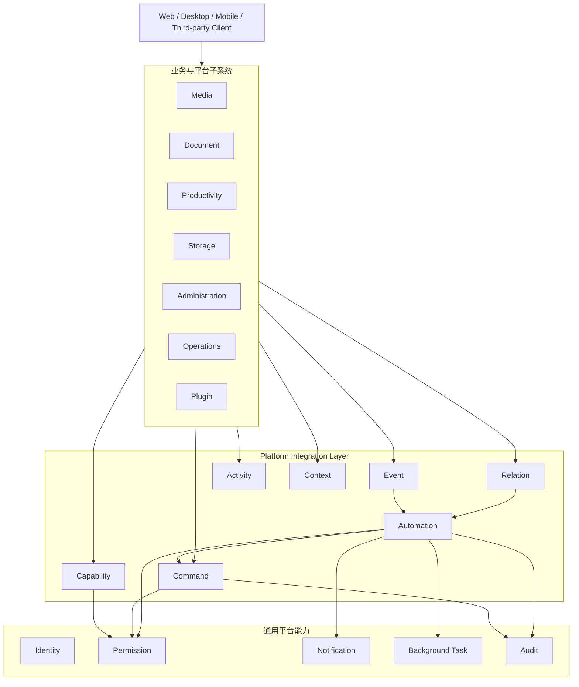
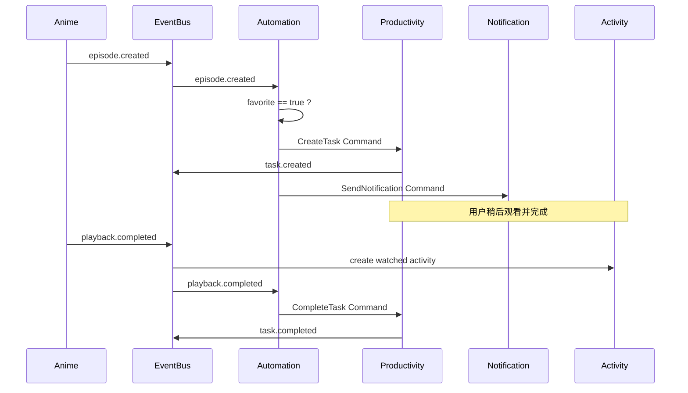

# Ikaros V2 平台联动与自动化设计

| 项目 | 内容 |
|---|---|
| 文档类型 | 平台级子系统设计 |
| 产品版本 | Ikaros V2 |
| 文档版本 | v0.1 |
| 编写日期 | 2026-08-30 |
| 状态 | 草案（Draft） |

> 本文档定义 Ikaros V2 各子系统之间如何建立稳定、可审计、可扩展的联动关系。
>
> V2 会同时包含媒体、阅读、音乐、图片、文档、内容创作、效率规划、平台管理、系统运维、存储、搜索、插件、协作等多个子系统。如果缺少统一的集成机制，系统很容易演变成大量彼此直接调用、互相修改数据的耦合模块。
>
> 本设计的目标不是增加一个新的业务子系统，而是提供一组平台级“胶水能力”，让各子系统在保持边界清晰的同时形成一个完整系统。

---

## 1. 设计目标

平台联动体系需要解决以下问题：

1. 一个子系统如何查询另一个子系统当前必须返回的结果？
2. 一个子系统发生状态变化后，其他子系统如何得知？
3. 两个不同子系统中的对象如何建立长期业务关系？
4. 用户如何配置“当 X 发生时自动执行 Y”？
5. 用户跨多个子系统产生的行为如何形成统一 Activity？
6. 一个 Task、Goal、Room、Resource、Collection 等对象如何表达自身所处的上下文？
7. 如何避免任意模块绕过目标子系统的校验直接修改其数据？
8. 如何保证关键事件即使服务重启也不会静默丢失？
9. 如何防止重复事件导致重复创建任务、重复通知或重复更新状态？
10. 如何对自动化与跨系统操作进行权限控制、追踪和审计？

---

## 2. 核心原则

### 2.1 子系统拥有自己的状态

每个子系统是其核心数据与业务规则的唯一所有者。

例如：

- Productivity 子系统拥有 Task、Goal、OKR 的业务状态。
- Media 子系统拥有播放、剧集与媒体消费相关业务状态。
- Document 子系统拥有文档内容、Revision 与协作状态。
- Storage 子系统拥有 Blob Placement、Replica、Cache 与恢复状态。
- Identity / Permission 子系统拥有用户身份和授权规则。
- Operations 子系统拥有运行状态、Scheduled Job、Alert 等信息。

其他子系统不得绕过所有者直接修改其内部状态。

错误示例：

```text
Automation
    ↓
直接修改 Productivity 数据
    ↓
Task.status = COMPLETED
```

正确示例：

```text
Automation
    ↓
Complete Task Command
    ↓
Productivity Subsystem
    ↓
业务校验
    ↓
Task Completed
```

### 2.2 同步查询与异步传播分离

当调用方“现在必须知道答案”时使用同步 Capability。

当调用方只需要声明“某件事已经发生”时使用 Event。

```text
查询 / 校验       → Capability
改变目标系统状态   → Command
状态变化传播       → Event
长期对象关系       → Relation
跨系统规则编排     → Automation
用户行为记录       → Activity
跨对象上下文       → Context
```

### 2.3 子系统之间不共享内部数据结构

其他子系统不应依赖某个模块的内部表结构、Repository、实体对象或私有实现类。

跨系统协作只能通过公开契约完成。

### 2.4 联动不能绕过权限

Automation、Scheduled Job、Plugin、Webhook、Room、Share Token 等执行主体都必须具有明确身份和权限上下文。

不存在“因为是后台自动化，所以天然拥有管理员权限”的规则。

### 2.5 联动必须可追踪

关键跨系统操作应能够回答：

- 谁触发的？
- 为什么触发？
- 来自哪个事件？
- 哪条 Automation Rule 执行的？
- 调用了什么 Command？
- 最终结果是什么？
- 是否发生重试？

### 2.6 默认采用最终一致性

跨子系统联动默认接受最终一致性。

不应为了让多个业务域在一次事务中同步成功，而把所有模块强行绑定在一个超大事务中。

只有真正需要立即确认结果的业务操作才使用同步 Command / Capability。

---

## 3. 平台集成模型



这层不是一个要求所有流量都经过的“超级中心服务”，而是一套统一契约与基础设施。

在模块化单体中，它可以表现为公共接口、事件总线和统一基础模块；未来即使部分能力拆为独立进程，这些契约仍然可以保持不变。

---

# 第一部分：Capability

## 4. Capability 定义

Capability 表示某个子系统对其他模块公开的同步能力。

它用于回答：

> “我现在必须知道一个结果。”

典型场景：

```text
Document
需要下载 Attachment
    ↓
Permission Capability
canDownload(user, attachment)
    ↓
true / false
```

或者：

```text
Video Player
需要读取 Blob
    ↓
Storage Capability
resolveReadableBlob(...)
    ↓
可读取位置 / 状态
```

### 4.1 Capability 适合的场景

- 权限判断
- Resource 基础信息查询
- Attachment 可访问性解析
- 当前用户身份
- 当前存储状态
- 当前配置读取
- 当前 Feature / Plugin 能力判断
- 必须即时返回的业务校验

### 4.2 Capability 不适合的场景

不要用 Capability 传播“已经发生的状态变化”。

错误：

```text
Anime Subsystem
调用 NotificationService
调用 TaskService
调用 ActivityService
调用 SearchService
```

正确：

```text
Anime Subsystem
    ↓
episode.created
    ↓
各订阅方分别处理
```

### 4.3 Capability 契约稳定性

Capability 属于平台内部公开契约。

需要遵守：

- 明确输入与输出
- 不暴露内部实体
- 不要求调用方理解内部表结构
- 避免返回可被调用方随意修改的内部对象
- 变更需要考虑兼容性

---

# 第二部分：Command

## 5. Command 定义

Command 表示请求目标子系统执行一次明确的状态变更。

例如：

```text
CompleteTask
ArchiveResource
RestoreBlob
CreateShare
PublishArticle
AddRoomMember
UpdateGoalProgress
```

Command 表达的是：

> “请目标子系统执行这件事。”

而不是：

> “我替目标子系统把数据改掉。”

## 5.1 Command 必须经过目标系统业务规则

例如 Automation 想完成一个 Task：

```text
Automation Rule
    ↓
CompleteTask Command
    ↓
Productivity
    ├── 检查 Task 是否存在
    ├── 检查当前状态
    ├── 检查权限
    ├── 执行业务规则
    └── 产生 task.completed Event
```

### 5.2 Command 与 HTTP API

HTTP-first 不意味着内部模块必须通过 HTTP 调用彼此。

在模块化单体阶段：

```text
External Client
    ↓ HTTP
Application API
    ↓
Command Handler / Capability
```

内部模块可以直接调用公开的 Command / Capability 接口。

未来模块拆分时，可以把同一个契约映射到 HTTP、消息或 RPC，而不改变业务含义。

### 5.3 Command 的幂等性

能够被事件、自动化、重试机制触发的 Command 应尽可能支持幂等。

例如：

```text
CompleteTask(taskId)
```

如果 Task 已经完成，再次收到同一个逻辑请求不应生成第二次无意义完成记录。

对于天然不能幂等的 Command，应携带唯一操作标识并进行去重。

---

# 第三部分：Event

## 6. Event 定义

Event 描述一个已经发生的事实。

命名应使用过去式或明确的事实语义，例如：

```text
resource.created
resource.updated
resource.archived
resource.deleted
attachment.created
blob.corrupted
episode.created
playback.completed
article.published
task.completed
goal.at_risk
room.member.joined
storage.degraded
user.login.failed
backup.completed
```

Event 不表示命令。

错误：

```text
send.notification
create.task
```

这两个是 Command / Action。

正确：

```text
episode.created
```

由订阅者决定是否发送通知或创建 Task。

## 6.1 Event 基本字段

逻辑上的 Event 至少应携带：

```text
Event ID
Event Type
Occurred At
Producer Subsystem
Actor / Principal（如果存在）
Subject / Aggregate ID
Correlation ID
Causation ID
Payload
Schema Version
```

### 6.2 Correlation 与 Causation

需要区分：

```text
Correlation ID
同一条业务链路的总关联 ID
```

和：

```text
Causation ID
直接导致当前 Event 的上一条 Command / Event ID
```

例如：

```text
episode.created
      │
      └── Automation Rule
              │
              └── CreateTask Command
                      │
                      └── task.created
```

整条链路可以共享一个 Correlation ID。

`task.created` 的 Causation ID 则指向 `CreateTask Command`。

这样系统才能追踪“为什么出现了这条 Task”。

## 6.3 Event Schema Version

Event Payload 需要有版本概念。

插件、Automation 与未来外部集成不能假设 Event Payload 永远不变。

兼容性原则：

- 优先向后兼容扩展字段
- 删除或改变已有字段需要新版本
- 消费者不应因为出现未知字段而失败

## 6.4 Event 的可靠性

关键业务 Event 不能只存在于内存中。

例如：

```text
article.published
```

如果数据库提交成功，但应用在事件发出前崩溃，不能导致后续 Search、Notification、Automation 永久不知道这件事发生过。

因此 V2 需要在详细设计中采用可靠的持久化事件机制，例如事务 Outbox 等模式。

本文档不锁定具体实现，但明确产品与平台要求：

> 核心业务状态提交成功后，对应的关键 Event 最终必须可被可靠投递。

### 6.5 LISTEN / NOTIFY 的定位

PostgreSQL LISTEN / NOTIFY 可以用于：

- 进程唤醒
- 低延迟提示
- Cache Invalidation 提示
- 通知 Event Dispatcher 有新记录

但不能作为唯一的持久化事件队列。

持久化记录才是真实事件来源。

## 6.6 至少一次投递与消费者幂等

平台应允许 Event 被重复投递。

因此消费者必须考虑：

```text
At-least-once Delivery
    ↓
Consumer Idempotency
```

例如 `episode.created` 重复消费时，不能为同一个 Episode 创建三个相同 Task。

Automation、Search Index、Notification 等消费者需要以 Event ID 或业务幂等键去重。

---

# 第四部分：Relation

## 7. Relation 定义

Relation 用来表达两个长期存在对象之间的业务关系。

Event 表达“发生了什么”，Relation 表达“它们是什么关系”。

例如：

```text
Task
  └── TARGETS → Article
```

```text
Goal
  └── RELATED_TO → Novel Collection
```

```text
Episode
  └── EPISODE_OF → Anime
```

```text
Attachment
  └── COVER_OF → Resource
```

## 7.1 Relation 与数据库外键不同

Relation 是业务语义，不等价于数据库层 FK。

例如：

```text
SEQUEL_OF
ADAPTED_FROM
TARGETS
RELATED_TO
DERIVED_FROM
COVER_OF
```

这些关系本身可能需要：

- 类型
- 方向
- 来源
- 排序
- 创建者
- 元数据

## 7.2 跨子系统关系

Relation 是跨系统联动的重要基础。

例如 Productivity Task 可以 Target 任意 Resource：

```text
Task
“写完 Blob Storage 设计”
      ↓ TARGETS
Document Resource
```

这样 Productivity 不需要复制文档标题、路径或内部状态。

## 7.3 Relation 删除规则

目标对象删除后，Relation 的行为需要根据关系语义决定：

- Cascade Remove Relation
- Preserve Historical Relation
- Mark Target Missing
- Block Deletion

不能统一用一种删除策略处理所有 Relation。

---

# 第五部分：Context

## 8. Context 定义

Context 用于回答：

> “这个对象是在什么背景下产生和使用的？”

例如一个 Task：

```text
Task
“看完这一季”
```

它可能同时具有：

```text
Project: 2026 春季追番
Goal: 本季度看完 10 部动画
Resource: 某动画
Collection: 春季番
```

这些关系不一定都属于同一种业务 Relation，所以需要统一的 Context 表达方式。

## 8.1 Context 可引用对象

典型 Context 包括：

```text
User
Resource
Attachment
Collection
Project
Goal
Objective
Room
Document
Plugin
Share
Subsystem
```

## 8.2 Context 的用途

Context 可用于：

- Automation 条件判断
- Activity 聚合
- Notification 跳转
- Search / Filter
- Audit 追踪
- Task / Goal 联动
- 时间统计归属
- 推荐相关资源

## 8.3 Context 不是万能 JSON

Context 只能表达对象身份与关系背景。

核心业务字段仍然属于对应领域模型。

---

# 第六部分：Automation

## 9. Automation 定义

Automation 是跨子系统联动的用户可配置编排层。

基本模型：

```text
WHEN Trigger
IF Conditions
THEN Actions
```

例如：

```text
WHEN
Episode Created

IF
Anime is Favorite

THEN
Create Task
Send Notification
```

## 9.1 Automation 的组成

```text
Automation Rule
├── Trigger
├── Conditions
├── Actions
├── Owner
├── Permission Context
├── Enabled
├── Execution Policy
└── Execution History
```

## 9.2 Trigger

Trigger 可以来自：

- Domain Event
- Scheduled Time
- Manual Trigger
- Webhook
- Plugin Event
- Health Alert
- Resource State Change
- User Activity

例如：

```text
resource.created
article.published
task.completed
scheduled.daily.03:00
storage.degraded
webhook.received
```

## 9.3 Condition

Condition 用于判断是否继续执行。

例如：

```text
Resource.type == ANIME_EPISODE
Resource.parent.favorite == true
User.id == currentUser
Goal.progress < 60%
Storage.tier == COLD
```

Condition 必须通过公开 Capability 获取必要数据，而不是直接读取其他子系统内部表。

## 9.4 Action

Action 本质上通常映射为 Command 或 Notification。

例如：

```text
Create Task
Complete Task
Send Notification
Archive Resource
Restore Blob
Create Share
Add Tag
Start Background Task
Call Webhook
```

Automation Engine 不直接修改目标系统状态。

## 9.5 Automation 权限

Automation Rule 必须有 Owner / Principal。

执行时默认继承该 Rule 的授权范围。

例如用户只能读取自己的私有 Collection，那么该用户创建的 Automation 也不能操作其他用户的私有 Collection。

管理员创建的系统 Automation 可以拥有更高权限，但必须明确标识为 System Rule，并进入 Audit。

## 9.6 Automation 执行历史

每次执行至少需要记录：

```text
Rule ID
Execution ID
Trigger Event ID
Actor / Principal
Start Time
End Time
Condition Result
Actions
Action Result
Retry Count
Final Status
Error Summary
Correlation ID
```

状态可包括：

```text
PENDING
RUNNING
SUCCEEDED
PARTIAL
FAILED
SKIPPED
CANCELLED
```

## 9.7 自动化循环保护

必须防止：

```text
Event A
→ Action B
→ Event B
→ Action A
→ Event A
→ ...
```

平台需要支持：

- 最大链路深度
- Correlation ID 检测
- Rule 再入策略
- 执行频率限制
- 短时间重复抑制

## 9.8 Automation Rate Limit

例如：

```text
storage.degraded
```

如果一分钟产生数百条重复 Event，不能导致管理员收到数百条通知。

需要支持：

- Debounce
- Throttle
- Deduplication Window
- Aggregate

## 9.9 系统规则与用户规则

Automation 分为：

```text
System Automation
```

和：

```text
User Automation
```

System Automation 用于平台基础联动，例如：

```text
Blob Corrupted
→ Create Integrity Check Background Task
→ Raise Alert
```

用户 Automation 用于个性化场景，例如：

```text
Favorite Anime New Episode
→ Create Task
```

---

# 第七部分：Activity

## 10. Activity 定义

Activity 表达用户在 Ikaros 中实际发生的业务行为。

例如：

```text
09:00 完成 Task
10:30 编辑 Article
12:00 看完 Episode
14:00 Focus 60 min
18:00 听完 Album
20:00 更新 OKR
```

这些行为来自不同子系统，但应能够进入统一 Activity 体系。

## 10.1 Activity 与 Event 区别

Event 是系统集成事实。

Activity 是面向用户行为与产品体验的数据。

不是所有 Event 都应该成为 Activity。

例如：

```text
blob.replica.verified
```

通常不属于用户 Activity。

而：

```text
playback.completed
```

可以产生：

```text
Activity: Watched Episode 12
```

## 10.2 Activity 与 Audit 区别

Activity：

> 用户做了什么业务行为。

Audit：

> 谁对系统或受保护对象执行了什么关键操作。

例如：

```text
用户看完一集动画
→ Activity
```

```text
管理员修改某用户角色
→ Audit
```

两者可以由同一个 Command 同时产生，但不能混为一张通用日志。

## 10.3 Activity 用途

统一 Activity 可用于：

- Recent Activity
- Today
- Timeline
- Continue Watching
- Continue Reading
- Continue Listening
- Daily Review
- Weekly Review
- Time Analysis
- Personal Statistics

---

# 第八部分：联动与权限

## 11. Principal

所有跨系统执行都必须能够识别执行主体。

Principal 可以包括：

```text
User
Service Account
System
Plugin
Automation Rule
Share Token
Room
```

一个后台动作不能简单以“系统内部调用”作为跳过权限校验的理由。

## 11.1 Delegation

某些场景需要代理执行。

例如：

```text
User
创建 Automation Rule
    ↓
Automation Rule
代表 User 执行 Create Task
```

此时需要保留：

```text
Actor = Automation Rule
On Behalf Of = User
```

这样 Audit 才能准确回答：

> 这条 Task 是用户手动创建的，还是用户配置的自动化创建的？

## 11.2 Resource ACL 与 Platform RBAC

跨系统联动同时遵守两类权限：

```text
Platform RBAC
控制是否可以使用某个平台能力
```

```text
Resource ACL
控制是否可以操作具体对象实例
```

例如用户拥有 `task:create` 平台权限，不代表可以针对他无权读取的私有 Resource 创建自动化操作。

---

# 第九部分：联动与后台任务

## 12. Command 与 Background Task

Command 不等于 Background Task。

如果操作可以立即完成：

```text
CompleteTask Command
→ 同步完成
```

如果操作耗时较长：

```text
RestoreBlob Command
    ↓
创建 Background Task
    ↓
立即返回 Task ID
```

### 12.1 三种 Task 概念继续保持分离

```text
Productivity Task
用户待办
```

```text
Scheduled Job
定时触发规则
```

```text
Background Task
系统异步执行实例
```

平台联动层必须使用清晰名称，不允许把三者统一成一个模糊的 `Task`。

## 12.2 Scheduled Job 联动

例如：

```text
Scheduled Job
每天 03:00
    ↓
Trigger Event
    ↓
Automation / Command
    ↓
Start Blob Integrity Background Task
```

Scheduler 自己不直接执行 Storage 内部逻辑。

---

# 第十部分：通知联动

## 13. Notification 作为 Action

Notification 是常见 Automation Action，但通知发送本身应由 Notification 子系统负责。

例如：

```text
storage.degraded
    ↓
Alert Rule
    ↓
SendNotification Command
    ↓
Notification Subsystem
    ├── In-App
    ├── Email
    ├── Webhook
    └── Plugin Provider
```

## 13.1 Notification Deduplication

来自高频 Event 的通知需要支持：

- 去重
- 聚合
- Quiet Hours
- Channel Preference
- Severity

---

# 第十一部分：插件联动

## 14. Plugin Integration

Plugin 不应成为拥有无限内部访问权限的特殊模块。

插件使用与核心模块一致的：

```text
Capability
Command
Event
Relation
Automation Extension Point
```

## 14.1 Plugin Event

插件可以：

- 订阅允许公开的 Event
- 发布插件定义 Event
- 提供 Event Schema

插件发布的 Event 必须带 Provider / Plugin Identity。

## 14.2 Plugin Capability

插件可以扩展：

```text
Metadata Provider
Storage Provider
Search Provider
Importer
Exporter
Renderer
Notification Provider
Automation Trigger
Automation Action
```

但扩展点必须有明确接口边界。

## 14.3 插件卸载

插件卸载后：

- 已持久化的核心 Resource 不应因为插件消失而无法读取
- 插件专属自动化 Action 应标记不可用
- 依赖该插件的 Automation Rule 应进入 DEGRADED / DISABLED 状态
- 不能悄悄删除用户已有 Rule

---

# 第十二部分：搜索联动

## 15. Search Index Update

Search 不应该要求所有子系统在每次写操作里同步调用 SearchService。

推荐语义：

```text
resource.updated
article.published
tag.changed
relation.changed
    ↓
Search Consumer
    ↓
更新索引
```

这样 Search 属于 Event Consumer。

## 15.1 搜索最终一致性

Resource 更新成功和 Search Index 可见之间允许存在很短的最终一致性窗口。

UI 可以在必要时通过 Resource Capability 读取最新详情，而不是要求全文索引和主数据完全同事务提交。

---

# 第十三部分：典型业务联动

## 16. 场景一：追番



这里 Anime 不直接依赖 Productivity。

---

## 17. 场景二：博客目标

```text
Goal
“本月写 4 篇博客”
        ↓
Project
“Ikaros 技术博客”
        ↓
Task
“写 Blob Storage 设计”
        ↓ TARGETS
Article Resource
```

执行链：

```text
Focus Session Completed
        ↓
Activity
        ↓
时间统计归属到 Project / Goal
```

发布后：

```text
article.published
    ↓
Automation
    ├── Complete related Task
    └── Update Goal Progress
            ↓
        goal.progress.updated
```

---

## 18. 场景三：存储健康

```text
Object Storage
DEGRADED
    ↓
storage.degraded
    ↓
Operations Alert
    ↓
Notification
```

持续超过阈值：

```text
Alert remains OPEN 30 min
    ↓
Automation
    ↓
Create Productivity Task
“检查对象存储”
```

修复后：

```text
storage.recovered
    ↓
Resolve Alert
    ↓
Recovery Notification
    ↓
Optionally Complete Admin Task
```

---

## 19. 场景四：Blob 冷存储恢复

```text
User requests Attachment
    ↓
Storage Capability
    ↓
Blob state = ARCHIVED
    ↓
RestoreBlob Command
    ↓
Background Task
    ↓
blob.restore.started
```

完成后：

```text
blob.restore.completed
    ↓
Notification
    ↓
客户端收到可访问状态
```

---

## 20. 场景五：协作文档

```text
User edits Document
    ↓
Realtime Collaboration
    ↓
Revision Created
    ↓
document.revision.created
    ├── Search Consumer
    ├── Activity Consumer
    └── Automation
```

如果文档关联 Task：

```text
document.published
    ↓
Automation
    ↓
Complete Task
```

---

## 21. 场景六：GitHub 插件

```text
GitHub Plugin
Issue Assigned
    ↓
plugin.github.issue.assigned
    ↓
Automation
    ↓
Create Productivity Task
```

Task 可以通过 Relation 指向插件提供的 External Resource Identity。

Issue 关闭时：

```text
plugin.github.issue.closed
    ↓
Automation
    ↓
Complete related Task
```

---

# 第十四部分：失败处理

## 22. 联动失败不能回滚源业务事实

例如：

```text
Article Published
```

已经成功提交。

后续 Notification 失败不能把 Article 回滚成 Draft。

应该是：

```text
article.published
    ↓
Notification Action FAILED
    ↓
Retry / Alert
```

源业务事实保持成立。

## 22.1 Retry

可重试动作应支持：

- Retry Count
- Backoff
- Next Retry At
- Maximum Attempts
- Manual Retry

## 22.2 Dead Letter / Failed Execution

超过重试限制后不能静默丢弃。

需要进入可查询失败状态，例如：

```text
FAILED
DEAD_LETTER
MANUAL_INTERVENTION_REQUIRED
```

管理员可以查看失败原因并重新执行。

## 22.3 Partial Success

一个 Automation Rule 可能包含多个 Action：

```text
Create Task      SUCCEEDED
Send Notification FAILED
Call Webhook      SUCCEEDED
```

因此 Execution 需要支持：

```text
PARTIAL
```

而不是只有成功 / 失败两个状态。

---

# 第十五部分：一致性与事务边界

## 23. 单子系统事务

一个子系统内部可以使用自己的事务保证核心不变量。

例如：

```text
Productivity
Create Task
+ Task Relation Metadata
+ Domain Event Outbox
```

可以在一个本地事务中完成。

## 23.1 跨子系统不使用分布式大事务作为默认方案

例如：

```text
Publish Article
+ Complete Task
+ Update Goal
+ Send Notification
```

不要求四个子系统同时处于同一个 ACID 事务。

正确模型：

```text
Publish Article
    ↓ commit
article.published
    ↓
其他子系统最终完成各自动作
```

## 23.2 补偿动作

真正需要跨系统撤销时，应显式设计补偿 Command，而不是依赖数据库回滚。

例如：

```text
CreateShare
→ External Delivery
```

若后续需要撤销：

```text
RevokeShare Command
```

---

# 第十六部分：可观测性

## 24. Integration Trace

平台应能通过 Correlation ID 查看一条完整联动链路。

例如：

```text
Correlation: C123

1. episode.created
2. Automation Rule #42 matched
3. CreateTask Command
4. task.created
5. SendNotification Command
6. notification.sent
```

这对于排查：

> “为什么系统自动给我创建了这个 Task？”

非常重要。

## 24.1 Metrics

平台应统计：

- Event Produced Count
- Event Delivery Lag
- Consumer Failure Count
- Automation Execution Count
- Automation Failure Rate
- Command Failure Rate
- Retry Count
- Dead Letter Count
- Average Execution Duration

## 24.2 Operations Integration

Integration Layer 本身需要进入 System Operations 健康监控。

例如：

```text
Event Dispatcher      UP / DEGRADED / DOWN
Automation Engine     UP / DEGRADED / DOWN
Outbox Backlog        Normal / Warning / Critical
Failed Executions     Count
Consumer Lag          Duration
```

---

# 第十七部分：命名规范

## 25. Event Naming

推荐：

```text
<domain>.<entity>.<fact>
```

例如：

```text
resource.created
resource.archived
attachment.created
blob.corrupted
article.published
task.completed
goal.at_risk
storage.degraded
```

不要求机械套用三段格式，但名称必须表达事实。

## 25.1 Command Naming

Command 使用动词：

```text
CreateTask
CompleteTask
ArchiveResource
RestoreBlob
SendNotification
PublishArticle
```

## 25.2 Capability Naming

Capability 使用能力语义：

```text
PermissionCapability
StorageCapability
ResourceCapability
IdentityCapability
```

实际代码命名在详细设计阶段确定。

---

# 第十八部分：平台边界规则

## 26. 禁止事项

V2 子系统联动明确禁止以下模式。

### 26.1 禁止跨模块直接 Repository 调用

错误：

```text
AnimeService
→ TaskRepository
```

### 26.2 禁止跨模块直接修改数据库表

错误：

```text
Automation
→ UPDATE productivity_task
```

### 26.3 禁止把 Event Bus 当远程函数调用

Event Consumer 不应依赖生产者等待返回结果。

需要结果时使用 Capability / Command。

### 26.4 禁止所有逻辑都塞进 Automation

领域核心不变量必须由领域子系统自身实现。

Automation 用于跨系统编排和用户自定义行为，不用于替代核心业务规则。

### 26.5 禁止把所有关系都放进通用 Relation

类型内部强业务关系仍可以拥有自己的领域模型。

通用 Relation 用于真正具有跨类型、可扩展意义的关系。

### 26.6 禁止把所有行为都记录为 Activity

运行日志、审计日志、安全事件、Domain Event、用户 Activity 各自有独立职责。

---

# 第十九部分：模块化单体落地原则

## 27. V2 初期优先模块化单体

V2 不因为子系统很多就默认拆微服务。

推荐：

```text
Ikaros Server
│
├── Platform Kernel
├── Resource
├── Storage
├── Media
├── Document
├── Productivity
├── Administration
├── Operations
├── Search
├── Notification
├── Automation
└── Plugin Runtime
```

模块之间通过公开契约协作。

### 27.1 内部不强制 HTTP

HTTP-first 的意义是：

> 对外核心能力可通过 HTTP 稳定访问。

不是：

> 同一个 JVM 内部所有方法调用都必须绕一圈 HTTP。

内部模块可以使用 Java 接口、Command Handler、Event Publisher 等高效方式协作。

### 27.2 保持可拆分性

只要：

- 不直接访问其他模块内部 Repository
- 不共享内部 Entity
- Event 有明确 Schema
- Command / Capability 有稳定契约

未来需要时就具备拆分某个重型模块的可能性，而不需要今天提前付出微服务复杂度。

---

# 第二十部分：平台联动能力分层

## 28. 最终模型

```text
┌──────────────────────────────────────────────┐
│              Ikaros Subsystems               │
│                                              │
│ Media / Docs / Planning / Storage / Admin   │
│ Operations / Search / Plugin / Collaboration │
└──────────────────────┬───────────────────────┘
                       │
          ┌────────────┼────────────┐
          │            │            │
          ▼            ▼            ▼
     Capability      Command       Event
          │            │            │
          │            │            ▼
          │            │       Automation
          │            │            │
          └────────────┼────────────┘
                       │
             ┌─────────┴─────────┐
             ▼                   ▼
          Relation            Activity
             │                   │
             └─────────┬─────────┘
                       ▼
                    Context
                       │
                       ▼
        Identity / Permission / Audit
```

可以把这套模型概括成：

> **查询用 Capability，改变状态用 Command，传播事实用 Event，长期关联用 Relation，跨域联动用 Automation，用户行为进入 Activity，对象背景通过 Context 连接。**

---

# 第二十一部分：与各 V2 子系统的关系

## 29. Resource

提供统一对象身份，并作为 Relation、Context、Activity 与 Automation 的重要目标。

## 29.1 Attachment / Storage

通过 Storage Capability 暴露可访问性，通过 Event 传播 Blob 状态变化，通过 Background Task 完成长耗时恢复、迁移和校验。

## 29.2 Productivity

Task、Goal、OKR 可以引用 Resource Context，并通过 Automation 与媒体、文档、插件和 Operations 联动。

## 29.3 Platform Administration

提供 Automation、Plugin、用户和管理操作所需 Platform RBAC，并记录关键 Audit。

## 29.4 System Operations

监控 Event Dispatcher、Automation Engine 等平台基础设施，并允许 Alert 触发 Automation。

## 29.5 Notification

作为跨系统统一通知出口，不要求业务子系统直接理解邮件、Webhook 等具体 Channel。

## 29.6 Search

作为 Domain Event Consumer 最终一致地维护搜索索引。

## 29.7 Plugin

使用统一集成模型加入平台，而不是获得核心数据库的无限访问能力。

## 29.8 Collaboration / Room

Room Event 可以驱动 Activity、Notification 和 Automation；Room 也可以作为 Context 与 Principal。

---

# 第二十二部分：实施优先级

## 30. P0：平台基础契约

- Capability 契约规范
- Command 契约规范
- Domain Event 规范
- Event Schema Version
- Correlation / Causation
- Event 持久化可靠性
- Consumer Idempotency
- Relation 基础能力
- Activity 基础能力
- Principal / Permission Context

## 30.1 P1：自动化闭环

- Automation Rule
- Event Trigger
- Scheduled Trigger
- Conditions
- Command Actions
- Notification Action
- Execution History
- Retry
- Deduplication
- Loop Protection

## 30.2 P2：高级平台能力

- Webhook Trigger / Action
- Plugin-defined Trigger / Action
- 可视化 Automation Builder
- 高级条件表达式
- 跨系统 Integration Trace
- Rule Template
- Import / Export Automation
- 高级限流与聚合

---

# 第二十三部分：验收原则

## 31. 平台联动设计验收问题

任何新的跨子系统需求，都应该先回答以下问题：

1. 这是同步查询、状态修改、事件传播、长期关系还是自动化？
2. 哪个子系统是该状态的唯一 Owner？
3. 调用方是否绕过了目标子系统的业务规则？
4. 是否需要即时结果？如果不需要，是否可以使用 Event？
5. Event 是否需要可靠持久化？
6. Event 重复消费是否安全？
7. 是否需要 Correlation / Causation 追踪？
8. 执行主体是谁？具有什么权限？
9. 是否需要 Audit？
10. 失败后是重试、补偿还是人工处理？
11. 是否可能形成 Automation 循环？
12. 这个关系应该是 Relation 还是领域内部专属关系？
13. 是否应该形成用户 Activity？
14. 未来插件是否可以通过同一契约参与？

如果以上问题无法明确回答，说明跨系统边界尚未设计清楚。

---

## 32. 总结

Ikaros V2 的目标不是把多个独立应用放在同一个导航栏下，而是让媒体、阅读、创作、效率、存储、协作、管理、运维和插件等能力围绕统一平台模型自然组合。

平台联动体系承担的是这些子系统之间的结构性连接：

```text
Capability
Command
Event
Relation
Context
Automation
Activity
```

其中最重要的约束是：

> **每个子系统拥有自己的状态，其他子系统只能通过公开 Capability、Command、Event、Relation 与 Automation 参与协作。**

这样既可以形成诸如“新剧集 → 创建待办 → 通知 → 看完后自动完成任务 → 推进目标”这样的完整跨域体验，又不会为了联动而牺牲模块边界、权限、安全性和长期可维护性。
