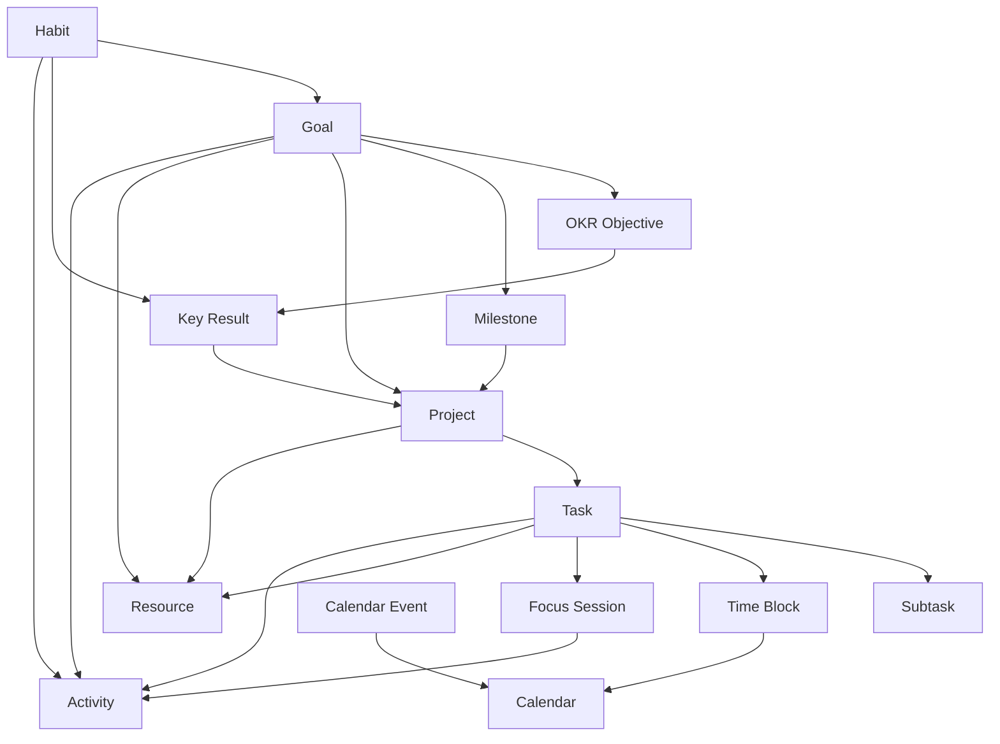

# Ikaros V2 效率与计划子系统设计

| 项目 | 内容 |
|---|---|
| 子系统 | Productivity / Planning |
| 面向版本 | Ikaros V2 |
| 文档版本 | v0.1 |
| 编写日期 | 2026-08-30 |
| 状态 | 草案（Draft） |

> 本文档描述 Ikaros V2 中目标管理、任务管理、时间管理、OKR、习惯、专注和复盘等效率能力的产品与领域设计。
>
> 本子系统参考成熟 Todo List / Calendar 产品的任务、日历、时间线、四象限、专注、习惯、统计等交互经验，但不直接复制外部产品的数据模型。设计应继续遵循 Ikaros V2 的 Resource-centric、HTTP-first、Composable Capabilities 原则，并与 Resource、Activity、Notification、Permission、Collaboration 等核心能力组合。

---

## 1. 子系统目标

效率与计划子系统用于回答以下问题：

- 我想完成什么？
- 为什么要完成？
- 我接下来要做什么？
- 什么时候做？
- 这件事最晚什么时候必须完成？
- 我已经投入了多少时间？
- 我的长期目标是否真的在推进？
- 我的计划与实际执行偏差有多大？
- 哪些任务、习惯和项目正在推动某个 Goal / OKR？
- 今天、这周、这个季度应该把注意力放在哪里？

本子系统不只是一个 Todo List，而是形成完整的：

```text
Capture
  ↓
Clarify
  ↓
Organize
  ↓
Prioritize
  ↓
Schedule
  ↓
Focus / Execute
  ↓
Track
  ↓
Review
  ↓
Adjust
```

闭环。

---

## 2. 设计原则

### 2.1 Task 不等于 Calendar Event

Task 表达“需要完成的动作或结果”。

Calendar Event 表达“在某个时间已经确定发生的事情”。

例如：

```text
Task
完成 V2 PRD Review

Calendar Event
2026-09-01 14:00 ~ 15:00 V2 架构评审会议
```

两者不能因为都拥有时间字段而合并为同一个概念。

### 2.2 Scheduled Time 不等于 Deadline

系统必须明确区分：

- **Scheduled Time / Do Time**：用户计划什么时候执行
- **Deadline / Due Time**：最晚什么时候必须完成

例如：

```text
Task: 提交季度总结
Scheduled: 9 月 25 日 20:00
Deadline: 9 月 30 日 23:59
```

用户可以多次调整执行计划，而不改变真正 Deadline。

### 2.3 Time Block 不等于 Task

Time Block 表示从日历中为某件事情预留的一段时间。

一个 Task 可以：

- 没有 Time Block
- 拥有一个 Time Block
- 被拆分到多个 Time Block

一个 Time Block 也可以用于：

- Task
- Goal
- Resource
- Focus Session
- 无具体目标的私人安排

### 2.4 Goal 不等于 Task List

Goal 表达长期结果或方向，Task 表达实际行动。

系统不能简单通过“完成多少个 Task”判断 Goal 是否完成。

Goal 的 Progress 可以来自：

- 用户手动更新
- Key Result
- Milestone
- Task / Project 完成度
- Habit 数据
- Focus / Time 数据
- 外部集成数据

### 2.5 OKR 是 Goal Framework，而不是所有目标的强制形式

简单目标不应该被迫填写 Objective / Key Result。

系统提供通用 Goal，在需要时可以启用 OKR Framework。

### 2.6 Planning 与 Ikaros 内容体系组合

任务不应成为一个与 Ikaros 其他内容完全隔离的小应用。

Task / Goal 应能够关联任意 Resource，例如：

```text
Task: 看完《某动画》第 12 集
TARGETS → Episode Resource

Task: 完成博客文章
TARGETS → Article Resource

Task: 整理游戏存档
TARGETS → Game Resource

Goal: 2026 年读完 30 本书
CONTRIBUTES_FROM → Novel / Book Resource
```

---

## 3. 子系统范围

效率与计划子系统包含：

1. Inbox / Capture
2. Task
3. Project / List
4. Goal
5. OKR
6. Milestone
7. Calendar
8. Time Block
9. Reminder
10. Priority / Eisenhower Matrix
11. Habit
12. Focus
13. Daily / Weekly / Monthly / Quarterly Review
14. Statistics / Insights
15. Collaboration
16. Automation / Event
17. External Calendar / Task Integration

---

## 4. 概念关系



---

## 5. Task 任务管理

### 5.1 Task 定义

Task 是用户需要采取行动才能完成的最小计划单元。

典型字段语义包括：

- Title
- Description
- Status
- Priority
- Important
- Urgent
- Scheduled Start
- Scheduled End
- Deadline
- Estimated Duration
- Actual Duration
- Recurrence
- Reminder
- Assignee
- Project
- Section
- Parent Task
- Tags
- Related Resource
- Dependencies

具体数据库字段由后续数据模型设计确定。

### 5.2 Task 状态

建议产品状态：

```text
Inbox
  ↓
Planned
  ↓
In Progress
  ↓
Completed
```

并支持：

```text
Blocked
Cancelled
Archived
```

状态与“是否逾期”必须分离。

Overdue 是根据 Deadline 派生出的状态，不是 Task 生命周期状态。

### 5.3 Inbox

Inbox 用于快速 Capture。

用户可以在尚未决定：

- 属于哪个 Project
- 什么时候做
- 优先级是什么
- 是否属于某个 Goal

时先创建 Task。

Inbox 是 Task 状态/系统视图，不应要求用户为了收集想法先建立 Project。

### 5.4 Subtask

Task 支持子任务。

子任务用于拆解动作，但不得无限依赖层级树表达所有业务关系。

复杂工作应升级为 Project。

### 5.5 Dependencies

任务之间支持依赖关系：

```text
BLOCKS
BLOCKED_BY
```

例如：

```text
完成数据库设计
    ↓ BLOCKS
实现数据库 Migration
```

被阻塞任务应在 UI 中明确表现。

### 5.6 Estimated Duration

Task 可以拥有预计时长，例如：

```text
15 min
30 min
1 h
2 h
```

预计时长用于：

- Calendar Planning
- Time Block
- Capacity Planning
- Plan vs Actual Review

### 5.7 Actual Duration

实际耗时不能简单通过：

```text
completed_at - created_at
```

计算。

实际耗时主要来自：

- Focus Session
- Time Tracking
- 用户手动补录

---

## 6. Recurring Task

### 6.1 重复规则

Task 支持：

- 每天
- 每周
- 工作日
- 每月
- 每年
- 自定义规则

### 6.2 固定周期与完成后周期

必须区分：

#### Fixed Schedule

```text
每周一 09:00
```

无论上一次什么时候完成，下一次仍按固定日历时间生成。

#### Completion-based

```text
完成后 7 天再次执行
```

下一次时间取决于本次实际完成时间。

两种重复语义不能混用。

### 6.3 Skip

重复 Task 支持跳过某一次，而不是必须通过“完成”来消除本次实例。

---

## 7. Project / List

### 7.1 Project

Project 表示为了一个具体结果而组织的一组 Task。

例如：

- Ikaros V2 PRD
- 搬家
- 日本旅行
- NAS 重构

Project 可以拥有：

- Status
- Description
- Owner
- Start / Target Date
- Sections
- Tasks
- Related Goal
- Related Resource
- Members

### 7.2 List

List 更偏向轻量组织，例如：

- 买东西
- 想看的电影
- 本周杂事

在实现层可以考虑复用 Collection 能力，但 Project 与普通 Collection 在产品语义上必须保持区分。

### 7.3 Section

Project 内可以使用 Section 对 Task 分组，例如：

```text
Backlog
Design
Development
Review
Done
```

Section 可以支撑 Kanban View。

---

## 8. Task Views

同一组 Task 应能够通过不同 View 展示，而不是复制数据。

至少支持：

### 8.1 List

标准列表视图。

### 8.2 Today

展示：

- 今天 Scheduled 的 Task
- 今天 Deadline 的 Task
- 已经 Overdue 的 Task
- 用户 Pin 到 Today 的 Task

### 8.3 Upcoming

未来计划视图。

### 8.4 Kanban

按以下维度分列：

- Section
- Status
- Priority
- Assignee
- 自定义字段

### 8.5 Timeline

根据 Task / Project 的计划起止时间展示时间线。

### 8.6 Eisenhower Matrix

根据：

```text
Important
Urgent
```

形成四象限：

```text
重要且紧急
重要不紧急
不重要但紧急
不重要不紧急
```

四象限应是 View，而不是复制四份 Task。

### 8.7 Smart View / Filter

用户可以保存查询，例如：

```text
priority >= HIGH
AND deadline < 7 days
AND status != COMPLETED
AND tag = ikaros
```

Smart View 本质上是保存的 Query。

---

## 9. Goal 目标管理

### 9.1 Goal

Goal 是用户希望在较长时间尺度实现的结果。

例如：

- 完成 Ikaros V2
- 一年阅读 30 本书
- 每周运动 3 次
- 完成一次长途旅行

### 9.2 Goal 类型

可以支持：

- Outcome Goal
- Numeric Goal
- Milestone Goal
- Habit Goal
- OKR Objective

但产品不强迫普通用户理解复杂 Goal Framework。

### 9.3 Goal 时间范围

Goal 可以拥有：

- Start Date
- Target Date
- Period

常见周期：

```text
Monthly
Quarterly
Yearly
Custom
```

### 9.4 Goal Progress

Goal Progress 支持：

#### Manual

用户手动更新，例如：

```text
65%
```

#### Derived

由系统数据自动计算，例如：

```text
已完成 18 / 30 本书
60%
```

或者：

```text
完成 8 / 12 个 Milestone
```

### 9.5 Goal 与 Task

Task 可以通过：

```text
CONTRIBUTES_TO
```

关系关联到 Goal。

Task 完成不一定直接等比例提高 Goal Progress。

---

## 10. OKR

### 10.1 OKR Cycle

OKR 应拥有明确周期，例如：

```text
2026 Q3
2026 Q4
2027 Annual
```

Cycle 可以包含多个 Objective。

### 10.2 Objective

Objective 是定性的目标描述，例如：

> 建立可长期演进的 Ikaros V2 基础架构

Objective 应：

- 有明确方向
- 有周期
- 可关联 Owner
- 可关联 Goal
- 通过 Key Result 衡量

### 10.3 Key Result

Key Result 必须是可衡量结果，而不是普通 Todo。

支持：

#### Numeric

```text
0 → 100
```

#### Percentage

```text
0% → 100%
```

#### Boolean

```text
完成 / 未完成
```

#### Milestone

由一组 Milestone 推进。

### 10.4 Key Result Check-in

KR 支持周期性 Check-in：

- Current Value
- Progress
- Confidence
- Status
- Note
- Blocker

### 10.5 Confidence

用户可以记录对 KR 能否按期达成的信心：

```text
On Track
At Risk
Off Track
```

Confidence 与当前百分比必须分开。

一个 KR 即使完成 70%，在周期只剩一天时仍可能是 Off Track。

### 10.6 Initiative

推动 Key Result 的 Initiative 不单独创造另一套任务系统。

Initiative 优先通过：

- Project
- Task
- Habit
- Resource

关联实现。

---

## 11. Milestone

Milestone 是 Goal / Project 中的重要节点。

例如：

```text
V2 PRD 完成
数据库 Schema 确定
API v2 Freeze
Beta Release
```

Milestone 可以拥有：

- Target Date
- Status
- Owner
- Related Goal
- Related Project

Milestone 本身不是普通 Task，但可以关联一组 Task。

---

## 12. Calendar

### 12.1 Calendar 统一时间视图

Calendar 同时展示：

- Calendar Event
- Scheduled Task
- Deadline
- Time Block
- Habit Schedule
- Countdown / Important Date

但不同类型必须在产品上可辨识。

### 12.2 Calendar View

支持：

- Day
- Multi-day
- Week
- Multi-week
- Month
- Year
- Agenda

### 12.3 Drag to Schedule

用户可以从 Task List 将 Task 拖入 Calendar 生成 Time Block / Scheduled Time。

不能因为拖入 Calendar 自动把 Deadline 改成相同时间。

### 12.4 Time Zone

Calendar Event、Deadline、Reminder 和 Time Block 应明确时区语义。

对于旅行等场景，应能够正确显示用户当前时区下的时间。

---

## 13. Time Block

### 13.1 定义

Time Block 表示用户对时间资源的主动分配。

例如：

```text
09:00 - 10:30
Ikaros V2 数据库设计
```

### 13.2 Flexible / Fixed

Time Block 可以区分：

- Flexible：允许 Planning 自动调整
- Fixed：用户希望保持固定时间

Calendar Event 默认更接近 Fixed Commitment。

### 13.3 Split

一个长 Task 可以拆成多个 Time Block：

```text
Task: 完成 V2 Storage Design
Estimated: 4h

09:00 - 11:00
14:00 - 16:00
```

### 13.4 Capacity

系统可以统计一天/一周已安排的 Time Block 总量，并提示明显 Overbooking。

---

## 14. Time Management

### 14.1 Planning Time

用户可以提前安排：

- Today
- Tomorrow
- This Week
- Next Week

### 14.2 Time Budget

Goal / Project 可以配置可选 Time Budget，例如：

```text
Ikaros V2
10 h / week
```

系统可以统计实际 Focus Time 与预算的偏差。

### 14.3 Estimate vs Actual

系统应该能够统计：

```text
Estimated 2h
Actual 3h 20m
```

长期用于改善用户的时间估算能力。

### 14.4 Schedule Conflict

当 Time Block 与 Calendar Event 冲突时，应明确提示。

不要求系统自动禁止冲突，因为现实生活中可能存在用户有意重叠安排的情况。

---

## 15. Focus 专注

### 15.1 Focus Session

用户可以针对：

- Task
- Project
- Goal
- Resource

启动 Focus Session。

### 15.2 Focus Mode

支持：

- Stopwatch
- Pomodoro
- Custom Timer

### 15.3 Pomodoro

默认提供常见工作/休息周期，但允许用户自行配置。

### 15.4 Focus Result

完成 Focus Session 后记录：

- Started At
- Ended At
- Duration
- Related Task
- Related Goal
- Interrupted / Completed
- Optional Note

### 15.5 Focus 与 Task 完成解耦

结束 Focus Session 不自动等于 Task Completed。

一个 Task 可以需要多个 Focus Session。

---

## 16. Habit 习惯

### 16.1 Habit 与 Recurring Task 分离

虽然 Habit 和 Recurring Task 都会重复出现，但语义不同。

Recurring Task：

> 每周五提交周报

Habit：

> 每天阅读 30 分钟

Habit 重点关注长期行为趋势与 Check-in，而 Task 重点关注一次工作是否完成。

### 16.2 Habit Metric

Habit 可以记录：

- Boolean
- Count
- Duration
- Numeric Value

例如：

```text
跑步 5 km
阅读 30 min
喝水 8 次
```

### 16.3 Habit Schedule

支持：

- Daily
- Certain weekdays
- N times per week
- N times per month
- Custom

### 16.4 Habit 与 Goal / KR

Habit 可以为 Goal / Key Result 自动贡献数据。

例如：

```text
Goal: 建立稳定运动习惯
Habit: 每周跑步 3 次
```

---

## 17. Reminder

### 17.1 Reminder Target

Reminder 可以绑定：

- Task
- Deadline
- Time Block
- Calendar Event
- Habit
- Goal Check-in
- Milestone

### 17.2 Multiple Reminder

同一对象支持多个 Reminder，例如：

```text
Deadline 前 7 天
Deadline 前 1 天
Deadline 前 1 小时
```

### 17.3 Reminder 与 Notification

Planning 子系统只定义“何时应提醒”。

具体发送方式复用 Ikaros Notification：

- In-app
- Push
- Email
- Webhook
- Plugin Provider

---

## 18. Countdown / Important Date

提供轻量的重要日期能力，例如：

- 生日
- 纪念日
- 发布日
- 考试
- 旅行日期
- 项目截止日

Countdown 不应强制表现为 Task。

---

## 19. Daily Planning

用户每天可以执行一次 Daily Planning：

```text
Inbox 清理
    ↓
处理 Overdue
    ↓
选择 Today Tasks
    ↓
检查 Calendar Events
    ↓
安排 Time Blocks
    ↓
确认 Today Goal
```

系统可以提供引导，但不应强制用户每天执行完整流程。

---

## 20. Review 复盘

### 20.1 Daily Review

展示：

- 今日计划 Task
- 已完成
- 未完成
- 延期
- Focus Time
- Habit
- Calendar
- Goal Progress

### 20.2 Weekly Review

至少包含：

- 本周完成 Task
- Carry-over Task
- Overdue
- Project Progress
- Goal / OKR Progress
- Focus Time
- Habit Completion
- Estimate vs Actual
- 下周重要事项

### 20.3 Monthly / Quarterly Review

用于长期趋势：

- Goal Progress
- OKR Result
- Time Allocation
- Completed Projects
- Habit Trend
- Resource Consumption / Creation

### 20.4 Review Note

用户可以为 Review 创建 Note / Document Resource。

Planning 统计与用户的主观复盘内容应当区分。

---

## 21. Statistics / Insights

系统可以提供：

### Task

- Completed Count
- Completion Rate
- Overdue Rate
- Carry-over Rate

### Time

- Focus Duration
- Planned Duration
- Actual Duration
- Estimate Accuracy

### Goal

- Goal Progress
- KR Progress
- On Track / At Risk / Off Track

### Habit

- Completion Rate
- Trend
- Frequency

### Allocation

按照：

- Goal
- Project
- Tag
- Resource Type

统计时间投入。

统计主要用于帮助用户理解行为，不应演变为对用户进行人格评价的“效率分数”。

---

## 22. 与 Resource 的关系

Planning 对象可以关联 Ikaros Resource。

建议关系语义包括：

```text
TARGETS
CONTRIBUTES_TO
CREATED_FROM
RELATED_TO
REVIEW_OF
```

例如：

```text
Task
“看完第 10 集”
TARGETS
Episode Resource
```

```text
Task
“完成文章初稿”
TARGETS
Article Resource
```

```text
Goal
“一年阅读 30 本书”
RELATED_TO
Novel / Book Resources
```

---

## 23. 与 Activity 的关系

以下行为进入统一 Activity：

- Task Completed
- Project Completed
- Goal Progress Updated
- Goal Completed
- Key Result Check-in
- Habit Check-in
- Focus Session Completed
- Review Completed

但并非所有编辑操作都需要成为用户可见 Activity。

详细变更历史可以进入 Audit / Revision。

---

## 24. Collaboration

### 24.1 Shared Project

Project 可以共享给其他 User / Group。

### 24.2 Assignment

Task 可以分配给成员。

### 24.3 Permission

至少支持：

- View
- Comment
- Create Task
- Edit Task
- Assign
- Manage Project

### 24.4 Comments

Task / Project / Goal 可以复用 Comment 能力。

### 24.5 Personal Data

个人 Habit、私人 Goal、个人 Focus Statistics 默认私有。

共享 Project 不应自动暴露成员的全部个人效率统计。

---

## 25. Offline / Sync

效率子系统的数据规模通常较小，但对移动端使用频率很高。

因此客户端应优先支持：

- Offline 查看 Today / Inbox / Upcoming
- Offline 创建 Task
- Offline 完成 Task
- Offline Habit Check-in
- Offline 修改简单字段

重新联网后进行同步。

对于冲突：

- Completion 等幂等操作优先自动合并
- 同一字段发生互斥编辑时不能静默覆盖重要数据
- Collaboration 场景应保留版本信息

具体同步算法由客户端与 API 设计决定。

---

## 26. External Calendar Integration

通过 Provider / Plugin 支持外部 Calendar：

- Google Calendar
- CalDAV
- ICS Subscription
- 其他 Calendar Provider

外部 Event 与 Ikaros Task 必须保持身份区分。

Calendar Sync 不应该把外部会议自动转成 Task。

---

## 27. External Task Integration

未来可以通过插件连接：

- Todoist
- TickTick / 滴答清单
- Microsoft To Do
- GitHub Issues
- 其他任务系统

同步策略必须明确：

- Import
- One-way Sync
- Two-way Sync

以及字段映射与冲突规则。

核心系统不依赖任何外部 Task Provider 才能正常运行。

---

## 28. Automation

Planning 子系统向统一 Event / Automation 提供事件，例如：

```text
planning.task.created
planning.task.completed
planning.task.overdue
planning.project.completed
planning.goal.progress_updated
planning.goal.completed
planning.okr.checkin_updated
planning.habit.checked_in
planning.focus.completed
planning.time_block.created
planning.review.completed
```

自动化示例：

```text
当动画 Resource 更新新剧集
→ 创建“观看最新一集”Task
```

```text
当 GitHub Issue Assigned
→ 创建 Task
```

```text
当某 Goal 进入 At Risk
→ 发送 Notification
```

---

## 29. HTTP API 边界

Planning 子系统遵循 HTTP-first。

核心能力应提供独立 API：

```text
/tasks
/projects
/goals
/okr-cycles
/key-results
/milestones
/calendars
/time-blocks
/habits
/focus-sessions
/reviews
```

路径仅表达领域边界示例，不在本文锁定最终 URL。

需要实时协作时，可以额外通过 SSE / WebSocket 推送：

- Task Assignment
- Project Change
- Goal Progress Change
- Calendar Change

---

## 30. 推荐领域边界

```text
Productivity / Planning
│
├── Task
│   ├── Inbox
│   ├── Project
│   ├── Recurrence
│   ├── Dependency
│   └── Smart View
│
├── Goal
│   ├── Goal
│   ├── Milestone
│   └── OKR
│       ├── Cycle
│       ├── Objective
│       ├── Key Result
│       └── Check-in
│
├── Time
│   ├── Calendar
│   ├── Calendar Event
│   ├── Time Block
│   ├── Reminder
│   └── Countdown
│
├── Execution
│   ├── Focus Session
│   └── Pomodoro
│
├── Habit
│   └── Check-in
│
└── Review
    ├── Daily
    ├── Weekly
    ├── Monthly
    └── Quarterly
```

---

## 31. 第一阶段产品范围

### P0

- Inbox
- Task CRUD
- Subtask
- Project
- Priority
- Tags
- Scheduled Time
- Deadline
- Reminder
- Recurrence
- Today / Upcoming
- Calendar
- Time Block
- Basic Goal
- Resource Relation
- Offline Basic Operations

### P1

- Kanban
- Timeline
- Eisenhower Matrix
- Smart View
- Task Dependency
- Focus / Pomodoro
- Habit
- Goal Progress
- Milestone
- Daily / Weekly Review
- Statistics
- Shared Project

### P2

- Full OKR
- KR Check-in / Confidence
- Quarterly Review
- Time Budget
- Capacity Planning
- Advanced Insights
- External Calendar Two-way Sync
- External Task Provider
- Automation Rules
- Advanced Collaboration

---

## 32. 明确的非目标

本子系统当前不以以下能力为核心目标：

- 完整替代 Jira / Linear 等专业研发项目管理系统
- 完整替代 Microsoft Project 等复杂项目排程软件
- 企业绩效考核系统
- 根据任务数量给员工排名
- 强制所有用户使用 OKR
- 通过单一“效率分数”评价用户
- 将 Calendar Event、Task、Habit、Goal 粗暴合并为同一种数据
- 为了实现 Timeline 而引入完整企业级 Gantt 项目管理复杂度

---

## 33. 关键产品约束

后续实现必须持续满足以下约束：

1. **Scheduled Time 与 Deadline 分离。**
2. **Task 与 Calendar Event 分离。**
3. **Task 与 Time Block 分离。**
4. **Recurring Task 与 Habit 分离。**
5. **Goal 与普通 Task List 分离。**
6. **OKR 是可选 Goal Framework，而不是所有目标的强制模型。**
7. **Task / Goal 可以关联任意 Ikaros Resource。**
8. **Focus Time 是实际执行数据，不等于 Task 生命周期时间。**
9. **Eisenhower、Kanban、Timeline 是 View，不复制 Task 数据。**
10. **共享 Project 不自动公开用户个人 Habit、Goal 和 Focus 数据。**
11. **离线操作是正式客户端能力，而不是异常兜底。**
12. **Planning 的行为数据应帮助用户复盘，而不是对用户人格或价值进行评分。**

---

## 34. 后续详细设计

在进入实现前，建议继续补充：

- Planning PostgreSQL 数据模型
- Task Recurrence 规则设计
- Calendar / Time Zone 设计
- Offline Sync 与冲突处理设计
- Goal / OKR Progress 计算模型
- Planning HTTP API
- Planning Event / Automation Contract
- Planning UI Information Architecture
- Material Design 3 Task / Calendar / Goal 页面规范
