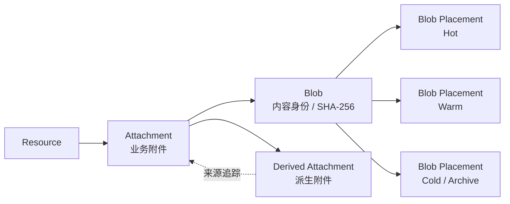

# Resource 关系总览

本图展示当前 V2 已实现的 Resource 相关领域关系。它描述的是领域模型关系，不代表数据库已经为所有关系声明了物理外键。

来源：

- [V2 产品需求文档](../00-product-baseline/Product-Requirements-Document.md)
- [核心平台 DDL](../../src/main/resources/db/migration/V202609021000__DDL_CORE_PLATFORM.sql)
- [Resource 源码包](../../src/main/java/run/ikaros/resource/)

## 领域关系图

```mermaid
erDiagram
    PLATFORM_USER ||--o{ RESOURCE : owns
    PLATFORM_USER ||--o{ COLLECTION : owns
    PLATFORM_USER ||--o{ RESOURCE_TAG : creates
    PLATFORM_USER ||--o{ RESOURCE_FAVORITE : marks
    PLATFORM_USER ||--o{ RESOURCE_ACTIVITY : records
    PLATFORM_USER ||--o{ RESOURCE_PROGRESS : tracks

    RESOURCE ||--|{ RESOURCE_TITLE : has
    RESOURCE ||--o{ EXTERNAL_IDENTITY : maps
    RESOURCE ||--o{ RESOURCE_METADATA : describes
    RESOURCE ||--o{ RESOURCE_TAG : tagged_with
    RESOURCE ||--o{ RESOURCE_FAVORITE : favorited_by
    RESOURCE ||--o{ RESOURCE_ACTIVITY : has
    RESOURCE ||--o{ RESOURCE_PROGRESS : has

    COLLECTION ||--o{ COLLECTION_RESOURCE : contains
    RESOURCE ||--o{ COLLECTION_RESOURCE : member_of

    RESOURCE ||--o{ RESOURCE_RELATION : source
    RESOURCE ||--o{ RESOURCE_RELATION : target

    RESOURCE ||--o{ ATTACHMENT : uses
    BLOB ||--o{ ATTACHMENT : backs
    BLOB ||--o{ BLOB_PLACEMENT : stored_at

    ATTACHMENT ||--o{ DERIVED_ATTACHMENT : source_attachment
    ATTACHMENT ||--o{ DERIVED_ATTACHMENT : derived_attachment

    PLATFORM_USER {
        uuid id PK
        string username
        string status
    }

    RESOURCE {
        uuid id PK
        uuid owner_id
        enum resource_type
        enum lifecycle
        timestamp deleted_at
    }

    RESOURCE_TITLE {
        uuid id PK
        uuid resource_id
        string locale
        string title
        boolean is_primary
    }

    EXTERNAL_IDENTITY {
        uuid id PK
        uuid resource_id
        string provider
        string external_type
        string external_id
    }

    RESOURCE_METADATA {
        uuid id PK
        uuid resource_id
        string field_key
        string value
        enum source
    }

    COLLECTION {
        uuid id PK
        uuid owner_id
        string name
    }

    COLLECTION_RESOURCE {
        uuid id PK
        uuid collection_id
        uuid resource_id
        int position
    }

    RESOURCE_RELATION {
        uuid id PK
        uuid source_resource_id
        uuid target_resource_id
        enum relation_type
    }

    RESOURCE_TAG {
        uuid id PK
        uuid owner_id
        uuid resource_id
        string name
    }

    RESOURCE_FAVORITE {
        uuid id PK
        uuid owner_id
        uuid resource_id
    }

    RESOURCE_ACTIVITY {
        uuid id PK
        uuid owner_id
        uuid resource_id
        enum activity_type
    }

    RESOURCE_PROGRESS {
        uuid id PK
        uuid owner_id
        uuid resource_id
        enum progress_type
        long position
        boolean completed
    }

    ATTACHMENT {
        uuid id PK
        uuid resource_id
        uuid blob_id
        string file_name
        enum attachment_kind
    }

    BLOB {
        uuid id PK
        string sha256 UK
        long size_bytes
        enum availability
    }

    BLOB_PLACEMENT {
        uuid id PK
        uuid blob_id
        string provider
        enum storage_tier
        string object_key
        enum placement_state
    }

    DERIVED_ATTACHMENT {
        uuid id PK
        uuid source_attachment_id
        uuid derived_attachment_id
    }
```

## 关系重点

### Resource 是业务中心

Resource 表达“这是什么”。标题、外部身份、元数据、标签、收藏、活动和消费进度都围绕 Resource 复用。

### Collection 只组织 Resource

Collection 通过 `COLLECTION_RESOURCE` 建立成员关系，不代表目录，也不改变附件的物理存储位置。

### Relation 是有类型的资源间关系

`RESOURCE_RELATION` 使用 `source_resource_id`、`target_resource_id` 和 `relation_type` 表达前传、后传、改编、相关等关系；同一 Resource 不能关联自身。

### Attachment、Blob、Placement 分层

这三层分别表达：

- `Attachment`：资源使用的业务内容对象
- `Blob`：实际内容的摘要、大小和可用状态
- `Blob Placement`：Blob 在具体 Provider 和存储层中的位置

因此，Resource 的逻辑删除不会直接等同于 Blob 的物理删除；Blob GC 需要单独扫描和决策。

## 当前实现边界

- 已实现上述关系的持久化模型及主要 REST API。
- `Attachment` 接口当前登记内容摘要和对象位置，不负责上传二进制内容。
- `Blob Placement` 当前支持状态查询和规划，不会自动复制、迁移或恢复副本。
- Activity 和 Progress 是 Resource 的用户行为数据，但不等同于 Audit Event。
