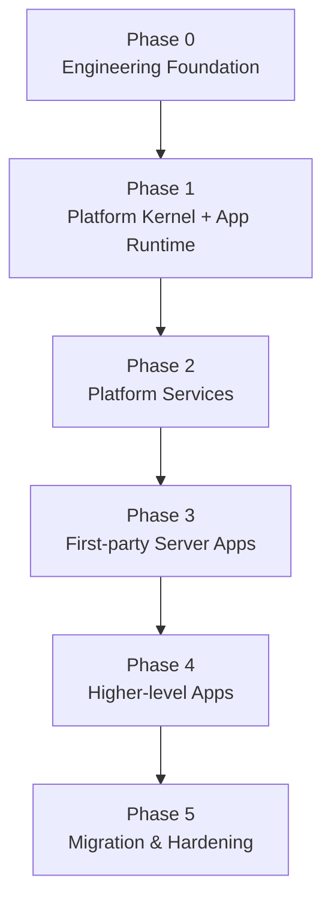

# Ikaros V2 Implementation Roadmap and Dependency Graph：图表

<!-- Generated by scripts/check_architecture_docs.py --write-mirrors; do not edit. -->

来源：[Implementation-Roadmap-and-Dependency-Graph.md](../00-product-baseline/Implementation-Roadmap-and-Dependency-Graph.md)。规范正文以来源文档为准。

## 图 1

