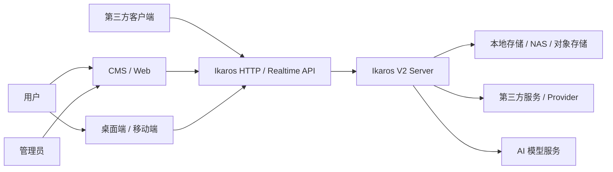
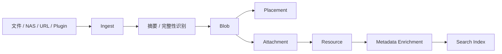
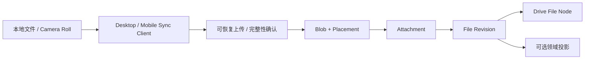
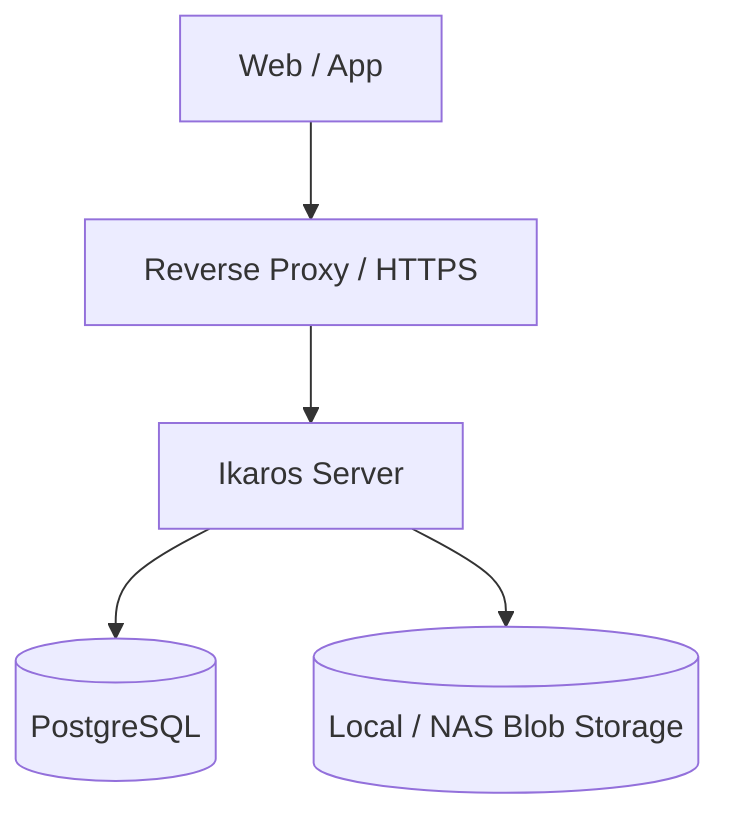
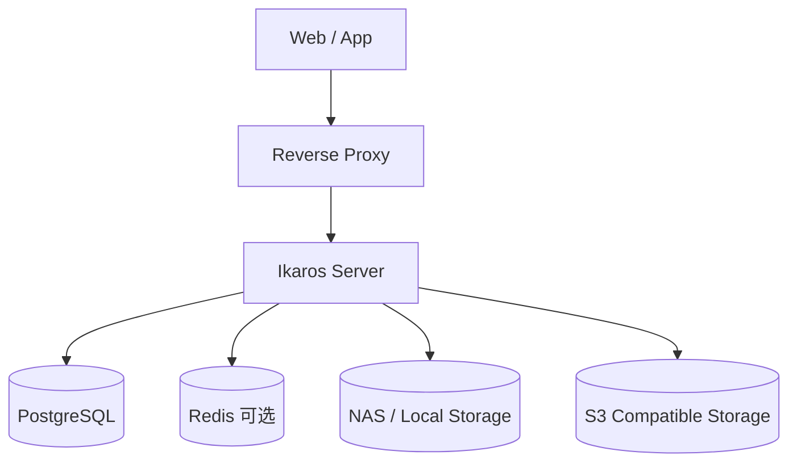
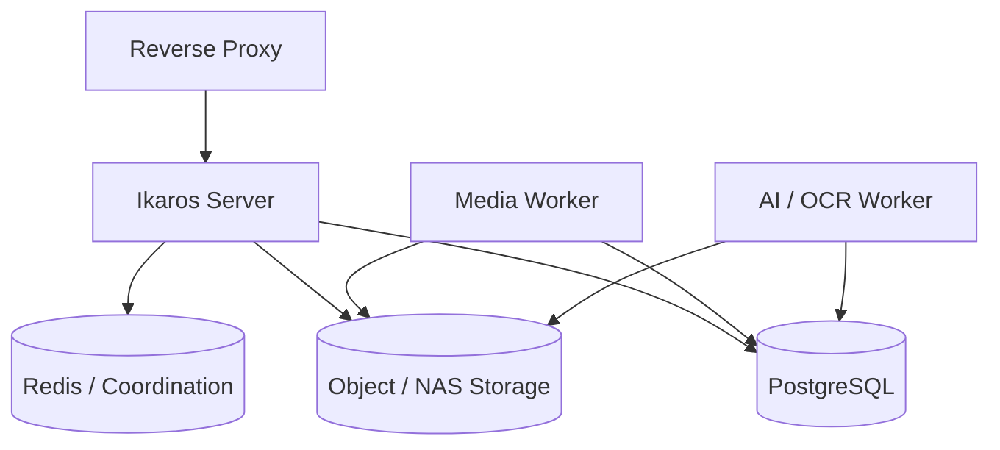

# Ikaros V2 系统概要设计：图表

<!-- Generated by scripts/check_architecture_docs.py --write-mirrors; do not edit. -->

来源：[System-Overview-Design.md](../00-product-baseline/System-Overview-Design.md)。规范正文以来源文档为准。

## 图 1

## 图 2

```mermaid
flowchart TB
    subgraph Clients[客户端层]
        CMS[CMS / Web Console]
        FLUTTER[Flutter App]
        EXTCLIENT[第三方客户端]
    end

    subgraph Interface[接口层]
        HTTP[HTTP API]
        RT[WebSocket / SSE / Realtime]
        OPENAPI[OpenAPI / API Contract]
    end

    subgraph Application[应用与平台层]
        SECURITY[身份 / 权限 / 安全]
        RESOURCE[Resource / Collection / Relation]
        DRIVE[Personal Drive / File Sync]
        CONTENT[媒体 / 阅读 / 音乐 / 图片 / 创作]
        PRODUCTIVITY[效率规划]
        FINANCE[个人财务]
        SECUREAPP[Private Notes / Password Manager]
        COLLAB[分享 / 协作 / Room]
        SEARCH[搜索与发现]
        AIINTEL[AI 智能增强]
        ANALYTICS[统计与分析]
        ADMINOPS[平台管理与运维]
    end

    subgraph Integration[平台联动层]
        CAP[Capability]
        CMD[Command]
        EVT[Event]
        REL[Relation]
        AUTO[Automation]
        ACT[Activity]
        CTX[Context]
    end

    subgraph Common[通用平台能力]
        TASK[Background Task]
        NOTIFY[Notification]
        AUDIT[Audit]
        PLUGIN[Plugin Runtime]
        STORAGECORE[Attachment / Blob / Storage]
        SECURE[Secure Data Foundation]
    end

    subgraph Infra[基础设施层]
        PG[(PostgreSQL)]
        CACHE[(Redis 可选)]
        INDEX[(Search Index)]
        BLOB[(Filesystem / S3 / NAS)]
    end

    Clients --> Interface
    Interface --> Application
    Application --> Integration
    Application --> Common
    Integration --> Common
    Common --> Infra
```

## 图 3

## 图 4

## 图 5

## 图 6

## 图 7

