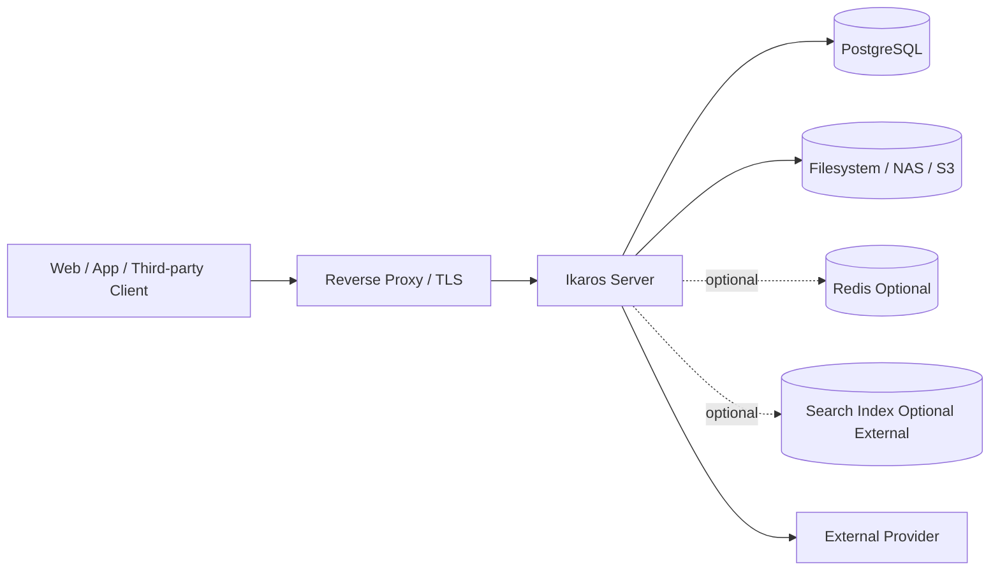
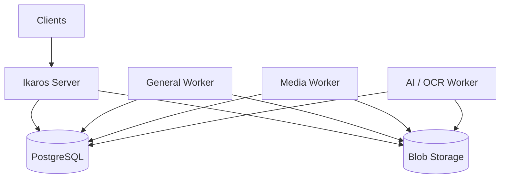
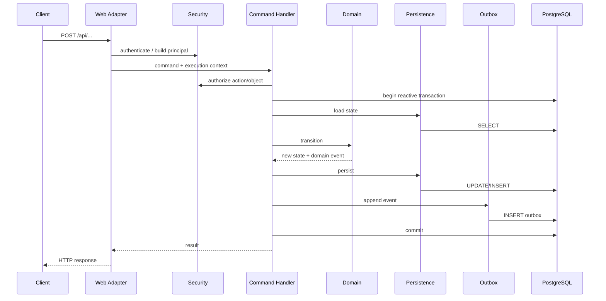
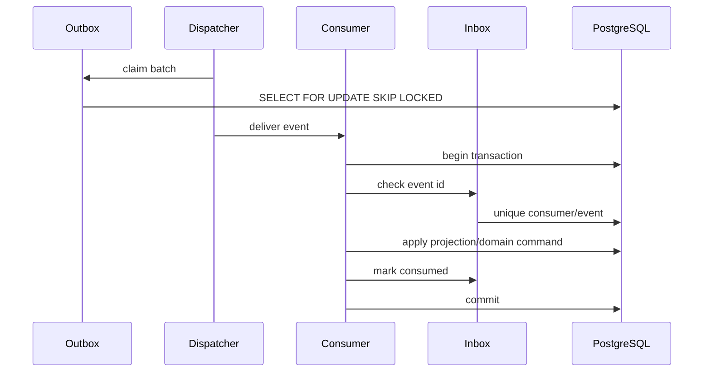
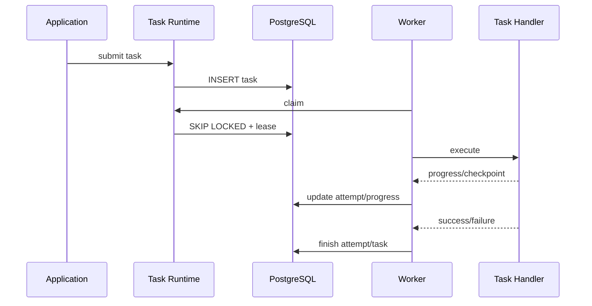

# Ikaros V2 技术架构设计：图表

<!-- Generated by scripts/check_architecture_docs.py --write-mirrors; do not edit. -->

来源：[Technical-Architecture-Design.md](../00-product-baseline/Technical-Architecture-Design.md)。规范正文以来源文档为准。

## 图 1

## 图 2

## 图 3

## 图 4

## 图 5

