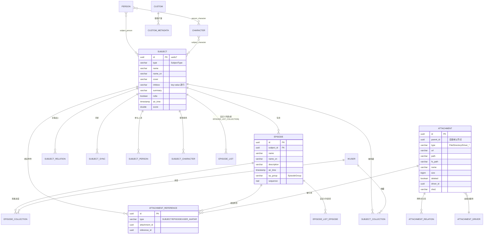

# 内容数据结构文档（总览）

> 本文档族描述 Ikaros 核心内容数据模型：**条目（Subject）**、**剧集（Episode）** 与 **附件（Attachment）** 的三层结构，以及音乐、漫画、小说四类内容如何复用同一套模型。
>
> - 文档语言：中文
> - 适用范围：`api` / `server` 模块的数据层、`console` 前端数据消费
> - 代码基准：`main` 分支（本文档族编写时的最新提交）

## 目录

| 文档 | 内容 |
|------|------|
| [README.md](./README.md) | 总览、统一模型设计、全局 ER 图（本文档） |
| [subject.md](./subject.md) | 条目（Subject）数据结构详解：表、字段、枚举、约束、DTO/VO |
| [music.md](./music.md) | 音乐数据结构：专辑/歌曲如何映射到 Subject/Episode |
| [comic.md](./comic.md) | 漫画数据结构：卷/话/页与图片附件的绑定关系 |
| [novel.md](./novel.md) | 小说数据结构：章节与文本附件的绑定关系 |

## 一、核心设计思想

Ikaros 的内容数据采用 **“一种条目、二级剧集、通用附件”** 的统一模型，而不是为每种媒体类型分别建表：

```
┌──────────────────────────────────────────────────────────┐
│                      Subject（条目）                      │
│   type 区分：ANIME / COMIC / GAME / MUSIC / NOVEL / ...   │
└──────────────────────────┬───────────────────────────────┘
                           │ 1 : N
┌──────────────────────────▼───────────────────────────────┐
│                      Episode（剧集/章节）                 │
│   动画 → 集；音乐 → 歌曲；漫画 → 话；小说 → 章节          │
│   group 区分：MAIN / OP / ED / OST / ...                 │
└──────────────────────────┬───────────────────────────────┘
                           │ M : N（attachment_reference）
┌──────────────────────────▼───────────────────────────────┐
│                    Attachment（附件/文件）                │
│   图片 / 视频 / 音频 / 文本，由 AttachmentDriver 提供     │
└──────────────────────────────────────────────────────────┘
```

四类内容的具体映射：

| 内容类型 | 条目 | 剧集 | 附件绑定 | 前端绑定方式 |
|----------|------|------|----------|--------------|
| 动画 ANIME | Subject | 集（`MAIN` 正片 / OP / ED / SP…） | 每集 1 个视频文件（可选字幕） | 单资源选择 |
| 音乐 MUSIC | Subject（专辑） | 歌曲（`MAIN`，`sequence` 为曲序） | 每首歌 1 个音频（可多资源：音频+歌词） | 多资源选择 |
| 漫画 COMIC | Subject | 话/卷（`MAIN`，`sequence` 为话序） | 每话多张页面图片（按附件 ID 排序） | 多资源选择 |
| 小说 NOVEL | Subject | 章节（`MAIN`，`sequence` 为章序） | 每章 1 个文本文件 | 单资源选择 |

> 判定依据：`console/src/modules/content/subject/SubjectDetails.vue`
> `initEpisodeHasMultiResource()` —— ANIME / GAME / NOVEL 为单资源，其余类型（COMIC / MUSIC 等）为多资源。

## 二、核心表清单

数据持久化全部位于 PostgreSQL，迁移脚本在 `server/src/main/resources/db/migration/`（Flyway，`V2026xxxxxx__*.sql`）。

| 表 | 作用 | 迁移脚本 |
|----|------|----------|
| `subject` | 条目主表 | `V202601101934__DDL_SUBJECT.sql` |
| `episode` | 剧集/歌曲/话/章节 | `V202601101923__DDL_EPISODE.sql` |
| `attachment` | 附件（文件） | `V202601101915__DDL_ATTACHMENT.sql` |
| `attachment_driver` | 附件驱动（本地/WebDAV/自定义） | `V202601101916__DDL_ATTACHMENT_DRIVER.sql` |
| `attachment_reference` | 附件 ↔ 条目/剧集 绑定 | `V202601101917__DDL_ATTACHMENT_REFERENCE.sql` |
| `attachment_relation` | 附件间关系（如视频↔字幕） | `V202601101918__DDL_ATTACHMENT_RELATION.sql` |
| `subject_collection` | 用户条目收藏（在看/看过…） | `V202601101936__DDL_SUBJECT_COLLECTION.sql` |
| `episode_collection` | 用户剧集进度（看完/进度） | `V202601101924__DDL_EPISODE_COLLECTION.sql` |
| `subject_relation` | 条目间关系（前传/续集/OST…） | `V202601112313__DDL_SUBJECT_RELATION.sql` |
| `subject_sync` | 条目同步信息（bgm.tv/TMDB…） | `V202601101938__DDL_SUBJECT_SYNC.sql` |
| `subject_person` / `subject_character` | 条目参与人员 / 登场角色 | `V202601101937/935__DDL_*.sql` |
| `person` / `character` | 人物 / 角色主表 | `V202601101930/920__DDL_*.sql` |
| `person_character` | 人物 ↔ 角色（配音等） | `V202601101931__DDL_PERSON_CHARACTER.sql` |
| `tag` | 标签（可打标 Subject/Episode/Attachment） | `V202601101939__DDL_TAG.sql` |
| `episode_list` 系列 | 自定义剧集列表 | `V202601101925/926/927__DDL_*.sql` |
| `episode_sequence_regular` | 剧集序号匹配正则（责任链） | `V202605301926__DDL_EPISODE_SEQUENCE_REGULAR.sql` |
| `custom` / `custom_metadata` | 自定义元数据扩展 | `V202601101921/922__DDL_*.sql` |
| `task` | 后台任务 | `V202601101940__DDL_TASK.sql` |
| `ikuser` | 用户 | `V202601101928__DDL_IKUSER.sql` |

## 三、全局 ER 图



## 四、关键约束汇总

1. **主键均为 `uuid`，默认 `uuidv7()`**（时间有序，可用作自然排序）。
2. 大多数业务实体继承 `BaseEntity` 审计字段：`create_time`、`create_uid`、`delete_status`、`update_time`、`update_uid`、`ol_version`（乐观锁版本）。
   > 例外：`attachment`（附件）表**不继承审计字段**，仅含 `update_time`（见 `AttachmentEntity` 与 `V202601101915__DDL_ATTACHMENT.sql`）。`V202608220000__DDL_ATTACHMENT_UNIQUE_TYPE_PARENT_NAME.sql` 为其新增 `(type, parent_id, name)` 唯一约束，防止并发刷新目录重复插入。
3. **`episode` 唯一约束**：`UNIQUE (subject_id, ep_group, sequence, name)` —— 同一条目内，分组 + 序号 + 名称组合不可重复。
4. **`subject_sync` 唯一约束**：`UNIQUE (platform, platform_id)` —— 同一平台的外部 ID 只能对应一个条目。
5. **`custom` 唯一约束**：`(c_group, version, kind, name)`。
6. **`attachment_reference`**：`(type, attachment_id, reference_id)` 三元组表达“哪个附件绑定到哪个实体”；类型为 `EPISODE` 时即“剧集资源”。
7. 附件由目录树组织：`attachment.parent_id` 指向父目录附件，顶层目录是 `attachment` 虚拟根（`AttachmentConst.V_ROOT_DIRECTORY_PARENT_ID`）。

## 五、聚合视图（API 层组合）

- `EpisodeRecord(episode, List<EpisodeResource>)`：剧集 + 其附件资源（`EpisodeResource` 含 `attachmentId / parentAttachmentId / url / canRead / name / tags(如 1080p)`）。
- `SubjectRecord(subject, List<EpisodeRecord>, List<Tag>, List<SubjectSync>, Map<String,String> extra)`：条目的完整聚合（详情页一次性加载，降低并发请求数）。
- 资源查询 SQL（`DefaultEpisodeService#findResourcesById`）：
  `ATTACHMENT_REFERENCE ar, ATTACHMENT att WHERE ar.TYPE='EPISODE' AND ar.REFERENCE_ID=:episodeId AND ar.ATTACHMENT_ID=att.ID ORDER BY ar.TYPE, ar.ATTACHMENT_ID`
  —— 该查询 TYPE 恒为 `EPISODE`，实际排序键即 **附件 ID（uuidv7 时间序）**：多资源（漫画页、字幕）的“绑定顺序≈上传/导入顺序”。

## 六、相关代码位置

| 主题 | 位置 |
|------|------|
| 实体类 | `server/src/main/java/run/ikaros/server/store/entity/*.java` |
| API 模型 | `api/src/main/java/run/ikaros/api/core/subject/{Subject,Episode,EpisodeRecord,EpisodeResource,SubjectRecord}.java` |
| 枚举 | `api/src/main/java/run/ikaros/api/store/enums/*.java` |
| 条目服务 | `server/src/main/java/run/ikaros/server/core/subject/service/` |
| 剧集服务 | `server/src/main/java/run/ikaros/server/core/episode/` |
| 音乐服务 | `server/src/main/java/run/ikaros/server/core/music/` |
| 附件服务 | `server/src/main/java/run/ikaros/server/core/attachment/` |
| 数据库迁移 | `server/src/main/resources/db/migration/` |