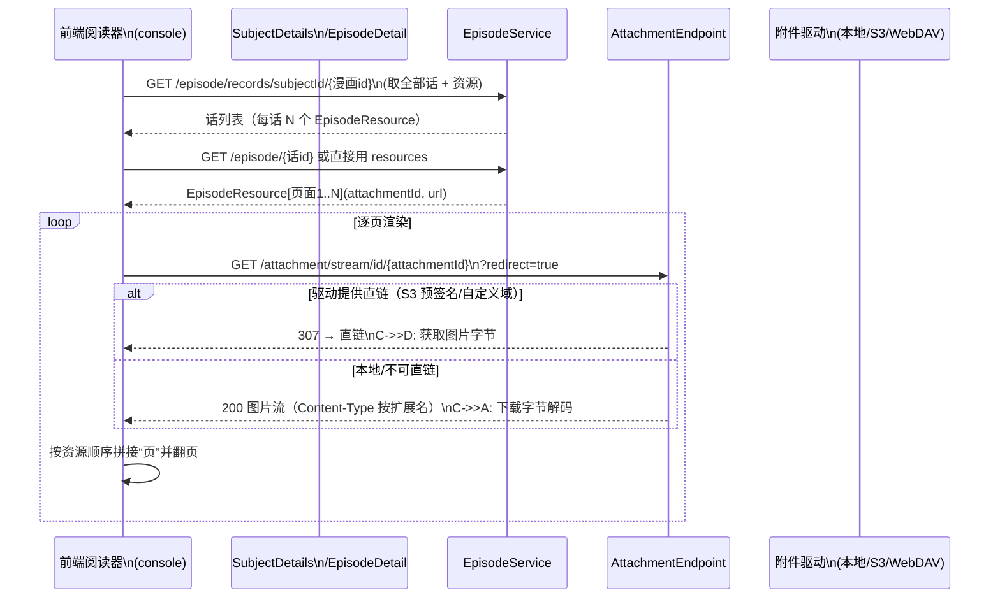

# 漫画数据结构详解

> 说明：Ikaros 用统一的 `Subject`(`type=COMIC`) + `Episode` + `Attachment` 承载漫画数据。
> 本文档描述漫画的**卷/话/页**三级结构组成、绑定规则与阅读数据流。

## 一、数据组成（映射关系）

```mermaid
flowchart LR
    subgraph Subject["Subject（漫画）type=COMIC"]
        S1[id]
        S2[name 漫画名]\nS3[nameCn 中文名]
        S4[cover 封面]
        S5[infobox 作者/连载杂志/话数…]
        S6[summary 简介]
        S7[airTime 连载开始]\nS8[score]
    end
    subgraph Ep["Episode（话/卷）"]
        E1[id + subjectId]
        E2[name 第N话 / 第N卷]
        E3[sequence 话序号]
        E4[group MAIN]
        E5[description 话简介]
    end
    subgraph Pages["Attachment（页面图片 ×N）"]
        P1[parentId 指向话/卷目录附件]\nP2[name 001.jpg … 020.jpg]
        P3[url / path / fsPath]
        P4[size + sha1]
        P5[driverId 驱动]
    end
    Subject -- "1:N" --> Ep
    Ep -- "M:N（attachment_reference type=EPISODE）" --> Pages
```

### 1.1 卷 / 话建模约定

| 漫画语义 | 落点 | 约定 |
|----------|------|------|
| 漫画本体 | `Subject(type=COMIC)` | `name`/`nameCn`/`cover`/`summary`/`airTime`；`infobox` 记作者、连载杂志、单行本数等 |
| 单话（章） | `Episode(group=MAIN)` | `name`=“第 N 话”或卷内标题，`sequence`=话序（1 起递增），`description` 可存话简介 |
| 单行本卷 | 可选：用 `Episode(group=MAIN, sequence=卷序)` | 若按卷组织，则卷为 Episode，页直接绑卷；也可“卷内再分话”（用 `sequence` 区间或 `name` 前缀区分） |
| 页面图片 | `Attachment(File/Driver_File)` | 每页一张图；按绑定顺序 = 阅读顺序（attachment_reference 按 `attachment_id` uuidv7 排序） |
| 封面 | `Subject.cover` 或 `AttachmentReference(type=SUBJECT)` | 条目封面（后者可让封面对应驱动内真实文件） |

> 前端多资源判定：`SubjectDetails.vue#initEpisodeHasMultiResource` 中 COMIC **不**在单资源名单内，
> 因此每话可绑定多张页面图（多资源选择器）。

## 二、结构要求

1. **`subject.type` 必须为 `COMIC`**；`name` 必填，`nsfw` 必填。
2. **话（Episode）序号**：同一漫画内 `(ep_group=MAIN, sequence, name)` 唯一（episode 表约束）；
   话序号应连续递增（1,2,3…），支持 `sequence` 为小数（番外 1.5 等）。
3. **页序约定**：页面图片通过 `attachment_reference(type=EPISODE, reference_id=话id)` 绑定；
   **阅读顺序 = attachment_reference.attachment_id 升序**（uuidv7 时间有序），
   因此导入时应按页名自然排序（001.jpg→020.jpg）批量绑定。
4. **单话多图**：一话至少 1 张图；建议把整话图片的父目录附件设为话的目录
   （`attachment.parent_id` → 话目录附件），便于整目录导入。
5. **封面**：建议 `AttachmentReference(type=SUBJECT)` 绑定封面附件（有监听器自动回写 `subject.cover`）。
6. **删除级联**：删除漫画 → 删其全部话 → 解绑附件引用（附件本体保留，由附件模块管理）。

## 三、阅读数据流



- 翻页顺序直接依赖 `EpisodeResource` 列表顺序（= 附件 ID 升序）。
- 图片类型支持：`FileType.IMAGE`（jpg/png/webp/gif…）；附件流接口按扩展名返回 `Content-Type`。
- 漫画无音轨，不需要 `attachment_relation(VIDEO_SUBTITLE)`。

## 四、相关 API 与代码

| 用途 | API | 代码位置 |
|------|-----|----------|
| 漫画列表/详情 | `GET /subjects/condition?type=COMIC`、`GET /subject/{id}` | `SubjectEndpoint` |
| 话列表（含资源） | `GET /episode/records/subjectId/{id}` | `EpisodeEndpoint` / `DefaultEpisodeService#findRecordsBySubjectId`（聚合 EpisodeRecord） |
| 话 CRUD | `POST/PUT/DELETE /episode...` | `EpisodeEndpoint` |
| 页流 | `GET /attachment/stream/id/{attachmentId}?redirect=true` | `AttachmentEndpoint#getStreamById`（307 直链 / 代理流） |
| 附件绑定 | `attachment_reference` | `AttachmentServiceImpl` / `DefaultEpisodeService#findResourcesById` |

## 五、扩展：卷内分话推荐组织

若漫画单行本卷数多、每卷内又有独立话目，推荐：

- `Episode(group=MAIN, sequence=卷序, name=“第N卷”)` 为卷级容器；
- 卷级容器内不直接绑图，而是卷的**页面**用 `sequence=卷序.话内序号`（如 1.1、1.2…）表达“第 1 卷第 1 页”，
  或每话一个 Episode 并依赖 `attachment.parent_id` 目录结构保持卷内层级。

> 该细则不作为强制约束——只要 `episode` 唯一约束与页序约定满足，模型即自洽。