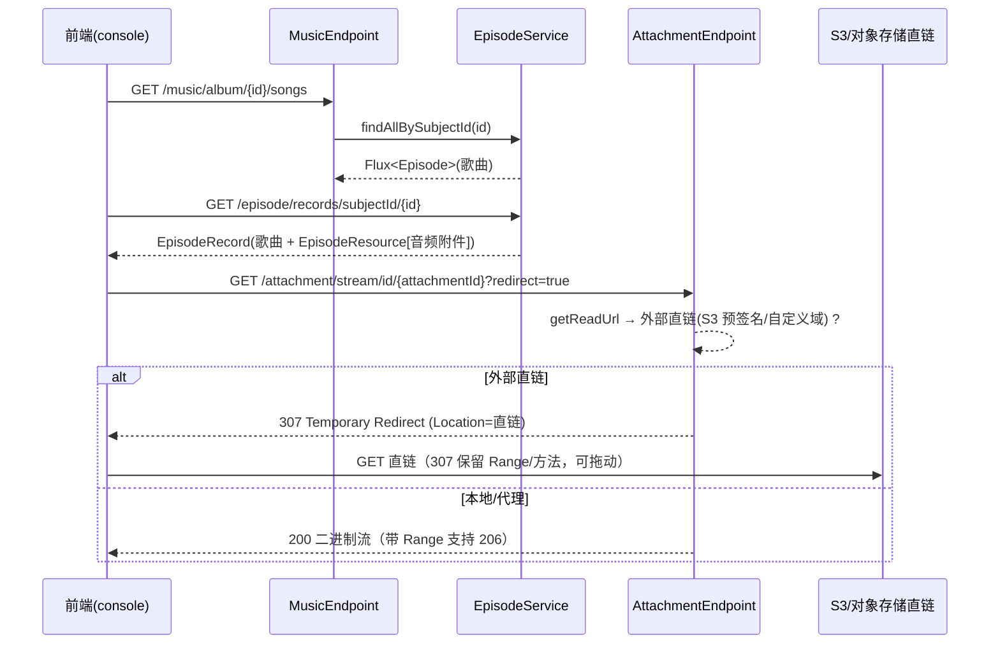

# 音乐数据结构详解

> 说明：Ikaros **没有独立的音乐表**——音乐专辑（Album）复用 `Subject`（`type=MUSIC`），
> 歌曲（Song）复用 `Episode`，音频文件复用 `Attachment` 并通过 `attachment_reference` 绑定。
> 本文档描述这一映射、字段组成与结构要求、以及播放流程。

## 一、数据组成（映射关系）

```mermaid
flowchart LR
    subgraph Subject["Subject（专辑）type=MUSIC"]
        S1[id]
        S2[name 专辑名]
        S3[nameCn 中文名]
        S4[cover 封面]
        S5[summary 专辑简介]
        S6[airTime 发行时间]
        S7[score 评分 0-10]
        S8[nsfw]
    end
    subgraph Episode["Episode（歌曲）"]
        E1[id]
        E2[subjectId 所属专辑]
        E3[name 曲名]
        E4[nameCn 中文名]
        E5[sequence 曲序/碟序]
        E6[group MAIN / MUSIC_DIST1-5]
        E7[description 歌词/简介]
    end
    subgraph Att["Attachment（音频文件）"]
        A1[id]
        A2[name xxx.flac]
        A3[url / path / fsPath]
        A4[size]
        A5[driverId 驱动]
    end
    Subject -- "1:N（episode.subject_id）" --> Episode
    Episode -- "M:N（attachment_reference type=EPISODE）" --> Att
```

### 1.1 专辑 → Subject 字段映射

| 音乐语义 | Subject 字段 | 必填 | 说明 |
|----------|--------------|------|------|
| 专辑 ID | `id` | 自动 | uuidv7 |
| 专辑名 | `name` | ✅ | 原始名称 |
| 中文名 | `nameCn` | — | |
| 封面 | `cover` | — | URL 或附件流地址 |
| 简介 | `summary` | — | 专辑描述 |
| 发行时间 | `airTime` | — | 专辑发售日 |
| 评分 | `score` | — | 0–10 |
| NSFW | `nsfw` | ✅ | |
| 类型 | `type` | ✅ | **固定 `MUSIC`**（创建/更新时由服务强制设置） |

> 服务端强制：`DefaultMusicService#createAlbum/updateAlbum` 会 `subject.setType(MUSIC)`，
> 即使客户端传错类型也会被纠正；查询侧 `findAlbumById` 会 `filter(type == MUSIC)`。

### 1.2 歌曲 → Episode 字段映射

| 音乐语义 | Episode 字段 | 必填 | 说明 |
|----------|--------------|------|------|
| 歌曲 ID | `id` | 自动 | |
| 所属专辑 | `subjectId` | ✅ | 由 `music/album/{id}/songs` 列表自动回填 |
| 曲名 | `name` | ✅ | |
| 中文名 | `nameCn` | — | |
| 简介/歌词 | `description` | — | |
| 发行时间 | `airTime` | — | |
| 曲序 | `sequence` | — | 单碟时 1..N；多碟可用 `MUSIC_DIST1..5` 分组 |
| 分组 | `group` | — | `MAIN`（默认）或 `MUSIC_DIST1`~`MUSIC_DIST5`（碟片 1~5） |

### 1.3 歌曲文件 → Attachment / attachment_reference

- 每个音频文件是一个 `Attachment`（`type=File` 或 `Driver_File`，由 `AttachmentDriver` 提供）。
- 通过 `attachment_reference(type=EPISODE, attachment_id=音频, reference_id=歌曲 episodeId)` 绑定。
- 一首歌可绑定 **多个资源**（前端针对 MUSIC 开启多资源选择）：音频 + 歌词（lrc）、封面图等；
  排序依据 `attachment_reference.attachment_id`（uuidv7 时间序）即“先绑定的在前”。

## 二、数据模型（DTO）

| DTO | 字段 | 说明 |
|-----|------|------|
| `Music`（`api/.../core/music/Music.java`） | `id/name/nameCn/cover/description/airTime/score/rank/nsfw/songCount` | 专辑视图；`songCount` 由 `episodeService.countBySubjectId` 实时计算 |
| `Song`（`api/.../core/music/Song.java`） | `id/subjectId/name/nameCn/description/airTime/sequence/group` | 歌曲视图；与 `Episode` 一一对应 |

## 三、结构要求

1. **`subject.type` 必须为 `MUSIC`**（服务层强制）。
2. **歌曲 `name` 非空**；同一专辑内 `(ep_group, sequence, name)` 不可重复（`episode` 唯一约束）。
3. **专辑必须显式关联歌曲**：歌曲 `subjectId` 指向专辑；删除专辑时 cascade 清理其歌曲与附件引用。
4. **歌曲必须绑定音频附件** 才能播放；绑定关系写入 `attachment_reference(type=EPISODE)`。
5. 每首歌建议 `sequence` 递增（播放列表排序），跨碟用 `MUSIC_DIST{n}` 分组 + 碟内序号。
6. 歌词文件建议以 `attachment_reference` 绑定到同一歌曲（多资源），不单独建模。

## 四、API（前缀 `/api`，`MusicEndpoint`）

| 方法 | 路径 | 说明 |
|------|------|------|
| GET | `/music/albums/{page}/{size}` | 专辑分页列表 |
| GET | `/music/album/{id}` | 专辑详情（含实时 `songCount`） |
| POST | `/music/album` | 创建专辑（强制 type=MUSIC） |
| PUT | `/music/album` | 更新专辑 |
| DELETE | `/music/album/{id}` | 删除专辑（级联） |
| GET | `/music/album/{id}/songs` | 专辑歌曲列表 |
| POST | `/music/song` | 新增歌曲 |
| PUT | `/music/song` | 更新歌曲 |
| DELETE | `/music/song/{id}` | 删除歌曲 |
| GET | `/music/search/{keyword}/{page}/{size}` | 专辑搜索（名称 Base64 模糊） |

## 五、播放流程（数据流）

- 播放源统一走 `/attachment/stream`，音乐与动画/漫画共用同一条流链路；
  外部直链场景返回 **307**（保留 GET 与 Range，播放器可拖动进度条；相关改动见 `PR #870`）。
- Subsonic 兼容层（`DefaultSubsonicService`）也复用 `episodeService.findResourcesById`
  提供音乐流媒体服务，数据源完全相同。

## 六、代码位置

| 主题 | 位置 |
|------|------|
| 音乐服务 | `server/.../core/music/service/impl/DefaultMusicService.java` |
| 音乐端点 | `server/.../core/music/endpoint/MusicEndpoint.java` |
| 专辑 DTO | `api/.../core/music/Music.java`、`Song.java` |
| 歌曲资源 | `api/.../core/subject/EpisodeRecord.java`、`EpisodeResource.java` |
| DB | `subject`、`episode`、`attachment_reference`（见 subject.md / README） |