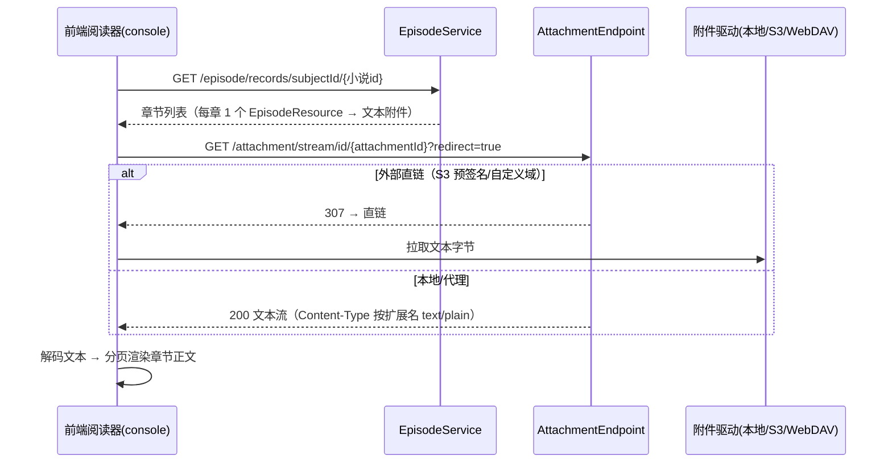

# 小说数据结构详解

> 说明：Ikaros 用统一的 `Subject`(`type=NOVEL`) + `Episode` + `Attachment` 承载小说数据。
> 本文档描述小说的**章节**与**文本文件**绑定规则、结构要求及阅读数据流。

## 一、数据组成（映射关系）

### 1.1 章节建模约定

| 小说语义 | 落点 | 约定 |
|----------|------|------|
| 小说本体 | `Subject(type=NOVEL)` | `name`/`nameCn`/`cover`/`summary`/`airTime`；`infobox` 记作者、出版社、连载状态等 |
| 章节 | `Episode(group=MAIN)` | `name`=章节标题，`sequence`=章序（1 起递增），`description` 可存章节摘要 |
| 章节正文 | `Attachment(File/Driver_File)` | 每章一个文本文件（txt / epub / markdown） |

> **单资源约束**：前端 `SubjectDetails.vue#initEpisodeHasMultiResource` 中 NOVEL 在单资源名单内，
> 即每章**只允许绑定 1 个文本附件**，界面用单选附件对话框。

## 二、结构要求

1. **`subject.type` 必须为 `NOVEL`**；`name` 必填、`nsfw` 必填。
2. **章节（Episode）**：同一小说内 `(ep_group=MAIN, sequence, name)` 唯一；
   章序建议连续递增（可含 0.x 番外、插曲）。
3. **每章绑定 1 个文本附件**（`attachment_reference(type=EPISODE, reference_id=章id)`）；
   绑定时应保证 `AttachmentType` 为文件类（`File` / `Driver_File`）。
4. **正文格式**：优先 `txt`（UTF-8）；`epub` 亦可绑定（前端/客户端负责解包渲染），
   但**单章单附件**前提下建议正文按章拆分为独立 txt，保持与章节 1:1。
5. **封面**：建议 `AttachmentReference(type=SUBJECT)` 绑定封面（自动回写 `subject.cover`）。
6. **删除级联**：删除小说 → 删全部章节 → 解绑附件引用。

## 三、阅读数据流

- 正文渲染由前端按需分页；服务端不预渲染。
- 若章节文件为 `.epub`（压缩容器），客户端负责解包；服务端仅提供字节流。
- 超长章节：可借助附件流 Range 分段拉取（若驱动支持按字节范围读取）。

## 四、相关 API 与代码

| 用途 | API | 代码位置 |
|------|-----|----------|
| 小说列表/详情 | `GET /subjects/condition?type=NOVEL`、`GET /subject/{id}` | `SubjectEndpoint` |
| 章节列表（含资源） | `GET /episode/records/subjectId/{id}` | `EpisodeEndpoint` / `DefaultEpisodeService` |
| 章节 CRUD | `POST/PUT/DELETE /episode...` | `EpisodeEndpoint` |
| 正文流 | `GET /attachment/stream/id/{attachmentId}?redirect=true` | `AttachmentEndpoint#getStreamById` |
| 附件绑定 | `attachment_reference(type=EPISODE)` | `AttachmentServiceImpl` / `DefaultEpisodeService#findResourcesById` |

## 五、与音乐/漫画的差异小结

| 维度 | 音乐 MUSIC | 漫画 COMIC | 小说 NOVEL |
|------|-----------|-----------|-----------|
| 二级结构 | 歌曲（曲序 `sequence`、碟分组 `MUSIC_DIST1-5`） | 话/卷（话序 `sequence`） | 章节（章序 `sequence`） |
| Episode 资源数 | 多资源（音频+歌词等，前端多选） | 多资源（每话多页图，前端多选） | **单资源**（每章 1 文本，前端单选） |
| 资源排序 | `attachment_id` 升序 | `attachment_id` 升序 = 页序 | 单资源无排序问题 |
| 播放/阅读 | 音频流（可拖动，307/206） | 图片逐页流 | 文本字节流 |
| 扩展元数据 | `infobox` + `custom_metadata` | `infobox` + `custom_metadata` | `infobox` + `custom_metadata` |