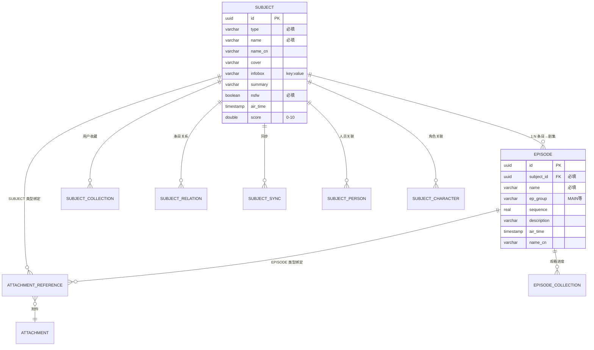

# 条目（Subject）数据结构详解

> 说明：本文档描述 `subject` 及其关联表的数据组成、字段语义、枚举取值与结构要求。
> 配套总览见 [README.md](./README.md)。

## 一、概述

条目（Subject）是 Ikaros 内容体系的**核心实体**，用 `type` 字段统一承载动画、漫画、游戏、音乐、小说、现实（真人）与其它内容：

| type（SubjectType） | 含义 | 二级结构（Episode 的用法） |
|--------------------|------|--------------------------|
| `ANIME` | 动画 / 番剧 | 集（MAIN 正片、OP、ED、SP、OVA…） |
| `COMIC` | 漫画 | 话 / 卷（按话创建 Episode） |
| `GAME` | 游戏 | 关卡 / DLC / 章节 |
| `MUSIC` | 音乐 | 专辑中的歌曲（一首歌一个 Episode） |
| `NOVEL` | 小说 | 章节（一章一个 Episode） |
| `REAL` | 现实（影视、真人剧） | 集 |
| `OTHER` | 其它 | 自定义 |

## 二、数据组成

### 2.1 `subject` 表（条目主表）

来源：`V202601101934__DDL_SUBJECT.sql`、`SubjectEntity.java`

| 字段 | 类型 | 说明 | 结构要求 |
|------|------|------|----------|
| `id` | uuid | 主键，默认 `uuidv7()` | 必填（自动生成） |
| `create_time` / `create_uid` | timestamp / uuid | 创建审计 | BaseEntity |
| `delete_status` | boolean | 逻辑删除标记 | BaseEntity |
| `update_time` / `update_uid` | timestamp / uuid | 更新审计 | BaseEntity |
| `ol_version` | bigint | 乐观锁版本号 | BaseEntity |
| `type` | varchar(255) | 条目类型（`SubjectType`） | **必填**，读写均须合法枚举 |
| `name` | varchar(255) | 原始名称 | **必填**（API 层 `@Schema(requiredMode=REQUIRED)`） |
| `name_cn` | varchar(255) | 中文名称 | 可选 |
| `cover` | varchar(10000) | 封面 URL 或附件流地址 | 可选 |
| `infobox` | varchar(50000) | 信息框，`key: value` 逐行纯文本 | 可选；新增 `custom` 表可作结构化扩展 |
| `summary` | varchar(50000) | 简介 | 可选 |
| `nsfw` | boolean | 是否 NSFW（匿名环境下可被搜索屏蔽） | **必填**（API 层 REQUIRED） |
| `air_time` | timestamp(6) | 发行 / 首播时间 | 可选 |
| `score` | double precision | 评分，0–10 | 可选 |

> `infobox` 格式约定：每行一个字段 `字段名: 值`。前端解析逻辑见
> `console/src/modules/content/subject/SubjectDetails.vue`（按 `\n` 分行、按 `:` 切分
> 成 `Map<key, value>` 展示）。例如：
>
> ```
> 中文名: 某科学的超电磁炮
> 话数: 24
> 放送开始: 2009-10-02
> 导演: 长井龙雪
> ```

### 2.2 `episode` 表（条目二级结构：集 / 歌曲 / 话 / 章）

来源：`V202601101923__DDL_EPISODE.sql`、`EpisodeEntity.java`

| 字段 | 类型 | 说明 | 结构要求 |
|------|------|------|----------|
| `id` | uuid | 主键 `uuidv7()` | 必填（自动生成） |
| `subject_id` | uuid | 所属条目 | **必填**，外键语义指向 `subject.id` |
| `name` | varchar(255) | 名称（如“第 12 话”“Track 02”） | **必填**（服务层校验非空） |
| `name_cn` | varchar(255) | 中文名 | 可选 |
| `description` | varchar(50000) | 描述 / 歌词简介等 | 可选 |
| `air_time` | timestamp(6) | 播出 / 发行时间 | 可选 |
| `ep_group` | varchar(50) | 剧集分组（`EpisodeGroup`） | 可选；默认 `MAIN` 见 `Episode#defaultEpisode` |
| `sequence` | real | 序号（第几集 / 第几话 / 曲目序号） | 可选；用于排序 |
| 唯一约束 | — | `UK (subject_id, ep_group, sequence, name)` | **同一条目内**分组+序号+名称不可重复 |

> 服务层在 `updateEpisodesWithSubjectId` 等批量场景会强制把 `subjectId` 回填为当前条目 ID。
> 序号匹配自动化：`episode_sequence_regular` 表通过责任链模式用正则解析附件文件名，
> 自动得出 `ep_group` / `sequence`（见 `api/.../EpisodeSequenceRegular*.java`）。

### 2.3 附件绑定（`attachment_reference`）

剧集与附件（视频 / 音频 / 图片 / 文本）的绑定全部通过 `attachment_reference` 表：

| 字段 | 说明 |
|------|------|
| `type` | 引用类型：`SUBJECT`（条目级，如封面附件）、`EPISODE`（剧集资源）、`USER_AVATAR` |
| `attachment_id` | 附件 ID |
| `reference_id` | 被引用实体 ID（`type=EPISODE` 时为 episode 的 id） |

- 条目封面：既可直接填 `cover` 字段（URL），也可绑附件并监听 `AttachmentSubjectCoverChangeListener` 自动回写。
- 剧集资源聚合：见 `DefaultEpisodeService#findResourcesById`，按 `ar.ATTACHMENT_ID` 排序返回 `EpisodeResource`。

## 三、关联表（数据组成）

### 3.1 收藏与进度（用户侧）

**`subject_collection`**（用户条目收藏，`V202601101936`）：

| 字段 | 说明 |
|------|------|
| `user_id` | 用户 |
| `subject_id` | 条目 |
| `type` | `CollectionType`：`WISH` 想看 / `DOING` 在看 / `DONE` 看过 / `SHELVE` 搁置 / `DISCARD` 抛弃 |
| `main_ep_progress` | bigint，正片观看进度（集数） |
| `is_private` | 是否私密收藏 |
| `comment` | varchar(5000)，吐槽/短评 |
| `score` | bigint，用户打分 |

**`episode_collection`**（用户剧集进度，`V202601101924`）：

| 字段 | 说明 |
|------|------|
| `user_id` / `subject_id` / `episode_id` | 用户 / 条目 / 剧集 |
| `finish` | boolean，是否看完 |
| `progress` | bigint，播放进度（秒/帧） |
| `duration` | bigint，总时长 |
| `update_time` | 最近更新 |

### 3.2 条目关系（`subject_relation`）

| 字段 | 说明 |
|------|------|
| `subject_id` | 源条目 |
| `relation_type` | `SubjectRelationType`（见下） |
| `relation_subject_id` | 目标条目 |

`SubjectRelationType` 取值：`OTHER / ANIME / COMIC / GAME / MUSIC / NOVEL / REAL`（按类型关联）、
`BEFORE` 前传、`AFTER` 后传、`SAME_WORLDVIEW` 同世界观、
`ORIGINAL_SOUND_TRACK`（OST）、`ORIGINAL_VIDEO_ANIMATION`（OVA）、`ORIGINAL_ANIMATION_DISC`（OAD）。

### 3.3 同步信息（`subject_sync`）

| 字段 | 说明 |
|------|------|
| `subject_id` | 条目 |
| `platform` | `SubjectSyncPlatform`：`BGM_TV`(bgm.tv) / `TMDB` / `AniDB` / `TVDB` / `VNDB` / `DOU_BAN`(豆瓣) / `OTHER` |
| `platform_id` | 外部平台 ID |
| `sync_time` | 同步时间 |

- 唯一约束 `UK (platform, platform_id)`：同一平台的外部 ID 只能归属一个条目，用于幂等同步。
- 对应接口：`POST /subjects/sync` 相关端点（`SubjectSynchronizer`）。

### 3.4 人员 / 角色

| 表 | 作用 | 关键字段 |
|----|------|----------|
| `person` | 人物（职员/声优/作者…） | `name`、`infobox`、`summary` |
| `character` | 角色 | `name`、`infobox`、`summary` |
| `subject_person` | 条目 ↔ 人员 | `subject_id`、`person_id` |
| `subject_character` | 条目 ↔ 角色 | `subject_id`、`character_id` |
| `person_character` | 人员 ↔ 角色（出演关系） | `person_id`、`character_id` |

> 音乐/漫画/小说场景下：`person` 可用于“艺术家 / 作者 / 插画师”，
> `character` 可用于“登场角色”，`subject_person/character` 建立关联。

### 3.5 标签（`tag`）

| 字段 | 说明 |
|------|------|
| `type` | `TagType`：`SUBJECT` / `EPISODE` / `ATTACHMENT` |
| `master_id` | 被标记实体 ID |
| `name` | 标签名 |
| `user_id` | 打标用户 |
| `color` | 颜色 |
| `create_time` | 创建时间 |

### 3.6 自定义剧集列表（`episode_list` 族）

- `episode_list`：列表本体（`name`、`name_cn`、`cover`、`description`、`nsfw`）。
- `episode_list_collection`：条目 ↔ 列表归属。
- `episode_list_episode`：列表 ↔ 剧集编排（用户自建“精选”列表）。

### 3.7 自定义元数据（`custom` / `custom_metadata`）

- `custom`：自定义类型声明，唯一约束 `(c_group, version, kind, name)`。
- `custom_metadata`：`(custom_id, cm_key, cm_value bytea)`，键值对扩展，
  唯一约束 `(custom_id, cm_key)` —— 可用于扩展条目字段（如音乐发行厂牌、漫画连载杂志等）。

## 四、结构要求（硬性约束）

1. **`type`、`name`、`nsfw` 为条目必填**（API 层 REQUIRED 校验，见 `Subject.java`）。
2. **同一 `subject_id` 下 `(ep_group, sequence, name)` 组合唯一**，不允许重复创建剧集。
3. **`subject_sync` 的 `(platform, platform_id)` 全局唯一**。
4. **删除为逻辑删除**（`delete_status`），不物理删除行。
5. **写操作默认带乐观锁**（`ol_version` 自增校验），防止并发覆盖。
6. 附件绑定必须显式写 `attachment_reference`，类型枚举必须为 `SUBJECT` / `EPISODE` / `USER_AVATAR` 之一。

## 五、API 层模型（DTO / VO）

| 模型 | 组成 | 说明 |
|------|------|------|
| `Subject` | 与 subject 表一一对应 | 增删改查载体 |
| `Episode` | subjectId/name/nameCn/description/airTime/sequence/group | 剧集载体；`defaultEpisode()` 提供默认值 |
| `EpisodeResource` | attachmentId, parentAttachmentId, episodeId, url, canRead, name, tags(1080p 等) | 剧集拥有的附件资源视图 |
| `EpisodeRecord` | `(Episode, List<EpisodeResource>)` | 剧集+资源聚合 |
| `SubjectRecord` | `(Subject, List<EpisodeRecord>, List<Tag>, List<SubjectSync>, Map<String,String> extra)` | 条目完整聚合（详情页数据） |
| `FindSubjectCondition` | page/size/type/name(Base64)/airTimeDesc… | 条件查询 |

## 六、条目 ER 图



## 七、相关 API 一览（前缀 `/api`）

| 方法 | 路径 | 说明 |
|------|------|------|
| GET | `/subjects/{page}/{size}` | 分页列表 |
| GET | `/subject/{id}` | 条目详情 |
| GET | `/subjects/condition` | 条件查询（类型/名称模糊/排序） |
| POST | `/subject` | 创建 |
| PUT | `/subject` | 更新 |
| DELETE | `/subject/{id}` | 删除（逻辑） |
| GET | `/episodes/subjectId/{id}` | 条目下全部剧集 |
| GET | `/episode/records/subjectId/{id}` | 剧集+资源聚合列表（详情页主数据源） |
| GET | `/episode/attachment/refs/{id}` | 剧集附件引用 |
| GET | `/episode/count/total/subjectId/{id}` | 剧集总数 |
| GET | `/episode/count/matching/subjectId/{id}` | 已绑定附件的剧集数 |
| POST/PUT/DELETE | `/episode` `/episode/id/{id}` | 剧集增删改 |

> 音乐专辑与歌曲的专用端点（`/music/album/**`、`/music/song/**`）是对上述模型的
> 薄封装，详见 [music.md](./music.md)。