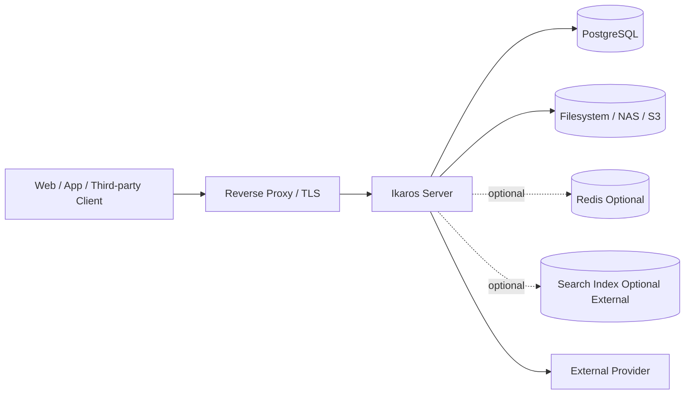
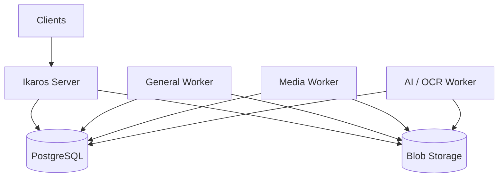
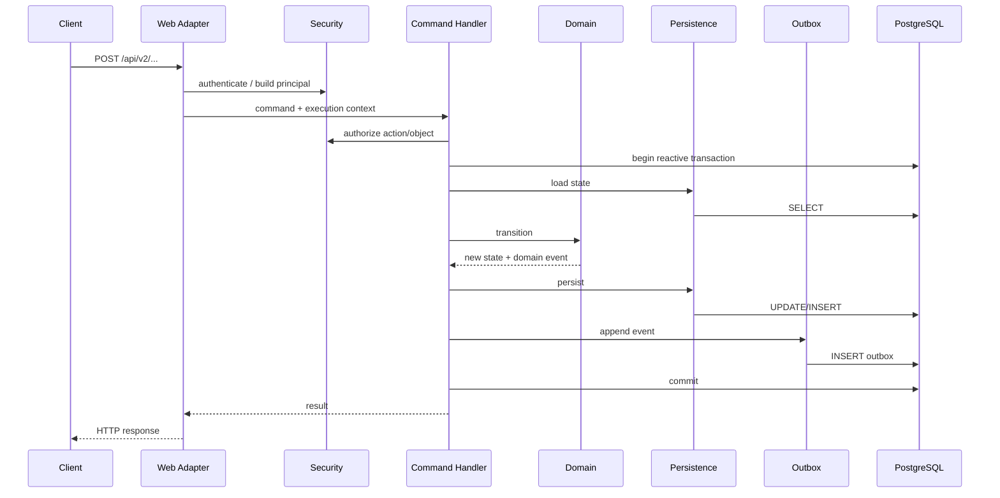
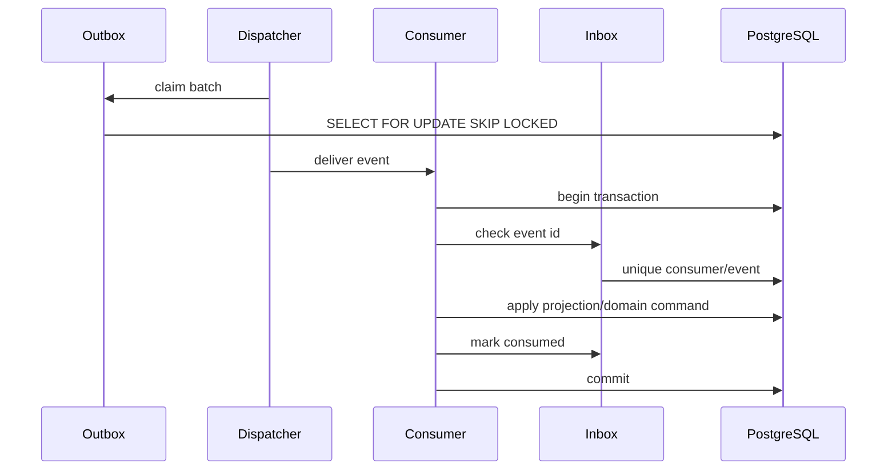
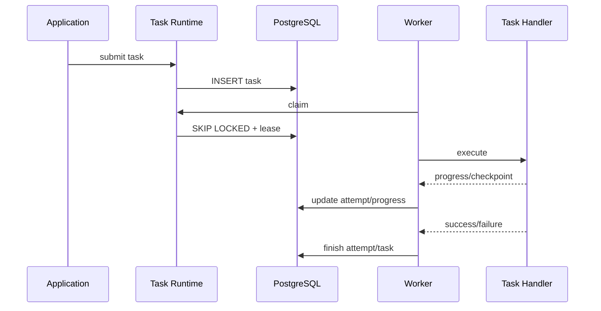

# Ikaros V2 技术架构设计

| 项目 | 内容 |
|---|---|
| 文档名称 | Ikaros V2 技术架构设计 |
| 适用版本 | Ikaros V2 |
| 文档版本 | v0.1 |
| 编写日期 | 2026-09-02 |
| 状态 | Engineering Baseline Draft |
| 上位设计 | `System-Overview-Design.md`、`Database-Overview-Design.md`、`API-Convention-Design.md` |
| 边界设计 | `Module-Package-Ownership-Design.md` |
| P0 基线 | `P0-Implementation-Baseline.md` |

> 本文档定义 Ikaros V2 从“系统与领域设计”下降到 Java / Spring / Reactor / PostgreSQL 工程实现时必须遵守的技术架构。
>
> `System-Overview-Design.md` 回答系统由什么组成，`Module-Package-Ownership-Design.md` 回答谁拥有状态和代码，本文档进一步回答：**这些边界在进程、Gradle、Spring、线程、事务、数据库、事件、任务、缓存、网络、存储、可观测性和部署层面如何真正落地。**
>
> 本文档不重新定义业务领域模型。若本文与上位系统级设计发生冲突，以系统级设计为准；若实现需要改变本文中的 Foundation Rule，应先提交 ADR / 设计修改，再修改代码。

---

## 1. 文档目标

Ikaros V2 的工程实现不能只做到“代码能运行”，还必须让系统在持续扩展数十个业务领域后仍然保持可理解、可测试、可恢复和可演进。

本文档重点解决以下问题：

1. V2 的后端技术栈和进程模型是什么。
2. 模块化单体如何在 Gradle 和 Spring Runtime 中形成真实边界。
3. HTTP / Realtime 请求如何进入 Application Command / Query。
4. Domain、Application、Persistence、Infrastructure 的职责如何在代码中落地。
5. WebFlux / Reactor 下哪些代码可以运行在 Event Loop，哪些必须隔离。
6. R2DBC 事务、PostgreSQL Schema Ownership、Flyway Migration 如何组织。
7. 跨模块状态传播如何通过 Outbox / Inbox 保证至少一次投递与消费者幂等。
8. Background Task、Scheduler、Worker 如何避免和 HTTP 请求线程混在一起。
9. Cache、Search、Analytics、AI Projection 如何保持“可丢失、可重建、不是真相源”。
10. Blob / 大文件 / Range / 对象存储的数据路径如何避免内存复制和阻塞。
11. Security、Configuration、Secret、Observability 如何作为平台能力接入，而不是散落在业务代码中。
12. 单机 Docker Compose 如何保持简单，同时允许未来拆分 Worker 和独立节点。
13. 哪些实现模式属于架构违规，必须由自动化测试阻止。

---

## 2. 架构决策摘要

Ikaros V2 的默认工程架构冻结为：

| 维度 | 默认决策 |
|---|---|
| 服务形态 | Modular Monolith，单 Server 进程优先 |
| Java | Java 21 LTS 基线 |
| Backend | Spring Boot 4.x |
| HTTP | Spring WebFlux |
| Reactive Runtime | Project Reactor |
| DB | PostgreSQL 18+ |
| DB Access | R2DBC，禁止业务运行时 JPA/JDBC 作为第二套持久化模型 |
| Migration | Flyway + JDBC，仅用于启动 / 运维迁移，不作为业务访问栈 |
| Transaction | Reactive Transaction，Application Command 边界统一管理 |
| Internal Integration | Command / Query API + Durable Event |
| Durable Event | PostgreSQL Outbox + Consumer Inbox |
| Task Runtime | PostgreSQL-backed Background Task / Attempt / Lease |
| Cache | 可关闭；进程内 / Redis 均属于加速层，不参与正确性 |
| Search | 异步 Projection，Search Engine 通过 Adapter 隔离 |
| Blob | Filesystem / NAS / S3-compatible Adapter |
| HTTP Client | Spring WebClient |
| Security | Spring Security WebFlux + Platform Authorization API |
| Metrics | Micrometer / Actuator |
| Trace Context | W3C Trace Context；支持 OpenTelemetry 接入 |
| Test | JUnit 5 + Reactor Test + Testcontainers PostgreSQL + Architecture Test |
| Build | Gradle Multi-Project |
| Deployment | Docker / Docker Compose first |

说明：

1. Patch Version 由 Gradle Platform / Version Catalog 管理，不应在所有设计文档重复绑定。
2. V2 可以复用当前工程已经验证过的 Java 21、Spring Boot 4.x、WebFlux、R2DBC 技术经验，但 V1 的包结构、数据库表和历史实现不是 V2 兼容约束。
3. Redis、独立 Search Engine、独立 Worker 都不是最小部署的强制依赖。
4. 任何可选基础设施失效时，不得破坏 PostgreSQL 中业务真相的一致性。

---

## 3. 运行时总体架构

### 3.1 最小部署拓扑



最小生产部署必须能够只依赖：

```text
Ikaros Server
PostgreSQL
Blob Storage
Reverse Proxy / HTTPS
```

其中 Blob Storage 可以只是本机文件系统挂载。

### 3.2 扩展部署拓扑

当出现视频转码、OCR、AI、大规模导入、归档恢复或其他重任务时，可以拆出 Worker：



Worker 与 Server 的共享不意味着 Worker 可以直接修改任意业务表。Worker 必须通过 Background Task Claim、Task Handler Contract、目标领域公开 Application API、明确拥有的数据表或 Event / Outbox 完成工作。

禁止把“独立 Worker”理解成“拿到数据库账号后任意执行 SQL 的后台脚本”。

### 3.3 Server 职责

Server 是默认 Composition Root，负责：

- HTTP / SSE / WebSocket Endpoint；
- Authentication / Authorization；
- Application Command / Query Dispatch；
- 事务边界；
- Module Assembly；
- Outbox Dispatch（单机模式）；
- Background Task Execution（单机模式）；
- Health / Metrics / Management；
- Plugin Runtime；
- Static Console Hosting（若部署形态选择同进程提供）。

### 3.4 Worker 职责

Worker 不暴露普通业务 HTTP API，主要负责 Claim Background Task、长耗时 IO、CPU-heavy Pipeline、外部工具进程、Transcode / Probe、OCR / AI、Import / Rebuild / Backup / Restore 和可恢复批处理任务。

---

## 4. Gradle 工程拓扑

### 4.1 原则

V2 必须使用 Gradle Multi-Project 表达关键编译期边界。

不要求每个最小包都拆成 Subproject，但以下边界应优先形成真实编译隔离：Platform Foundation、Integration / Event、Security、Background Task、P0 Core Domain API、P0 Core Domain Implementation、Server Composition Root、Plugin API / Runtime。

### 4.2 P0 推荐结构

```text
ikaros
├── server
├── platform
│   ├── foundation
│   ├── integration
│   ├── security
│   ├── task
│   ├── operations
│   ├── plugin-api
│   └── plugin-runtime
├── modules
│   ├── resource
│   │   ├── api
│   │   └── impl
│   ├── storage
│   │   ├── api
│   │   └── impl
│   └── identity
│       ├── api
│       └── impl
└── test-support
```

后续领域可以按相同模式扩展。

### 4.3 API / Implementation 分离

`<module>:api` 只允许包含稳定跨模块契约，例如 Command / Query Contract、Capability Interface、Public Result DTO、Public Error、Permission Key、Event Contract Reference，以及真正属于公开契约的 ID / Value Object。

`<module>:api` 不应依赖 Spring WebFlux、R2DBC Driver、PostgreSQL Client、Redis Client、Storage SDK、ORM / Repository 或模块内部 Entity。

`<module>:impl` 负责 Application Handler、Domain Model、Persistence Adapter、Infrastructure Adapter、Web Adapter（若 endpoint 由领域拥有）以及 Module Spring Configuration。

### 4.4 依赖方向

允许：

```text
server
  -> module.impl
  -> platform runtime

moduleA.impl
  -> moduleA.api
  -> moduleB.api
  -> platform foundation/api
```

禁止：

```text
moduleA.impl -> moduleB.impl
moduleA.impl -> moduleB.persistence
moduleA.persistence -> moduleB.persistence
moduleA -> server
platform.foundation -> business module
api -> impl
```

### 4.5 循环依赖

任何 Gradle Project Circular Dependency 都是架构错误。

出现业务双向依赖时，优先使用 Event、更小的 Capability Contract、Integration Module 中的稳定协调协议或重新划分所有权。禁止通过把两边代码搬进 `common` 解决循环依赖。

---

## 5. Java Package 与模块内部结构

每个业务模块推荐结构：

```text
run.ikaros.v2.<module>
├── api
├── application
│   ├── command
│   ├── query
│   ├── service
│   └── port
├── domain
│   ├── model
│   ├── policy
│   ├── event
│   └── error
├── adapter
│   ├── web
│   ├── persistence
│   └── provider
└── config
```

与 `Module-Package-Ownership-Design.md` 的 `api / application / domain / infrastructure / persistence` 语义一致；此处只是进一步给出可直接使用的实现布局。

### 5.1 Domain 层

Domain 层必须尽量保持 Plain Java：不依赖 WebFlux、R2DBC、Redis、HTTP、Storage SDK，不直接读取 Spring SecurityContext，不启动线程、不产生网络 IO。

Domain 方法同步执行 invariant 检查、state transition、value object validation、domain policy 与领域事件描述。

> Reactive 是 IO 编排模型，不应侵入每个 Value Object 和 Aggregate。

### 5.2 Application 层

Application 层负责：

```text
Principal / Execution Context
        ↓
Authorization
        ↓
Load State
        ↓
Domain Transition
        ↓
Persist
        ↓
Append Outbox
        ↓
Return Result
```

Application Command Handler 是默认写事务边界。

### 5.3 Adapter 层

Adapter 负责把外部技术协议转换为 Application Contract，例如 HTTP → Command / Query、PostgreSQL Row → Domain State、S3 / Filesystem → Storage Port、Webhook → Provider Event、External API → Provider DTO、Task Runtime → Task Handler。

Adapter 不得把技术细节泄露给 Domain。

---

## 6. Spring Runtime 组装

### 6.1 Server 是唯一 Composition Root

只有 `server` 应负责启动完整 Spring ApplicationContext。

业务模块通过显式 Module Configuration 注册，例如：

```text
ResourceModuleConfiguration
StorageModuleConfiguration
SecurityModuleConfiguration
TaskModuleConfiguration
```

避免依赖“扫描整个仓库后碰巧找到所有 Bean”的隐式组装。

### 6.2 Bean 可见性

跨模块 Bean 访问必须通过公开 Interface。

禁止按实现类类型注入另一个模块的 Service、注入另一个模块的 Repository、通过 `ApplicationContext.getBean()` 绕过依赖关系、通过 Bean Name 猜测另一个模块内部组件，或插件直接获取 Core Internal Bean。

### 6.3 Spring Annotation 边界

Domain 层不要求使用 `@Component`、`@Service`。Application / Adapter 可以使用 Spring Annotation，但 Module API 不应因为方便注入而强制依赖 Spring Runtime。

### 6.4 Auto Configuration

平台级、可独立启停的基础能力可以使用 Auto Configuration，例如 Redis Cache Adapter、S3 Storage Adapter、Observability Exporter、Plugin Runtime Adapter。业务领域本身不应大量依赖 Classpath Magic 自动发现。

---

## 7. HTTP / Realtime 接口技术架构

### 7.1 HTTP Adapter

V2 稳定 HTTP API 默认使用 Spring WebFlux Annotation Controller：

```text
@RestController
@RequestMapping("/api/v2/...")
```

默认选择 Annotation Controller 的原因：与 OpenAPI operationId 映射直接、Bean Validation 清晰、Security / ProblemDetail 生态成熟，并且对大量业务 Endpoint 更容易保持一致。

RouterFunction 可以用于确有技术收益的少量基础设施 Endpoint，但不得形成第二套 API 规范。

### 7.2 HTTP DTO 与 Application DTO

默认分离：

```text
HTTP Request DTO
      ↓ mapper
Application Command
      ↓
Domain
      ↓
Application Result
      ↓ mapper
HTTP Response DTO
```

这样可以防止 JSON 兼容字段污染 Domain、HTTP null / patch 语义进入业务模型、Persistence Entity 直接序列化，以及内部重构意外修改 OpenAPI。

### 7.3 OpenAPI First

`api/openapi-v2-*.yaml` 是稳定 HTTP 契约的机器可读 Source of Truth。

CI 必须验证 operationId 唯一、Endpoint 实现覆盖、Schema 兼容性、Error / Problem 结构、snake_case、UUID / RFC3339 格式，以及 ETag / Idempotency / Range 等专项契约。

允许生成 DTO / Interface，但生成代码不得承载业务实现。

### 7.4 Realtime

SSE / WebSocket 主要用于 Background Task Progress、Notification、Room / Presence、协作状态和实时操作流。

Realtime Channel 不是第二套写 API。所有持久业务变更仍必须映射到：

```text
Authenticated Command
 -> Authorization
 -> Domain Rule
 -> Transaction
 -> Event
```

---

## 8. Command / Query 应用架构

### 8.1 逻辑 CQRS，不做过度 CQRS

V2 将 Command 与 Query 分开表达，但 P0 不建设独立 Write Database / Read Database。

```text
Command
  -> Business State Change
  -> Transaction
  -> Event

Query
  -> Read Model / Owner State / Projection
  -> No Business Mutation
```

### 8.2 Command Handler

一个 Command Handler 至少负责 Principal / Permission、输入验证、Idempotency、Concurrency / expected revision、Transaction、Domain Transition、Persistence、Durable Event、Audit Context，以及必要的 Background Task Submission。

### 8.3 Query Handler

Query Handler 必须是逻辑只读。允许读取 Owner Schema、读取模块拥有的 Projection、调用其他模块 Query API 和使用 Cache；禁止为了拼页面查询直接 JOIN 其他模块私有 Schema。

### 8.4 Application Contract 调用

模块化单体内部调用：

```text
moduleA.application
   -> moduleB.api.SomeCapability
```

不要求通过 localhost HTTP。未来若 moduleB 拆成独立服务，只需为同一 Capability 提供 Remote Adapter。

---

## 9. Reactive 执行模型

### 9.1 总原则

WebFlux / Reactor 的价值在于大量 IO 场景下减少阻塞线程，不代表“所有代码都必须异步化”。

> **IO orchestration is reactive; domain logic is synchronous and deterministic.**

### 9.2 Event Loop 禁止阻塞

Netty Event Loop 上禁止 JDBC Query、`Thread.sleep`、`Future.get`、阻塞文件扫描、大文件 Hash、FFmpeg 同步等待、外部 CLI `waitFor`、大型 ZIP / Archive、阻塞 SDK，以及 `.block()` / `.blockFirst()` / `.blockLast()`。

### 9.3 `.block()` 规则

运行时业务代码中默认 **MUST NOT** 使用 Reactor `.block*()`。

仅 Application Bootstrap 中确有同步生命周期要求的短操作、CLI / Migration Tool、测试代码，或与明确阻塞框架桥接且已经隔离在线程池之外的 Adapter 可以例外。任何例外必须在代码审查中说明。

### 9.4 Blocking Adapter

暂时无法替换的阻塞 SDK 必须封装在 Adapter 内，并使用专用 Scheduler / Executor 隔离：

```text
Reactive Pipeline
   -> Blocking Adapter Boundary
      -> bounded dedicated executor
```

不能在业务代码中随处 `subscribeOn(boundedElastic())` 掩盖阻塞问题。

### 9.5 CPU Heavy 工作

Video Transcode、批量 Media Probe、OCR、Embedding、批量 Thumbnail、Full Search Rebuild、Backup / Restore、Large Import、大文件 Hash、Archive Pack / Unpack 默认转为 Background Task。

HTTP 请求负责提交任务，不负责长期占用连接执行整个 Pipeline。

### 9.6 Backpressure

处理大量数据时必须使用分页 / cursor、限制 `flatMap` concurrency、避免 `collectList()` 无界聚合、对批任务使用 chunk、对上传下载使用 streaming，并对消息消费设置 bounded concurrency。

---

## 10. Reactor Context 与 Request Context

统一 Execution Context 至少包含 request_id、trace_id、principal_id、必要的 session / client 信息、correlation_id、causation_id，以及业务需要时的 application timezone context。

HTTP 层将 Security / Request 信息转换为显式 Application Execution Context。禁止 Domain 深层代码依赖 ThreadLocal 获取当前用户。

Reactor Context 可以承载 Trace / Security 等基础上下文，但权限相关的核心业务判断应尽量通过显式参数或 Platform Authorization API 完成，避免隐藏依赖。

---

## 11. Transaction 技术架构

### 11.1 事务边界

默认规则：

> 一个业务 Command = 一个 Owner Domain 的本地 PostgreSQL Transaction。

事务内通常包含：

```text
Read Current State
 -> Validate Revision
 -> Domain Transition
 -> Persist State
 -> Append Outbox
 -> Append Audit Reference（需要时）
COMMIT
```

### 11.2 Reactive Transaction

V2 统一基于 R2DBC Reactive Transaction。建议由 Platform 提供统一 `ReactiveTransactionExecutor`，底层使用 Spring `TransactionalOperator`。业务模块不应各自发明 transaction helper。

### 11.3 `@Transactional`

允许在明确的 Reactive Application Handler 边界使用 Spring Reactive `@Transactional`，但 P0 默认推荐统一 Transaction Executor，因为它能更清晰表达 Transaction Scope、Retry Boundary、Outbox append、Error Mapping 与 Test Hook。

禁止把 Transaction Annotation 放到 Repository 上试图组合出业务事务。

### 11.4 跨模块事务

默认禁止一个 Command 在同一个数据库事务里直接修改多个 Domain Owner 的私有表。

跨模块业务流程使用目标模块 Command、Durable Event、Saga / Process Manager（复杂流程时）或 Background Task Orchestration。

即使所有 Schema 都位于同一个 PostgreSQL，也不得把数据库物理共址误认为领域事务共属。

### 11.5 Retry

数据库事务重试只针对可识别的瞬时失败，例如 serialization failure、deadlock、transient connection failure（且业务 Command 可安全重试）。

重试必须考虑 Idempotency Key、Side Effect Boundary 与 External Call 是否已经发生。事务内部默认禁止直接调用不可回滚的外部 API。

---

## 12. PostgreSQL Persistence 架构

### 12.1 PostgreSQL 是普通业务真相源

所有核心业务状态必须以 PostgreSQL 中明确约束的结构保存。Cache、Search、Analytics、Redis Stream、内存 Event Bus 都不能替代业务真相。

### 12.2 Schema Ownership

数据库 Schema 按 Owner Domain 划分，例如：

```text
resource.*   owned by Resource
storage.*    owned by Storage
security.*   owned by Security
platform.*   owned by Platform Foundation
```

具体 Schema 名以 Database Design 为准。

规则：Owner Module 可以读写自己的 Schema；其他模块不得直接写；跨 Owner 读取原则上通过 Query API / Projection；Migration 由 Owner Module 管理；Foreign Key 是否跨 Schema 必须以数据库专项设计为准，不得由实现自行添加。

### 12.3 Persistence Port

```text
application/domain
   -> repository port
      -> R2DBC persistence adapter
```

Repository Interface 属于 Owner Module，不属于全局共享基础设施。

### 12.4 R2DBC 实现

允许使用 Spring Data R2DBC、`R2dbcEntityTemplate`、`DatabaseClient` 和手写 SQL，根据查询复杂度选择。不要求为了“Repository 风格统一”把复杂 SQL 拆成低效 N+1 调用。

### 12.5 Entity / Domain 分离

Persistence Record / Entity 默认不直接等同于 Domain Aggregate。尤其当存在 JSONB、Join Table、Immutable Revision、Aggregate 内部多表、Projection 或 Encryption Envelope 时，应显式 Mapping。

### 12.6 SQL 规则

必须参数化、明确 Index 支持、分页查询有稳定排序、大集合避免无界 `IN (...)`、批处理使用 Chunk、锁语义明确、Claim 场景使用适当的 `FOR UPDATE SKIP LOCKED`，并对并发写使用 revision / unique constraint / transaction invariant。

---

## 13. Flyway Migration 架构

### 13.1 Migration 与业务访问栈分离

V2 业务运行时使用 R2DBC，但数据库迁移使用 Flyway + PostgreSQL JDBC Driver。

```text
Application Startup
   -> Flyway JDBC Migration
   -> Schema Validation
   -> R2DBC Runtime Ready
   -> Readiness = UP
```

JDBC Driver 的存在不意味着业务代码可以使用 JDBC 绕过 R2DBC 架构。

### 13.2 Migration Ownership

Migration 按领域 Owner 组织，并由统一版本序列发布。P0 可以采用统一目录，但文件命名必须能追踪 Owner。具体顺序以 `database/P0-Database-Schema-Design.md` 为准。

### 13.3 Migration Rule

生产 Migration 必须前向可重复部署验证、不依赖开发机本地状态、明确长锁风险；大表变更采用 expand / migrate / contract；禁止 Application Startup 自动执行不可控的大数据重写；数据回填量大时提交 Background Migration Task。

### 13.4 多节点

未来 Server / Worker 多节点时，Schema Migration 只能由一个受控 Migration Actor 执行。其他节点必须等待 Schema 达到兼容版本后进入 Ready。

---

## 14. Durable Event：Outbox / Inbox

### 14.1 为什么不用纯内存事件保证业务正确性

内存 Event Bus 在进程崩溃时会丢失事件，因此只能承担非关键临时通知。

跨模块业务状态传播必须使用 Durable Event：

```text
Business Transaction
   ├── Update State
   └── Insert Outbox Event
COMMIT
       ↓
Outbox Dispatcher
       ↓
Consumer
       ↓
Inbox Dedup
       ↓
Consumer Transaction
```

### 14.2 Outbox 原子性

业务状态和 Event Outbox 必须在同一事务提交。禁止先提交业务数据、再单独 publish event 的模式。

### 14.3 Delivery Semantics

P0 采用：

> **At-least-once delivery + idempotent consumer**

不承诺 exactly-once transport。

### 14.4 Consumer Inbox

每个 Durable Consumer 必须用稳定 Consumer Name 和 Event ID 去重，推荐唯一约束 `(consumer_name, event_id)`。

只有 Consumer Side Effect 和 Inbox Mark 能处于安全一致关系时才算消费成功。

### 14.5 Dispatcher

单机模式 Dispatcher 可以运行在 Server 内。多节点模式使用数据库 Claim：`FOR UPDATE SKIP LOCKED`、bounded batch、需要时的 lease / heartbeat、retry with backoff，以及 poison event / dead letter state。

### 14.6 In-process Dispatch

即使 Producer 和 Consumer 当前在同一个 JVM，Durable Cross-Domain Event 也应经过 Outbox Contract。可以优化为同进程 Dispatcher 调用 Consumer Bean，但不能跳过持久化事件语义。

### 14.7 Event Envelope

统一 Event Envelope 至少包含 event_id、event_type、schema_version、occurred_at、producer、适用时的 aggregate / subject id、correlation_id、causation_id、允许时的 actor / principal reference 以及 payload。

敏感信息必须执行 Data Minimization，不得因为“事件在内网”就把 Secret 或 Secure Plaintext 放入 Outbox。

---

## 15. 非持久内部事件

Cache local hint、UI connection count、best-effort telemetry、非关键内部唤醒信号可以使用进程内通知，但必须满足：

> 丢失事件不会导致业务状态永久错误。

Spring `ApplicationEventPublisher`、Reactor `Sinks` 等只能用于此类用途，不能替代 Outbox。

---

## 16. Background Task 技术架构

### 16.1 Task 是持久业务执行状态

Background Task 必须持久化 task identity、task type、input reference、status、priority、available_at、attempt policy、progress、cancellation、created / started / finished time 以及 correlation context。

### 16.2 Task / Attempt 分离

```text
Background Task
  -> Attempt 1 failed
  -> Attempt 2 crashed
  -> Attempt 3 succeeded
```

Task 表达业务执行目标；Attempt 表达一次 Worker 执行历史。

### 16.3 Claim / Lease

Worker Claim 使用 PostgreSQL 并发控制：

```text
SELECT ...
FOR UPDATE SKIP LOCKED
LIMIT N
```

Claim 后形成 Lease。Worker 崩溃后 Lease 到期，任务重新可执行。

### 16.4 Task Handler

业务模块注册 `TaskType -> TaskHandler`。Task Runtime 只负责生命周期，不理解具体媒体、OCR、Backup 等业务规则。

### 16.5 Cancellation

Cancellation 为 cooperative cancellation。Handler 必须在安全 Checkpoint 检查取消状态。外部进程类任务应保存 Process Handle / execution reference，以便尽力终止。

### 16.6 Scheduler

Scheduled Job 不应直接执行长业务逻辑。正确路径：

```text
Scheduler Trigger
   -> enqueue Background Task / Command
   -> Worker executes
```

这样 Scheduled Job 也获得 retry、audit、progress、lease 和 crash recovery。

---

## 17. Cache 技术架构

### 17.1 Cache 永不参与业务正确性

Cache 关闭时，系统必须仍然正确。Cache 丢失时，系统只允许变慢、增加 DB / Provider 查询；不允许权限错误、数据丢失、状态回退或唯一约束失效。

### 17.2 Cache Adapter

Application / Query 依赖统一 Cache Port，不直接绑定 Redis。可提供 No-op Cache、Local Cache、Redis Cache。

### 17.3 Key 设计

Cache Key 必须包含 namespace、entity identity、必要时的 schema / representation version，以及结果与 Principal 相关时的 permission scope。严禁把不同权限用户的结果错误复用。

### 17.4 Invalidation

优先通过 Durable Event / after-commit hook 触发失效。不能在事务提交前删除 Cache 后假设数据库一定提交成功。

### 17.5 Redis 故障

Redis 连接失败默认降级为 Cache Miss / No-op，而不是让核心 Command 全局失败。Security Rate Limit 等若选择 Redis 实现，必须单独定义 Fail-open / Fail-closed 策略，不能套用普通 Cache 规则。

---

## 18. Search / Analytics / AI Projection 架构

三者共同原则：

```text
Business Truth
   -> Durable Event
   -> Projection Consumer
   -> Derived Store / Index
```

### 18.1 Search

Search Index 不是业务真相，允许延迟、允许重建，必须记录 projector / source version；Full Rebuild 使用 Generation 切换；Search Failure 不阻塞普通业务写入。

Search Engine 必须位于 Adapter 后面，避免 Domain 直接依赖 Lucene / OpenSearch / Elasticsearch 等具体实现。

### 18.2 Analytics

Analytics Consumer 将 Activity / Event 投影为 Fact / Aggregate。业务代码不得同步维护大量统计 Counter 来换取“看起来实时”。

### 18.3 AI

AI Run 只能通过受控 Context / Tool API 访问业务数据。AI 生成结果若要修改业务状态，必须重新进入目标 Domain Command，不得由 AI Adapter 直接写表。

---

## 19. Blob / Attachment / 大文件数据路径

### 19.1 禁止大文件全量进入 JVM Heap

大文件上传、下载、复制、Hash、转码输入必须使用 Streaming / Channel / File API。

用于媒体和 Drive 大文件时禁止 `readAllBytes()`、`byte[] wholeVideo` 或把全部 DataBuffer 收集成一个巨大 Buffer。

### 19.2 Upload Path

推荐流程：

```text
HTTP Stream
   -> Temporary / Multipart Upload
   -> Hash / Verify
   -> Blob Commit
   -> Attachment Commit
   -> Domain Link
```

大对象可以直接 Multipart Upload 到 S3-compatible Storage，但最终 Commit 必须由 Storage Domain 确认完整性和身份。

### 19.3 Download Path

```text
Authorization
 -> Resolve Attachment
 -> Resolve Readable Placement
 -> Range / Stream
```

不得先查到物理路径再在 Controller 自行读取文件。

### 19.4 Range

Range Request 需要贯穿 Storage Adapter。Local File、NAS、S3 都应该提供统一 Range Read 能力。

### 19.5 Direct URL

S3 Presigned URL 只有在权限已经由 Ikaros 验证、URL TTL 足够短、不泄露内部永久 Credential、Secure Domain 允许、审计与分享策略允许时才可以使用；否则使用 Ikaros Proxy Stream。

---

## 20. 外部 Provider / HTTP Client 架构

### 20.1 WebClient

Reactive 外部 HTTP 默认使用 Spring WebClient。统一 Client Factory 应负责 connect timeout、response timeout、proxy、user-agent、trace propagation、request logging redaction、TLS policy、codec limit 和 provider metrics。

### 20.2 Retry

仅对可安全重试的调用自动 Retry：GET / HEAD、明确幂等 PUT、带 Provider Idempotency Key 的请求，或明确声明 safe retry 的 Adapter。

禁止对任意 POST 进行“失败就重试三次”的全局策略。

### 20.3 Timeout

所有外部请求必须有 Timeout。禁止无限等待 Third-party Provider 占用 Reactor Pipeline。

### 20.4 Circuit / Bulkhead

高故障率 Provider 可以使用 Circuit Breaker / Bulkhead，但这属于 Adapter Resilience，不应传播到 Domain API。

---

## 21. Security 技术架构

### 21.1 Authentication 与 Authorization 分离

```text
Credential -> Principal
Principal + Action + Resource Context -> Allow / Deny
```

### 21.2 Application 层必须再次拥有授权边界

Controller 的 Security Rule 只能作为第一道门。真正的业务 Command 仍必须执行授权判断，因为同一个 Application API 可能来自 HTTP、Automation、Plugin、Background Task、Internal Command 或 Realtime Channel。

### 21.3 Security Context

Spring Security Reactive Context 用于认证传播，但业务 Handler 应获得明确的 `PrincipalContext` / `ExecutionContext`。禁止业务 Repository 自行读取 SecurityContext 来决定 SQL 行为。

### 21.4 Object-level Authorization

对象级权限必须在目标 Domain / Authorization Capability 中权威判断。Search / Cache 可以做候选过滤，但最终数据访问不能只相信 Search ACL Projection。

### 21.5 Secret

业务配置只保存 Secret Reference。禁止 API Response 返回 Secret 明文、Event Payload 携带 Provider Secret、普通 Application Log 打印 Credential，或 Plugin Config 把 Secret 当普通 JSON 配置保存。

---

## 22. Configuration 技术架构

配置分为：

```text
Bootstrap Configuration
Runtime Application Configuration
Secret Configuration
Device-local Configuration
```

### 22.1 Bootstrap Configuration

DB Connection、Work Dir、Initial Storage、Server Port、Migration Switch、Observability Export Endpoint 等由 Environment / Config File 提供。

### 22.2 Runtime Application Configuration

由 Platform Operations 管理并持久化，例如 Application Timezone、Feature Toggle、Provider Policy、Default Playback Policy、Task Concurrency、Retention Policy。

### 22.3 Type-safe Configuration

Spring Bootstrap 配置应使用 `@ConfigurationProperties`，避免大量散落 `@Value("${...}")`。

所有配置必须有类型、默认值、校验，并明确是否动态生效、是否 Secret、是否需要重启。

---

## 23. Error Handling 技术架构

### 23.1 Error 分层

```text
Domain Error
  -> Application Error
  -> HTTP Problem
```

Domain 不生成 HTTP Status Code。

### 23.2 ProblemDetail

HTTP Adapter 统一使用 API Convention 定义的 Problem Contract，并基于 Spring `ProblemDetail` / WebExceptionHandler 统一映射。必须包含稳定机器错误码，而不能要求客户端解析自然语言 message。

### 23.3 Error 不泄漏实现

生产 Error Response 禁止直接暴露 SQL、Table Name、Filesystem Physical Path、Stack Trace、Provider Credential、Java Class Name 或无必要的 Internal Hostname。

---

## 24. Observability 技术架构

### 24.1 三类信号

V2 统一观测 Logs、Metrics、Traces。

### 24.2 Logs

日志必须支持结构化字段：timestamp、level、logger、request_id、trace_id、correlation_id、允许时的 principal_id、module、适用时的 task_id / event_id，以及 error_code。

### 24.3 Metrics

Micrometer 指标至少覆盖 HTTP latency / error、R2DBC pool、Outbox backlog、Inbox failure、Task queue depth、Task duration / retry、Storage latency / error、Provider latency / error、Search projection lag、Cache hit / miss、JVM / GC / memory、Plugin failure。

### 24.4 Trace

采用 W3C Trace Context。Trace 必须贯穿：

```text
HTTP Request
 -> Command
 -> DB
 -> Outbox Event
 -> Consumer
 -> Background Task
 -> External Provider
```

异步边界通过 correlation / causation 保持可追踪性。

### 24.5 Health

至少区分 Liveness 与 Readiness。Readiness 应考虑 Migration 是否完成、PostgreSQL 是否可用、核心 Module 是否启动成功。Redis / Search 等可选组件失效是否影响 Readiness，应按其 Required / Optional 属性判断。

---

## 25. Resilience 与故障隔离

### 25.1 基础设施故障不应扩散

一个 Metadata Provider 超时，不应耗尽全局线程和 DB Connection；一个 Plugin 崩溃，不应使 Server 无法处理核心 Resource API；一个 Search Index 损坏，不应阻止 Resource 写入；一个 Redis 故障，不应使核心读取完全不可用。

### 25.2 Bulkhead

至少对 External Provider、Media Processing、AI、Search Rebuild、Backup / Restore、Blob Hash / Copy 提供独立 Concurrency Limit。

### 25.3 Degraded Mode

| 组件失败 | 默认行为 |
|---|---|
| Redis | Bypass Cache |
| Search | Search unavailable / degraded；业务写继续 |
| Analytics | Projection lag；业务继续 |
| AI Provider | AI capability unavailable；核心业务继续 |
| Metadata Provider | Retry / stale metadata；内部 Resource 保留 |
| S3 Placement | 尝试其他 Replica；无可读副本时目标内容不可读 |
| Plugin | Disable / fail isolated |

---

## 26. Performance 与资源治理

### 26.1 Connection Pool

R2DBC Pool 大小必须可配置，并与 PostgreSQL max_connections、Server instance count、Worker count、Task concurrency 一起规划。禁止通过无限增加 Pool 修复慢 SQL。

### 26.2 Query Budget

列表 API 必须有 page size 上限、stable order、cursor / page contract，禁止默认返回无界全表。

### 26.3 Memory Budget

单请求不得把全库 Resource、全目录文件、完整视频、Full Search Index 或大型 Backup Archive 无界聚合到内存。

### 26.4 Scheduler Budget

Background Task 必须支持按 Task Type 配置 max concurrency、max attempt、timeout / heartbeat、priority 和 resource class（CPU / IO / GPU）。P0 可以先实现 CPU / IO 分类，GPU Worker 在媒体 / AI 需要时扩展。

---

## 27. Plugin Runtime 技术边界

Plugin Runtime 必须保持：

```text
Plugin
  -> Plugin API / Extension Point
  -> Public Capability
  -> Core Domain
```

禁止：

```text
Plugin
  -> Core Repository
  -> Core Entity
  -> Internal Spring Bean
  -> Arbitrary Core SQL
```

Plugin 可以拥有独立私有 Schema / Migration，但必须遵守 Plugin Design 的生命周期和卸载规则。Plugin ClassLoader / Runtime Failure 必须隔离。

Plugin 停用后，核心业务不应因为缺少 Plugin Bean 而无法启动；若某数据依赖插件解释，应以 Capability Unavailable 显式表达。

---

## 28. Testing 技术架构

### 28.1 Test Pyramid

```text
Domain Unit Test
      ↓
Application Handler Test
      ↓
Persistence Integration Test
      ↓
Module Integration Test
      ↓
Contract Test
      ↓
E2E Acceptance Test
```

### 28.2 Domain Test

Domain 测试不得启动 Spring Context，重点验证 invariant、state transition、edge case 和 deterministic policy。

### 28.3 Reactive Test

Reactive Pipeline 使用 Reactor `StepVerifier`。禁止测试通过到处 `.block()` 掩盖生产代码中的异步问题。

### 28.4 PostgreSQL Test

数据库约束必须使用真实 PostgreSQL Testcontainers 验证。不使用 H2 模拟 PostgreSQL 的 JSONB、partial index、advisory lock、`SKIP LOCKED`、`timestamptz`、transaction isolation 或 PostgreSQL SQL 语义。

### 28.5 Architecture Test

CI 必须执行 Architecture Boundary Test，至少验证：

- `*.domain..` 不依赖 Spring Web / R2DBC；
- module A 不依赖 module B impl；
- 非 Owner Module 不依赖其他模块 persistence package；
- Controller 不直接依赖 Repository；
- Plugin 不依赖 Core Internal Package；
- API Project 不依赖 Impl Project；
- `server` 是 Composition Root，不被业务模块反向依赖。

可以使用 ArchUnit + Gradle Dependency Verification 实现。

### 28.6 Contract Test

必须覆盖 OpenAPI、Event Schema、Permission Registry、Flyway Migration、Outbox / Inbox Replay、Task Crash Recovery、Idempotency、Optimistic Concurrency、Range / Streaming 和 Security leakage。

---

## 29. Build 与 CI 架构

### 29.1 CI Gate

每个 Pull Request 至少执行：

```text
compile
 -> unit test
 -> architecture test
 -> PostgreSQL integration test
 -> OpenAPI validation
 -> event schema validation
 -> migration validation
 -> static analysis
 -> package
```

### 29.2 Dependency Management

第三方版本通过 Gradle Version Catalog 或 Java Platform / BOM 集中管理。禁止多个模块独立定义同一个核心依赖的不同版本。

### 29.3 Reproducible Build

Release Build 必须锁定 JDK Major、Gradle Wrapper、Node / pnpm（若构建 Console），生成 build metadata，输出版本与 git commit，并让容器镜像可追踪到 commit。

---

## 30. Docker / Deployment 技术架构

### 30.1 Container Principle

Ikaros Server 容器应非 root 运行；配置通过 env / file / secret mount 注入；Work Dir / Blob Dir 通过 Volume；不把持久数据写入容器可丢失层；支持 graceful shutdown；暴露 health endpoint。

### 30.2 Graceful Shutdown

收到 Shutdown Signal 后：

1. 停止接收新请求；
2. Readiness Down；
3. 等待短请求完成；
4. 停止 Claim 新 Task；
5. 尝试安全释放 Task Lease / 在 Lease 到期后恢复；
6. Flush telemetry；
7. 关闭 R2DBC / HTTP Client。

### 30.3 Reverse Proxy

TLS 默认由 Reverse Proxy / Ingress 终止。Server 必须正确处理可信代理下的 Forwarded Header、original scheme、client address、public base URL；但必须配置 Trusted Proxy 范围，不能无条件信任任意 `X-Forwarded-*`。

---

## 31. Worker 拆分与未来分布式演进

V2 不提前微服务化，但所有关键技术边界都应允许拆分。

### 31.1 可拆分候选

Media Worker、AI / OCR Worker、Search Projector、Backup / Restore Worker、Import Worker、Notification Delivery Worker。

### 31.2 拆分条件

只有满足 CPU / GPU 资源与 Server 明显不同、故障隔离有明显收益、横向扩展需求显著、生命周期独立、Deployment Frequency 独立、外部工具或运行环境冲突等条件时，才考虑独立进程。

### 31.3 不拆 Domain Ownership

把 Task Handler 移到 Worker 不等于把 Domain Ownership 转移给 Worker。例如：

```text
Media Worker produces Probe Result
      ↓
Media Application Command validates / commits result
```

Worker 不能因为执行 FFmpeg 就拥有 Media Domain Schema。

---

## 32. 禁止模式

以下模式在 V2 中视为架构违规：

1. **Controller 直接写 Repository**：绕过 Application / Authorization / Domain Rule。
2. **跨模块 Repository 注入**：必须改为目标模块 API / Capability。
3. **跨 Schema 随意 JOIN**：为了一个页面方便直接 JOIN 多个领域私表，应使用 Projection / Query Composition。
4. **Reactor Pipeline 中阻塞**：例如 `mono.map(x -> blockingSdk.call())`。
5. **业务 Event 只发内存**：事务提交后只用 Spring Event 通知其他模块。
6. **Cache 当真相源**：只有 Redis 中保存某业务状态、PostgreSQL 不存在权威记录。
7. **Search 反向写业务表**：Search Result / Ranking 不得直接修改 Resource Truth。
8. **Background Task 隐藏在 `subscribe()`**：Controller 中裸 `subscribe()` 不构成可靠后台任务。
9. **`common` 垃圾场**：所有不知道放哪里的 DTO / Util / Entity 都丢进 `common`。
10. **Secret 明文传播**：Secret 进入普通 Config、Event、Log、DTO、Cache。

---

## 33. P0 代码骨架建议

Phase 0 的首批代码可以按以下顺序落地：

```text
1. platform:foundation
   - UUIDv7
   - Clock
   - Timezone
   - ExecutionContext
   - Error primitive

2. platform:integration
   - EventEnvelope
   - OutboxRepository
   - InboxRepository
   - Dispatcher
   - ConsumerRegistry

3. platform:security
   - Principal
   - PermissionRegistry
   - AuthorizationService

4. platform:task
   - Task model
   - Attempt model
   - Claim / Lease
   - TaskHandlerRegistry
   - WorkerLoop

5. modules:resource
   - api
   - impl/application/domain/persistence

6. modules:storage
   - api
   - impl/application/domain/persistence
   - filesystem adapter

7. server
   - Spring Boot entry
   - module assembly
   - HTTP Problem mapping
   - security filter
   - health / metrics

8. Flyway
   - foundation schema
   - outbox/inbox
   - task/attempt
   - identity/security
   - resource
   - storage

9. Contract / Architecture / Integration Tests
```

---

## 34. P0 推荐请求链

### 34.1 Command 请求



### 34.2 Event 消费



### 34.3 Background Task



---

## 35. 架构自动化 Gate

P0 实现合并前至少具备以下自动化检查：

| Gate | 必须验证 |
|---|---|
| `ARCH-001` | Domain 不依赖 Web / DB / Redis / Storage SDK |
| `ARCH-002` | Module Impl 不依赖其他 Module Impl |
| `ARCH-003` | Controller 不直接依赖 Repository |
| `ARCH-004` | 非 Owner 不访问其他模块 Persistence Package |
| `ARCH-005` | API Project 不依赖 Impl Project |
| `ARCH-006` | Server 是 Composition Root |
| `REACT-001` | 关键 Runtime Package 无 `.block*()` |
| `DB-001` | Flyway 可在空 PostgreSQL 完整升级 |
| `DB-002` | P0 Constraint Test 使用 PostgreSQL Testcontainers |
| `EVT-001` | State + Outbox 原子提交 |
| `EVT-002` | Duplicate Event 不产生重复 Side Effect |
| `TASK-001` | Worker Crash 后 Lease 可恢复 |
| `TASK-002` | Retry 产生新 Attempt，不伪造 Task History |
| `API-001` | OpenAPI 与实现一致 |
| `SEC-001` | 权限不能仅由 Controller / UI 控制 |
| `SEC-002` | Secret 不进入普通 Event / Log / Response |
| `STREAM-001` | 大文件下载支持 Streaming / Range，不全量入 Heap |

---

## 36. ADR 触发条件

以下变化必须新增或修改 ADR，不能直接在实现中发生：

- 从 Modular Monolith 拆成 Microservice；
- 引入第二个业务关系数据库；
- 放弃 R2DBC 改用 JPA/JDBC 主栈；
- 引入 Kafka / RabbitMQ 代替 PostgreSQL Outbox Transport；
- Redis 从可选 Cache 变为强依赖；
- Search Store 成为业务写模型；
- 更换 Plugin Runtime Isolation 模型；
- 引入 Multi-Tenant；
- 改变 UUIDv7 Identity Policy；
- 改变 Outbox / Inbox Delivery Semantics；
- 改变 Secure Domain Key Boundary；
- Worker 获得跨 Domain 数据库写权限；
- 引入第二套隐藏 Internal HTTP Business API。

---

## 37. Definition of Done：技术架构层

一个 P0 模块不能只因为“Controller 能返回 200”就视为完成。

技术架构层 DoD 至少要求：Gradle Ownership 清晰；Package Boundary 通过 Architecture Test；Domain 不依赖 Infrastructure；Command / Query 契约已实现；Permission 在 Application Boundary 生效；PostgreSQL Schema / Constraint 已通过 Testcontainers；Reactive Transaction 正确；Durable Event 进入 Outbox；Consumer 支持 Inbox 幂等；长任务进入 Background Task；HTTP 与 OpenAPI 一致；Error 使用统一 Problem Contract；Metrics / Trace / Correlation 可观测；无不受控 Blocking Call；无跨 Owner Repository / SQL；Cache / Search 关闭后核心业务仍正确；Crash / Retry / Duplicate Delivery 有自动化测试。

---

## 38. 最终工程原则

Ikaros V2 技术架构最终应长期保持以下十条原则：

1. **模块化单体不是“大单体”**：代码和数据必须有 Owner。
2. **Domain 不依赖技术栈**：Reactive、DB、HTTP 都属于外层。
3. **HTTP 不等于业务层**：Controller 只做 Adapter。
4. **PostgreSQL 是业务真相，Projection 是可重建派生物。**
5. **一个业务 Command 的状态与 Outbox 必须原子提交。**
6. **至少一次投递通过 Consumer Idempotency 获得业务确定性。**
7. **长耗时工作必须成为持久 Background Task，而不是裸 `subscribe()`。**
8. **WebFlux Event Loop 不能被阻塞。**
9. **跨模块只依赖公开 API，不依赖 Entity / Repository / SQL。**
10. **未来可以拆 Worker / Service，但不能靠破坏当前边界为未来买单。**

这份技术架构的目标不是增加抽象层数量，而是确保 Ikaros V2 在功能持续增长时，仍然可以从代码结构直接回答四个问题：

```text
谁拥有这份状态？
谁允许修改它？
失败后如何恢复？
未来如何安全演进？
```
