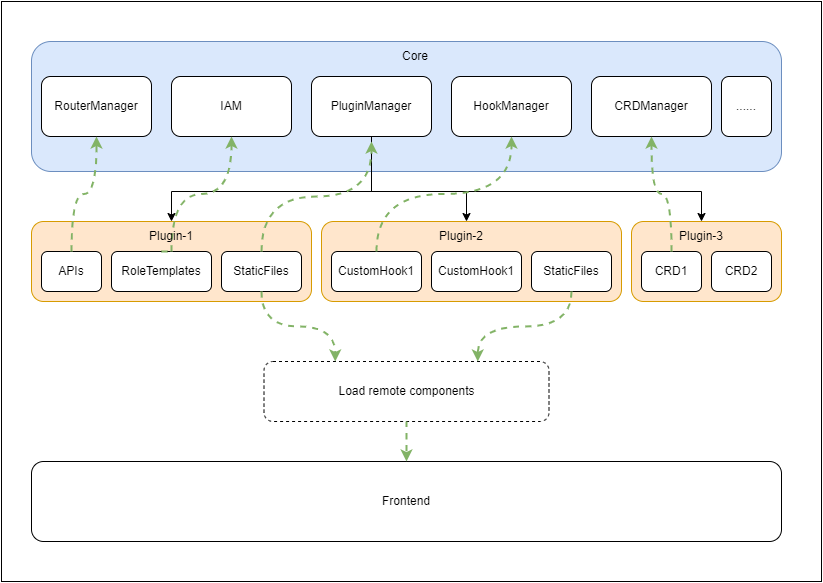

# RFC :插件模块设计

| **概述**  | Ikaros功能性拓展插件模块设计                   |
| ------- | ----------------------------------- |
| **已创建** | 2022 年 12 月 27 日                    |
| **状态**  | WIP                                 |
| **所有者** | [li-guohao](mailto:git@liguohao.cn) |
| **贡献者** | 暂无                                  |

## 目标

服务端

- 参考[Kubernetes CRD](https://kubernetes.io/zh-cn/docs/tasks/extend-kubernetes/custom-resources/custom-resource-definitions/) 和 [OpenAPI v3](https://spec.openapis.org/oas/v3.1.0) 以及 [Halo Extension](https://github.com/halo-dev/rfcs/tree/main/extension) 设计定制资源定义，方面插件进行数据持久化
- 服务端API支持插件进行拓展，core 提供统一的API生成方式，权限暂时不做更细粒度的划分，全部走`JWT`
- 实现插件的类加载，并提供对插件操作的API
- core 提供 hook，供插件在一些非关键地方进行操作，非关键指的是不影响本体的正常运行
- 插件静态资源文件的加载，包括插件的配置文件 和 插件的管理端拓展打包文件
- 为了安全考虑，core 不能把所有的方法调用暴露给插件，需要提供接口暴露可开放的方法给插件调用

管理端前端(admin)

- 可通过插件在各级导航栏插入新的功能入口
- 可通过插件添加新页面
- 可通过插件添加自定义导航栏路由
- 通过hook增强各个页面或组件的功能

公共目标

- 插件管理：提供可视化的插件管理机制，支持插件的安装、卸载、启用、停用、配置、升级。
- 插件框架：提供插件开发、打包、发布相关的脚手架，提供完善的插件开发文档。

## 非目标

## 背景和动机

为拓展系统功能性，需要插件模块进行支持

## 设计

### 术语

- core: 本体，核心模块

- admin: 管理端

- hook: core预留的增强功能的钩子

### 服务端(Backend)

#### 描述

插件启用时由 PluginManager 负责加载，包括:

- IAM: 统一身份认证（Identity and Access Management)，简称IAM,是权限控制中心。

- RouterManager: 请求路由注册器，负责注册所有的核心的路由和插件定义的路由，以及OpenAPI的路由注册。

- PluginManager: 插件管理器，负责所有的插件的启用、卸载、类加载、类卸载等功能，插件的资源管理，配置资源和管理端资源。

- HookManager: 负责所有的钩子的暴露、钩子实现的查找、钩子注册到声明周期等动作，还有内部方法的隐藏和可供插件调用的方法的暴露。可共享事件`@SharedEvent`的桥接

- CRDManager: 负责所有的定制资源持久化模型的管理。

- StaticFiles：由 PluginManager 加载。

- 类似 manifest 和 RoleTemplates 的 yaml。

- Listeners：由 PluginManager 管理。

- Spring Bean Components：委托给 PluginManager 管理。

#### 类加载

插件启用加载时，由 `PluginManager` 创建一个新的 `PluginClassLoader` 实例负责加载插件类和资源，`PluginClassLoader`的`parent` 为 Ikaros 使用的类加载器，加载顺序符合双亲委派机制。

#### 权限控制

自定义角色模板yml文件，core根据这些文件对插件定义的API进行权限控制

#### 数据持久化

插件使用CRD进行数据持久化

## 时间线

*建议的实施时间表是什么？*

## 依赖项

依赖于 pf4j 和 java 类加载

## 考虑的替代方案 / 现有技术

*您还考虑了哪些其他方法？哪些现有的解决方案是接近但不完全正确的？该项目将如何替代或整合替代方案？*

## 操作

*您是否正在为任何团队添加任何新的常规人工流程或额外工作？如果这是一个新系统，谁来运行它？*

## 安全 / 隐私 / 合规

*应该考虑哪些安全 / 隐私 / 合规方面？*

*如果你不确定，永远不要假设没有。始终与安全团队交谈。*

## 风险

*存在哪些已知风险？哪些因素可能会使您的项目复杂化？*

*包括：安全性、复杂性、兼容性、延迟、服务不成熟、缺乏团队专业知识等。*

## 修订

1. *已创建 RFC*
2. *重大更改的更新，包括状态更改。*

## 参考

- [Halo Plugin RFC](https://github.com/halo-dev/rfcs/blob/main/plugin/pluggable-design.md)
- [Chapter 5. Loading, Linking, and Initializing](https://docs.oracle.com/javase/specs/jvms/se17/html/jvms-5.html)
- [Chapter 12. Execution](https://docs.oracle.com/javase/specs/jls/se17/html/jls-12.html#jls-12.6)
- [Class Loader API Doc](https://docs.oracle.com/en/java/javase/17/docs/api/java.base/java/lang/ClassLoader.html)
- [Oracle Chapter 2 Class Loaders](https://docs.oracle.com/cd/E19501-01/819-3659/beade/index.html)
